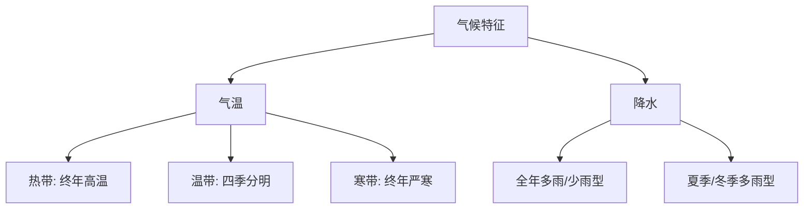

# 第一节 日本

标签：#认识国家 #日本 #东亚

## 一、本节定位

中图版·北京版地理七年级下册 **第八章 认识国家 · 第一节**。日本是"认识国家"的第一个案例，主线：岛国位置 → 多火山地震 → 资源贫乏与加工贸易经济 → 东西融合的文化。

## 二、核心概念

| 术语 | 含义 |
|---|---|
| 岛国 | 国土全部由岛屿组成的国家 |
| 板块交界带 | 板块相互碰撞挤压的地带，多火山地震 |
| 加工贸易经济 | 进口原料燃料—加工制造—出口工业制成品的经济模式 |
| 临海型工业布局 | 工业集中分布在沿海港口地带 |

## 三、位置与范围

- **海陆位置**：位于亚洲东部、太平洋西北部的**岛国**；西隔日本海与中国、朝鲜半岛、俄罗斯相望。
- **组成**：北海道、**本州**（最大）、四国、九州四大岛及附近小岛。
- 首都**东京**；海岸线曲折，多优良港湾（横滨、神户为著名海港）。

## 四、自然环境知识梳理

### 1. 多火山、地震

- 地处**环太平洋火山地震带**（亚欧板块与太平洋板块交界处），地壳不稳定。
- **富士山**是著名活火山、日本最高峰和象征。
- 防灾应对：抗震建筑（传统民居轻质材料）、防灾演习、地震预警系统。

### 2. 地形与气候

- 地形以**山地丘陵**为主（约3/4），平原狭小（关东平原最大），河流短急。
- 气候：温带季风气候与亚热带季风气候，**海洋性显著**（冬温夏凉、降水较多）。

## 五、经济知识梳理

| 项目 | 内容 |
|---|---|
| 资源条件 | 矿产资源**贫乏**，市场狭小；但港湾优良、科技先进、劳动力素质高 |
| 经济模式 | **进口原料、燃料 → 加工 → 出口制成品**（加工贸易经济） |
| 工业分布 | 集中于**太平洋沿岸和濑户内海沿岸**（临海型） |
| 分布原因 | 便于进口原料、出口产品，港口条件好，城市人口集中 |
| 主要工业区 | 京滨、名古屋、阪神、濑户内、北九州 |

## 六、地图要素判读

1. 在地图上按自北向南顺序认四大岛：北海道→本州→四国→九州。
2. 找出太平洋沿岸"工业带"，理解沿海布局与进出口的关系。
3. 对照板块分布图，确认日本位于亚欧板块与太平洋板块交界。

## 七、文化特点

- 文化具有**东西方融合**的特点：和服与西装、和食与西餐、传统神社与现代都市并存。
- 与中国文化渊源深厚（文字、建筑、茶道等）。

## 八、背记要点

1. 日本是太平洋西北部岛国，四大岛中本州最大。
2. 地处环太平洋火山地震带，多火山地震；富士山是象征。
3. 地形以山地丘陵为主，平原狭小，河流短急。
4. 季风气候具有明显海洋性。
5. 经济模式：加工贸易；工业集中在太平洋及濑户内海沿岸。
6. 文化东西融合。

## 九、自测小题

1. 日本四大岛屿中面积最大的是______岛。
2. 日本多火山地震，因为位于______板块与______板块交界处。
3. 日本的象征、著名活火山是______山。
4. 日本工业集中分布在（A. 日本海沿岸 B. 太平洋及濑户内海沿岸 C. 内陆盆地）。
5. 日本发展经济的不利条件是______资源贫乏。
6. 判断：日本平原广阔，农业规模大。（对/错）

**答案**：1. 本州 2. 亚欧；太平洋 3. 富士 4. B 5. 矿产 6. 错（山地为主，平原狭小）

相关：[[第二节 俄罗斯]] ｜ [[第四节 美国]] ｜ [[主题探究：走近一个国家]]

### 气候类型分布与特征

