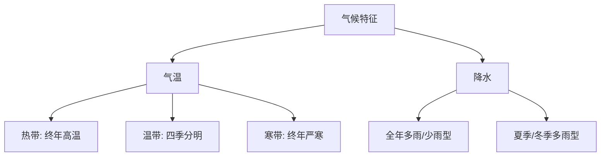

# 第三节 澳大利亚

标签：#认识国家 #澳大利亚 #南半球

## 一、本节定位

中图版·北京版地理七年级下册 **第八章 认识国家 · 第三节**。澳大利亚是独占一块大陆的南半球国家，主线：古老大陆与特有动物 → 三大地形区与半环状气候 → "骑在羊背上""坐在矿车上"的经济。

## 二、核心概念

| 术语 | 含义 |
|---|---|
| 世界活化石博物馆 | 澳大利亚保存大量古老特有生物，故得此称 |
| 混合农业 | 种植业与畜牧业结合的农业形式（小麦—牧羊带） |
| 大自流盆地 | 澳大利亚中部地下水可自流出地表的盆地 |
| 大堡礁 | 澳大利亚东北海岸的世界最大珊瑚礁群 |

## 三、位置与范围

- 位于**南半球**，独自占有**澳大利亚大陆**，还包括塔斯马尼亚岛等，是世界唯一独占一块大陆的国家。
- 南回归线横穿中部，大部分属**热带和亚热带**。
- 四面环海：东临太平洋，西临印度洋——季节与北半球**相反**。

## 四、自然环境知识梳理

### 1. 三大地形区（自西向东）

| 地形区 | 特点 |
|---|---|
| 西部高原 | 低矮广阔的高原，沙漠广布 |
| 中部平原 | 地势低平，有**大自流盆地**、北艾尔湖（最低点） |
| 东部山地 | **大分水岭**纵贯，东坡湿润西坡干燥 |

### 2. 气候：半环状分布

- 以南回归线为中心，气候呈**半环状**：中西部大面积热带沙漠气候，向外依次为热带草原气候、东南沿海亚热带湿润/温带海洋性气候、北部热带草原气候。
- 干旱区面积广，人口集中在气候湿润的**东南沿海**（悉尼、墨尔本、首都堪培拉）。

### 3. 特有动物

- 袋鼠、考拉、鸸鹋、鸭嘴兽等——大陆**长期孤立**、自然环境单一、无大型天敌，古老物种得以保存，称"**世界活化石博物馆**"。

## 五、经济知识梳理

| 称号 | 含义 |
|---|---|
| "骑在羊背上的国家" | 世界重要的养羊和羊毛出口国；农牧业机械化程度高，有著名的混合农业带 |
| "坐在矿车上的国家" | 煤、铁等矿产丰富，是重要的矿产品出口国（铁矿在西部，煤矿在东部沿海） |

- 现在**服务业**已成为澳大利亚的经济支柱。

## 六、地图要素判读

1. 找南回归线穿过大陆中部，解释热带面积广、干旱区大的原因。
2. 自西向东依次辨认高原—平原—山地三大地形区。
3. 观察人口城市集中在东南沿海，联系气候与港口条件。

## 七、背记要点

1. 澳大利亚是世界上唯一独占一块大陆的国家，位于南半球。
2. 三大地形区：西部高原、中部平原（大自流盆地）、东部大分水岭。
3. 气候呈半环状分布，中西部沙漠广。
4. 特有动物多的原因：长期与其他大陆隔离。
5. 两大绰号：骑在羊背上（羊毛）、坐在矿车上（矿产出口）。
6. 人口城市集中在东南沿海；首都堪培拉，最大城市悉尼。

## 八、自测小题

1. 世界上唯一独占一块大陆的国家是______。
2. 澳大利亚被称为"骑在______上的国家"和"坐在______上的国家"。
3. 澳大利亚特有动物有袋鼠、______、鸸鹋等。
4. 澳大利亚人口和城市主要分布在（A. 中部平原 B. 西部高原 C. 东南沿海）。
5. 横穿澳大利亚中部的特殊纬线是______。
6. 判断：澳大利亚的首都是悉尼。（对/错）

**答案**：1. 澳大利亚 2. 羊背；矿车 3. 考拉 4. C 5. 南回归线 6. 错（首都是堪培拉）

相关：[[第二节 俄罗斯]] ｜ [[第五节 巴西]] ｜ [[主题探究：走近一个国家]]

### 气候类型分布与特征

