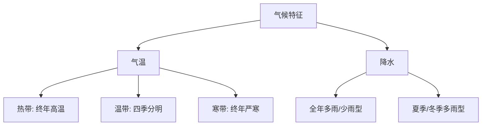

# 第四节 美国

标签：#认识国家 #美国 #北美洲

## 一、本节定位

中图版·北京版地理七年级下册 **第八章 认识国家 · 第四节**。美国是世界最发达的国家，主线：本土位置与三大地形带 → 密西西比河与五大湖 → 农业地区专门化 → 高新技术产业 → 移民国家。

## 二、核心概念

| 术语 | 含义 |
|---|---|
| 农业地区专门化 | 依据各地自然条件与市场，形成大规模专门生产某类农产品的农业带 |
| 高新技术产业 | 以电子信息、生物工程、新材料等为代表的知识密集型产业 |
| 硅谷 | 位于旧金山东南，世界著名高新技术产业中心 |
| 移民国家 | 人口主体由外来移民及其后裔构成的国家 |

## 三、位置与组成

- **本土**位于北美洲中部，东临大西洋，西临太平洋，南临墨西哥湾；北接加拿大，南邻墨西哥。
- 本土主要位于**北温带**；还有两个海外州：**阿拉斯加州**（跨北寒带）、**夏威夷州**（热带、太平洋中）。
- 首都**华盛顿**；人口城市多分布在沿海和五大湖区。

## 四、自然环境知识梳理

### 1. 三大地形带（自西向东，纵列分布）

**西部高大山系（落基山脉等）→ 中部广阔平原（大平原）→ 东部低缓山地（阿巴拉契亚山脉）**

### 2. 河湖

- **密西西比河**：世界第四长河，自北向南注入墨西哥湾，航运灌溉价值大。
- **五大湖**：世界最大淡水湖群；**苏必利尔湖**是世界最大淡水湖。

### 3. 气候

- 以**温带大陆性气候**为主；中部平原南北贯通，冬季寒潮可长驱南下，夏季暖湿气流北上。

## 五、经济知识梳理

### 1. 农业：地区专门化

| 农业带 | 分布 | 主要条件 |
|---|---|---|
| 乳畜带 | 东北部五大湖沿岸 | 气候冷湿宜牧草，城市人口密集、市场大 |
| 玉米带 | 中部 | 地势平坦、土壤肥沃、夏季高温多雨 |
| 小麦区 | 中部、北部大平原 | 地广人稀，机械化耕作 |
| 棉花带 | 南部 | 热量充足 |

- 特点：**机械化、专门化**程度高，是世界最大的农产品出口国之一。

### 2. 工业与高新技术

- 工业体系完整，是世界高新技术产业基地；**硅谷**是最著名的高新技术产业中心。
- 传统工业区在东北部（五大湖区），新兴工业向南部、西部"阳光地带"扩展。

## 六、人文要点

- 美国是**移民国家**，人种构成复杂，主体为欧洲移民后裔；原住民为印第安人。
- 美国经济总量世界领先，但也是**资源消耗和碳排放大国**，对全球环境影响大。

## 七、背记要点

1. 美国本土三面临海，另有阿拉斯加、夏威夷两个海外州。
2. 地形三大纵列带：西部山系、中部平原、东部阿巴拉契亚山。
3. 密西西比河纵贯中部；五大湖为世界最大淡水湖群。
4. 农业特点：地区专门化 + 机械化。
5. 高新技术产业发达，代表地是硅谷。
6. 移民国家，人种构成复杂。

## 八、自测小题

1. 美国本土东临______洋，西临______洋。
2. 美国地跨北温带、北寒带和热带的原因是拥有______州和______州。
3. 世界最大的淡水湖群是______，其中最大的是______湖。
4. 美国农业生产的两大特点是机械化和（A. 自给自足 B. 地区专门化 C. 精耕细作）。
5. 世界著名高新技术产业中心"硅谷"位于______市附近。
6. 判断：美国五大湖沿岸的农业带是棉花带。（对/错）

**答案**：1. 大西；太平 2. 阿拉斯加；夏威夷 3. 五大湖；苏必利尔 4. B 5. 旧金山 6. 错（是乳畜带）

相关：[[第一节 日本]] ｜ [[第五节 巴西]] ｜ [[主题探究：走近一个国家]]

### 气候类型分布与特征

