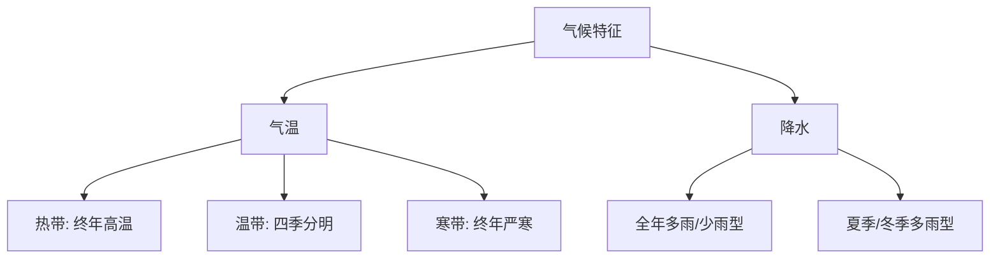

# 主题探究：走近一个国家

标签：#认识国家 #主题探究 #研究方法

## 一、探究定位

中图版·北京版地理七年级下册 **第八章 认识国家 · 主题探究**。在学完 [[第一节 日本]]、[[第二节 俄罗斯]]、[[第三节 澳大利亚]]、[[第四节 美国]]、[[第五节 巴西]] 之后，总结"认识一个国家"的通用方法，并自选一个国家开展探究。

## 二、核心概念

| 术语 | 含义 |
|---|---|
| 区域认知 | 从位置、自然、人文等角度认识区域特征的思维方式 |
| 自然环境要素 | 地形、气候、河流、资源等 |
| 人文环境要素 | 人口、民族、语言、经济、城市、文化等 |
| 人地关系 | 人类活动与地理环境相互影响的关系 |

## 三、认识国家的一般框架

**位置范围 → 自然环境 → 人文经济 → 人地关系与发展**

| 步骤 | 关键问题 | 案例回顾 |
|---|---|---|
| ① 位置与范围 | 在哪里？多大？邻居是谁？ | 日本：太平洋西北部岛国 |
| ② 地形与河流 | 地表什么样？水系如何？ | 俄罗斯：四大地形区、伏尔加河 |
| ③ 气候 | 冷热干湿如何？对生产生活的影响？ | 澳大利亚：半环状气候 |
| ④ 资源与经济 | 有什么资源？靠什么发展？ | 美国：农业专门化+高新技术 |
| ⑤ 人口与文化 | 人在哪里？什么文化特色？ | 巴西：东南沿海集中、桑巴文化 |
| ⑥ 人地关系 | 发展中遇到什么环境问题？ | 巴西：雨林保护与开发 |

## 四、探究实施步骤

1. **选国家**：选择资料易得、自己感兴趣的国家（如埃及、法国、印度）。
2. **收集资料**：地图册、教材、权威网站、纪录片；注意标注资料来源。
3. **整理归纳**：按上表框架填写"国家档案卡"。
4. **分析联系**：重点说明要素之间的联系，如"气候→农业""位置→贸易"。
5. **展示交流**：国家名片海报、演示文稿或导游词，配地图与图表。

## 五、国家档案卡模板

| 栏目 | 内容 |
|---|---|
| 国名/首都 | |
| 位置（半球、纬度、海陆） | |
| 主要地形与河流 | |
| 主要气候类型 | |
| 代表性资源与产业 | |
| 人口与城市分布 | |
| 文化符号 | |
| 面临的问题与对策 | |

## 六、方法要点

- 描述位置的"三步法"：半球位置→纬度位置→海陆位置。
- 分析自然要素时始终联系"对人类活动的影响"，避免罗列。
- 用**地图**说话：至少配一幅位置图、一幅地形或气候图。

## 七、背记要点

1. 认识国家四大步：位置范围→自然环境→人文经济→人地关系。
2. 自然要素：地形、气候、河流、资源；人文要素：人口、城市、经济、文化。
3. 要素之间相互联系，位置和气候常是分析起点。
4. 资料要注明来源，结论要有地图和数据支撑。

## 八、自测小题

1. 描述一个国家的位置应包括半球位置、______位置和海陆位置。
2. 分析国家农业发展条件，首先要看______和地形。
3. "认识国家"框架中，最后一步是分析______关系与可持续发展。
4. 展示探究成果时，最能直观呈现国家位置的工具是（A. 文字 B. 地图 C. 录音）。
5. 判断：认识国家只需要记住首都和面积即可。（对/错）

**答案**：1. 纬度 2. 气候 3. 人地 4. B 5. 错

相关：[[第一节 日本]] ｜ [[第五节 巴西]] ｜ [[主题探究：设计旅行方案]]

### 气候类型分布与特征

