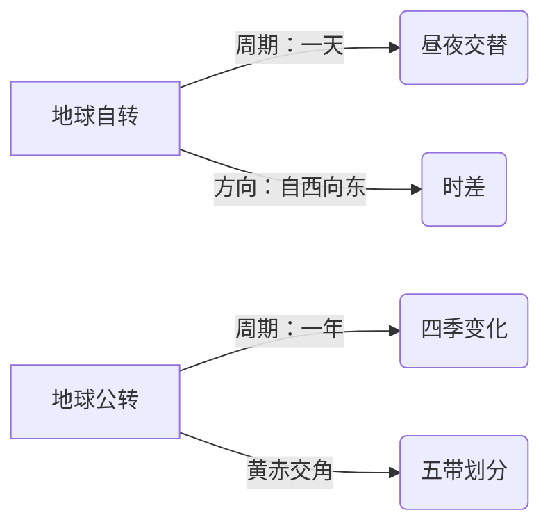

# 主题探究：模拟联合国气候变化大会

标签：#共建地球家园 #主题探究 #气候变化

## 一、探究定位

中图版·北京版地理七年级下册 **第九章 共建人类地球家园 · 主题探究**。通过模拟联合国气候变化大会，扮演不同国家代表，理解全球气候变化的成因、影响与国际合作应对，是本章 [[共建人类地球家园·重点梳理]] 的实践活动。

## 二、核心概念

| 术语 | 含义 |
|---|---|
| 全球气候变暖 | 全球平均气温总体升高的现象 |
| 温室气体 | 二氧化碳、甲烷等能增强大气保温作用的气体 |
| 碳达峰 | 二氧化碳排放量达到峰值后不再增长 |
| 碳中和 | 排放的二氧化碳与吸收的量相互抵消，实现"净零排放" |
| 《巴黎协定》 | 2015年通过的全球气候治理协定，目标是控制全球升温幅度 |

## 三、背景知识梳理

### 1. 气候变暖的原因

- 人为原因（主要）：大量燃烧**煤、石油、天然气**等化石燃料排放二氧化碳；**滥伐森林**使吸收二氧化碳的能力下降。
- 自然原因：地球气候本身存在冷暖波动。

### 2. 气候变暖的影响

| 领域 | 影响 |
|---|---|
| 冰川与海洋 | 两极和高山冰川消融，海平面上升，沿海低地、岛国被淹风险增大 |
| 极端天气 | 高温、干旱、暴雨、台风等更频繁 |
| 生态系统 | 物种栖息地改变，生物多样性受威胁 |
| 农业与健康 | 农业减产风险、疾病传播范围变化 |

### 3. 应对措施

- **减缓**：节能减排、发展风能太阳能等清洁能源、植树造林、绿色出行。
- **适应**：修建海堤、培育耐旱作物、完善灾害预警。
- **国际合作**：气候变化是全球性问题，任何国家都无法独善其身，需共同承担"共同但有区别的责任"。

## 四、模拟大会流程

1. **分组分角色**：发达国家、发展中国家、小岛屿国家等代表及主席团。
2. **查资料立立场**：了解所代表国家的排放状况、经济水平、诉求。
3. **陈述与磋商**：各国发言→自由磋商→起草决议草案。
4. **表决与总结**：通过决议，反思各国立场差异与合作难点。

## 五、不同国家立场对比

| 国家类型 | 核心关切 | 典型主张 |
|---|---|---|
| 发达国家 | 技术与市场 | 各国共同减排 |
| 发展中国家 | 发展权与资金 | 发达国家应率先减排并提供资金技术 |
| 小岛屿国家 | 生存安全 | 要求最严格的控温目标 |

## 六、背记要点

1. 气候变暖主因：燃烧化石燃料排放二氧化碳 + 滥伐森林。
2. 最直接后果之一：冰川消融、海平面上升。
3. 应对两条路：减缓（减排增汇）+ 适应。
4. 中国目标：力争2030年前碳达峰、2060年前碳中和。
5. 全球问题需要全球合作，遵循"共同但有区别的责任"。

## 七、自测小题

1. 造成全球气候变暖的主要温室气体是______。
2. 气候变暖使两极冰川消融，导致______上升，威胁沿海低地。
3. 应对气候变化的国际协定是2015年通过的《______协定》。
4. 下列做法有助于减缓气候变暖的是（A. 焚烧秸秆 B. 绿色出行、植树造林 C. 增加燃煤电厂）。
5. 我国提出力争2030年前实现碳______，2060年前实现碳______。
6. 判断：气候变化只是发达国家的事，与发展中国家无关。（对/错）

**答案**：1. 二氧化碳 2. 海平面 3. 巴黎 4. B 5. 达峰；中和 6. 错

相关：[[共建人类地球家园·重点梳理]] ｜ [[共建人类地球家园·综合练习]] ｜ [[第四节 极地地区]]

### 地理示意图：地球运动

