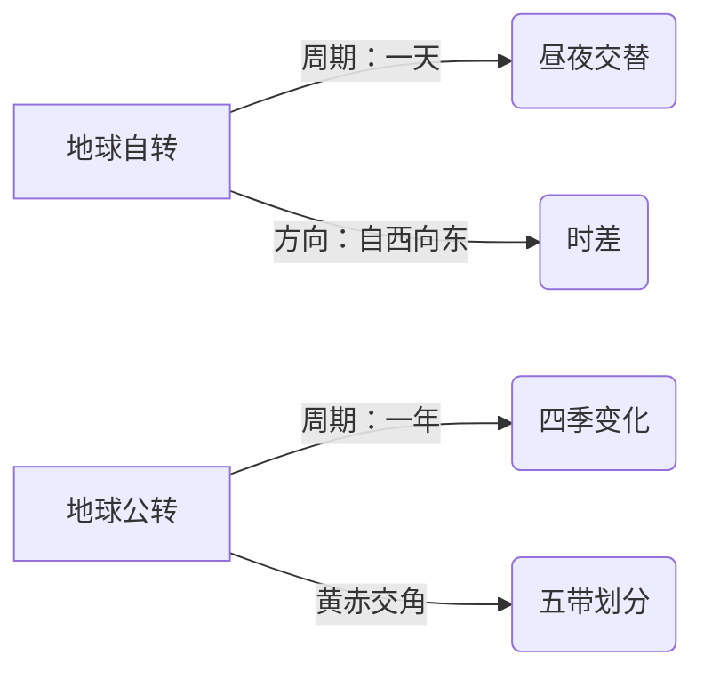

# 共建人类地球家园·综合练习

标签：#共建地球家园 #综合练习 #期末复习

## 一、练习定位

中图版·北京版地理七年级下册 **第九章 共建人类地球家园 · 综合练习**。以本章为核心，串联全册"大洲—地区—国家"知识进行综合演练。建议先复习 [[共建人类地球家园·重点梳理]] 再做题。

## 二、考点清单

| 考点 | 常见考法 |
|---|---|
| 资源分类 | 判断可再生/非可再生资源 |
| 气候变暖 | 成因、影响、应对措施 |
| 人口问题 | 增长过快/过慢的影响 |
| 可持续发展 | 结合区域案例评价做法 |
| 区域综合 | 用大洲/国家案例分析人地关系 |

## 三、选择题

1. 下列全部属于可再生资源的一组是（ ）
   A. 石油、森林、水　B. 太阳能、土地、水　C. 煤、铁矿、天然气
2. 全球气候变暖的最主要人为原因是（ ）
   A. 火山喷发　B. 大量燃烧化石燃料　C. 地球公转变化
3. 海平面上升对下列地区威胁最大的是（ ）
   A. 内陆高原　B. 沿海低地和岛国　C. 沙漠腹地
4. 下列行为符合可持续发展理念的是（ ）
   A. 大量使用一次性餐具　B. 垃圾分类、绿色出行　C. 围湖造田扩大耕地
5. 亚马孙雨林遭破坏后，最可能加剧的全球问题是（ ）
   A. 气候变暖　B. 火山地震　C. 台风增多
6. 关于人口问题的叙述，正确的是（ ）
   A. 人口越多越好　B. 人口增长应与资源环境相协调　C. 人口越少越好

## 四、填空题

7. 自然资源按能否再生分为______资源和______资源。
8. 应对气候变化的两类措施是______和适应。
9. 我国提出2030年前实现碳______、2060年前实现碳______。
10. 环境问题不受国界限制，解决全球环境问题需要______合作。

## 五、综合题

11. 读"世界气候变暖示意"材料回答：
    (1) 写出气候变暖的两个主要人为原因。
    (2) 列举气候变暖的两项影响。
    (3) 从个人角度提出两条减排建议。
12. 结合 [[第五节 巴西]] 所学：
    (1) 亚马孙雨林被称为什么？有哪些生态作用（举两项）？
    (2) 巴西在雨林开发中应如何兼顾发展与保护？
13. 结合 [[第四节 极地地区]]：为什么说极地冰川消融是"全球问题的晴雨表"？

## 六、参考答案

- 选择题：1.B　2.B　3.B　4.B　5.A　6.B
- 填空题：7. 可再生；非可再生　8. 减缓　9. 达峰；中和　10. 国际（全球）
- 综合题要点：
  - 11.(1) 燃烧化石燃料排放二氧化碳；滥伐森林。(2) 冰川消融、海平面上升；极端天气增多（合理即可）。(3) 绿色出行、节约用电、少用一次性用品等。
  - 12.(1) "地球之肺"；调节全球气候、维护生物多样性、涵养水源。(2) 限制滥伐、建立保护区、发展生态旅游等可持续方式。
  - 13. 极地气候敏感，变暖信号最先在冰川消融上显现，并通过海平面上升影响全球沿海地区。

## 七、错题反思模板

| 题号 | 错因（概念不清/审题失误/记忆缺漏） | 对应知识点 | 复习行动 |
|---|---|---|---|
| | | | |

## 八、复习提示

1. 资源分类题抓"短期内能否再生"这一标准。
2. 气候变暖答题链：原因（排放+毁林）→影响（冰融、海升、极端天气）→措施（减缓+适应+合作）。
3. 综合题多结合具体区域（巴西雨林、极地、西亚水资源）作答，注意"问题—原因—措施"三段式。

相关：[[共建人类地球家园·重点梳理]] ｜ [[主题探究：模拟联合国气候变化大会]] ｜ [[主题探究：走近一个国家]]

### 地理示意图：地球运动

<svg viewBox="0 0 800 260" xmlns="http://www.w3.org/2000/svg" font-family="sans-serif">
  <rect width="800" height="260" fill="#f0fdfa" rx="12"/>
  <text x="400" y="28" text-anchor="middle" font-size="16" font-weight="bold" fill="#134e4a">七年级地理总复习框架——核心主线</text>
  <!-- 7 regions -->
  <rect x="25" y="50" width="745" height="40" rx="8" fill="#0d9488"/>
  <text x="400" y="75" text-anchor="middle" font-size="13" font-weight="bold" fill="white">第一层：自然地理（地球·地图·海陆·气候·水）</text>
  <!-- Key points row 1 -->
  <rect x="30" y="100" width="155" height="70" rx="6" fill="#ccfbf1" stroke="#0d9488" stroke-width="1.5"/>
  <text x="107" y="122" text-anchor="middle" font-size="11" font-weight="bold" fill="#134e4a">位置与范围</text>
  <text x="107" y="140" text-anchor="middle" font-size="10" fill="#0f766e">纬度·海陆·半球</text>
  <text x="107" y="155" text-anchor="middle" font-size="10" fill="#0f766e">经纬度坐标</text>
  <rect x="200" y="100" width="155" height="70" rx="6" fill="#ccfbf1" stroke="#0d9488" stroke-width="1.5"/>
  <text x="277" y="122" text-anchor="middle" font-size="11" font-weight="bold" fill="#134e4a">地形</text>
  <text x="277" y="140" text-anchor="middle" font-size="10" fill="#0f766e">七大洲·四大洋</text>
  <text x="277" y="155" text-anchor="middle" font-size="10" fill="#0f766e">六大板块</text>
  <rect x="370" y="100" width="155" height="70" rx="6" fill="#ccfbf1" stroke="#0d9488" stroke-width="1.5"/>
  <text x="447" y="122" text-anchor="middle" font-size="11" font-weight="bold" fill="#134e4a">气候</text>
  <text x="447" y="140" text-anchor="middle" font-size="10" fill="#0f766e">11种气候类型</text>
  <text x="447" y="155" text-anchor="middle" font-size="10" fill="#0f766e">季风·洋流</text>
  <rect x="540" y="100" width="235" height="70" rx="6" fill="#fef3c7" stroke="#f59e0b" stroke-width="1.5"/>
  <text x="657" y="122" text-anchor="middle" font-size="11" font-weight="bold" fill="#92400e">人文地理</text>
  <text x="657" y="140" text-anchor="middle" font-size="10" fill="#78350f">人口·聚落·语言宗教</text>
  <text x="657" y="155" text-anchor="middle" font-size="10" fill="#78350f">发展与合作</text>
  <!-- Bottom row -->
  <rect x="25" y="183" width="745" height="60" rx="8" fill="#134e4a" stroke="#5eead4" stroke-width="1.5"/>
  <text x="400" y="205" text-anchor="middle" font-size="13" font-weight="bold" fill="#5eead4">第二层：区域地理（认识大洲·地区·国家）</text>
  <text x="200" y="230" text-anchor="middle" font-size="11" fill="#ccfbf1">亚洲·非洲·欧洲·北美洲</text>
  <text x="530" y="230" text-anchor="middle" font-size="11" fill="#ccfbf1">日本·俄罗斯·澳大利亚·美国·巴西</text>
  <line x1="380" y1="190" x2="380" y2="240" stroke="#5eead4" stroke-width="1" opacity="0.5"/>
</svg>

