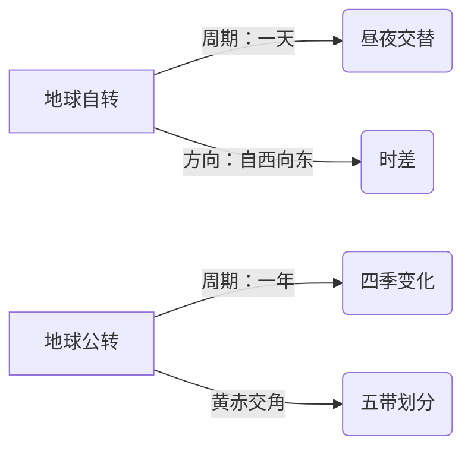

# 第二节 主要的气候类型

标签：#中考必考 #背诵 #综合

## 一、气候类型的判断方法

判断气候类型通常按“**以温定带、以水定型**”两步走：

1. **以温定带**：根据最冷月均温判断热量带。
2. **以水定型**：根据降水季节分配判断具体类型。

## 二、热带气候类型

| 气候类型 | 分布规律 | 气候特征 |
|---|---|---|
| 热带雨林气候 | 赤道附近 | 全年高温多雨 |
| 热带草原气候 | 热带雨林气候南北两侧 | 全年高温，分干湿两季 |
| 热带季风气候 | 亚洲的中南半岛、印度半岛 | 全年高温，分旱雨两季 |
| 热带沙漠气候 | 南北回归线附近大陆西岸和内陆 | 全年炎热干燥 |

## 三、亚热带气候类型

| 气候类型 | 分布规律 | 气候特征 |
|---|---|---|
| 亚热带季风和湿润气候 | 南北纬 25°—35°大陆东岸 | 夏季高温多雨，冬季温和少雨 |
| 地中海气候 | 南北纬 30°—40°大陆西岸 | 夏季炎热干燥，冬季温和多雨 |

## 四、温带气候类型

| 气候类型 | 分布规律 | 气候特征 |
|---|---|---|
| 温带季风气候 | 亚欧大陆东岸 | 夏季高温多雨，冬季寒冷干燥 |
| 温带海洋性气候 | 南北纬 40°—60°大陆西岸 | 全年温和湿润 |
| 温带大陆性气候 | 亚欧大陆和北美大陆内部 | 冬冷夏热，全年少雨 |

## 五、寒带与高原山地气候

| 气候类型 | 分布规律 | 气候特征 |
|---|---|---|
| 苔原气候 | 亚欧大陆和北美大陆北冰洋沿岸 | 长冬无夏，降水稀少 |
| 冰原气候 | 南极大陆、格陵兰岛 | 全年酷寒 |
| 高原山地气候 | 高原、山地 | 垂直差异显著 |

## 六、要点小结

- 热带雨林、热带草原、热带季风、热带沙漠——看降水分类型。
- 地中海气候“**雨热不同期**”，是考试高频考点。
- 温带海洋性气候全年温和湿润，利于多汁牧草生长。

## 七、知识联系

- 气候特征离不开[[第一节 气温与降水的分布和变化]]的基础数据。
- 气候类型直接影响[[第三节 气候对生产和生活的影响]]。

## 八、自测题

1. 地中海气候的特征是什么？
2. 温带海洋性气候主要分布在哪些地区？
3. “全年高温多雨”描述的是哪种气候？
4. 判断气候类型的基本步骤是什么？

### 地理示意图：地球运动

