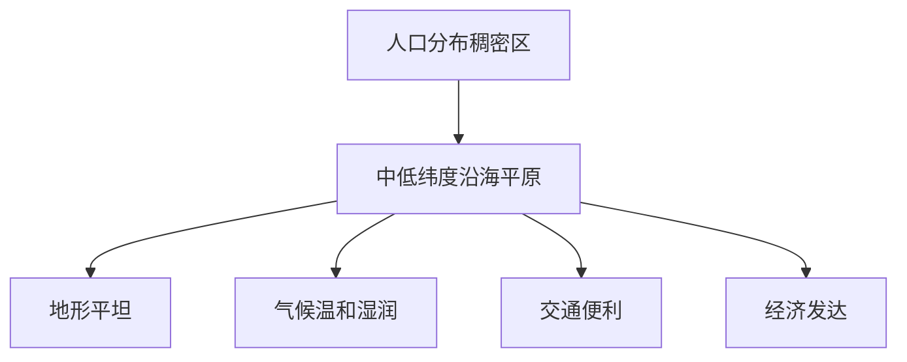

# 第二节 语言和宗教

标签：#中考高频 #基础 #记忆

## 一、世界主要语言

### 联合国六种工作语言

| 语言 | 主要分布地区 |
|---|---|
| 汉语 | 中国、东南亚部分地区 |
| 英语 | 英国、美国、加拿大、澳大利亚、印度等 |
| 法语 | 法国、比利时、加拿大魁北克、非洲部分国家 |
| 俄语 | 俄罗斯及中亚部分国家 |
| 西班牙语 | 西班牙、拉丁美洲多数国家 |
| 阿拉伯语 | 西亚、北非 |

> 💡 汉语是世界上**使用人数最多**的语言；英语是世界上**使用范围最广**的语言。

## 二、世界三大宗教

| 宗教 | 发源地 | 主要分布地区 | 代表性建筑 |
|---|---|---|---|
| 基督教 | 亚洲西部 | 欧洲、美洲、大洋洲 | 教堂 |
| 伊斯兰教 | 阿拉伯半岛 | 西亚、北非、中亚、东南亚部分地区 | 清真寺 |
| 佛教 | 古印度 | 东亚、东南亚、南亚部分地区 | 佛塔、寺庙 |

## 三、宗教建筑识别

| 建筑 | 特点 |
|---|---|
| 教堂 | 顶部有尖顶、十字架 |
| 清真寺 | 圆顶、新月标志 |
| 佛塔/寺庙 | 塔状、飞檐、佛像 |

## 四、语言与宗教的关系

语言和宗教往往是特定地区历史文化的重要组成部分，对人口迁移、国际交往、区域文化认同都有深刻影响。

## 五、要点小结

- 联合国工作语言：汉、英、法、俄、西、阿。
- 三大宗教：基督教、伊斯兰教、佛教。
- 通过建筑特点可快速判断宗教类型。

## 六、知识联系

- 语言宗教的分布与[[第一节 人口和人种]]的迁移历史有关。
- 宗教建筑常成为[[第三节 聚落]]的文化景观。
- 不同发展水平国家间的文化交流见[[第一节 发展中国家和发达国家]]。

<svg viewBox="0 0 820 400" xmlns="http://www.w3.org/2000/svg" font-family="sans-serif">
  <rect width="820" height="400" fill="#f0fdfa" rx="12"/>
  <text x="410" y="28" text-anchor="middle" font-size="17" font-weight="bold" fill="#134e4a">六大语言 + 三大宗教 · 记忆速查图</text>
  <!-- Languages section -->
  <text x="230" y="55" text-anchor="middle" font-size="14" font-weight="bold" fill="#134e4a">联合国六种工作语言</text>
  <!-- 6 language cards in 2 rows -->
  <!-- Row 1 -->
  <rect x="20" y="65" width="200" height="80" rx="8" fill="#134e4a" stroke="#5eead4" stroke-width="2"/>
  <text x="120" y="90" text-anchor="middle" font-size="16" font-weight="bold" fill="#5eead4">汉语</text>
  <text x="120" y="110" text-anchor="middle" font-size="11" fill="#ccfbf1">中国·东南亚</text>
  <text x="120" y="127" text-anchor="middle" font-size="10" fill="#5eead4">使用人数最多★</text>
  <rect x="237" y="65" width="200" height="80" rx="8" fill="#0f766e" stroke="#5eead4" stroke-width="2"/>
  <text x="337" y="90" text-anchor="middle" font-size="16" font-weight="bold" fill="white">英语</text>
  <text x="337" y="110" text-anchor="middle" font-size="11" fill="#ccfbf1">英·美·加·澳·印</text>
  <text x="337" y="127" text-anchor="middle" font-size="10" fill="#5eead4">使用范围最广★</text>
  <!-- Row 2 -->
  <rect x="20" y="155" width="200" height="70" rx="8" fill="#0d9488" stroke="#5eead4" stroke-width="1.5"/>
  <text x="120" y="180" text-anchor="middle" font-size="14" font-weight="bold" fill="white">法语</text>
  <text x="120" y="198" text-anchor="middle" font-size="10" fill="#ccfbf1">法国·比利时·非洲部分国家</text>
  <rect x="237" y="155" width="200" height="70" rx="8" fill="#14b8a6" stroke="#0d9488" stroke-width="1.5"/>
  <text x="337" y="180" text-anchor="middle" font-size="14" font-weight="bold" fill="#134e4a">俄语</text>
  <text x="337" y="198" text-anchor="middle" font-size="10" fill="#134e4a">俄罗斯·中亚部分</text>
  <!-- Row 3 -->
  <rect x="20" y="235" width="200" height="70" rx="8" fill="#5eead4" stroke="#0d9488" stroke-width="1.5"/>
  <text x="120" y="260" text-anchor="middle" font-size="14" font-weight="bold" fill="#134e4a">西班牙语</text>
  <text x="120" y="278" text-anchor="middle" font-size="10" fill="#134e4a">西班牙·拉丁美洲多数国</text>
  <rect x="237" y="235" width="200" height="70" rx="8" fill="#ccfbf1" stroke="#0d9488" stroke-width="1.5"/>
  <text x="337" y="260" text-anchor="middle" font-size="14" font-weight="bold" fill="#134e4a">阿拉伯语</text>
  <text x="337" y="278" text-anchor="middle" font-size="10" fill="#0f766e">西亚·北非</text>
  <!-- Three religions section -->
  <text x="640" y="55" text-anchor="middle" font-size="14" font-weight="bold" fill="#134e4a">世界三大宗教</text>
  <!-- Christianity -->
  <rect x="460" y="65" width="345" height="110" rx="8" fill="#fef3c7" stroke="#f59e0b" stroke-width="2"/>
  <text x="550" y="92" text-anchor="middle" font-size="14" font-weight="bold" fill="#92400e">✝ 基督教</text>
  <text x="550" y="112" text-anchor="middle" font-size="10" fill="#78350f">发源：亚洲西部</text>
  <text x="550" y="128" text-anchor="middle" font-size="10" fill="#78350f">分布：欧洲·美洲·大洋洲</text>
  <text x="640" y="92" text-anchor="middle" font-size="11" fill="#92400e" font-weight="bold">代表建筑</text>
  <text x="720" y="92" text-anchor="middle" font-size="22">⛪</text>
  <text x="720" y="112" text-anchor="middle" font-size="11" fill="#78350f">教堂</text>
  <text x="720" y="128" text-anchor="middle" font-size="10" fill="#78350f">信徒最多★</text>
  <!-- Islam -->
  <rect x="460" y="185" width="345" height="110" rx="8" fill="#ddd6fe" stroke="#7c3aed" stroke-width="2"/>
  <text x="550" y="212" text-anchor="middle" font-size="14" font-weight="bold" fill="#4c1d95">☪ 伊斯兰教</text>
  <text x="550" y="232" text-anchor="middle" font-size="10" fill="#5b21b6">发源：阿拉伯半岛</text>
  <text x="550" y="248" text-anchor="middle" font-size="10" fill="#5b21b6">分布：西亚·北非·中亚·东南亚</text>
  <text x="720" y="212" text-anchor="middle" font-size="22">🕌</text>
  <text x="720" y="232" text-anchor="middle" font-size="11" fill="#4c1d95">清真寺</text>
  <text x="720" y="248" text-anchor="middle" font-size="10" fill="#4c1d95">信徒第二多</text>
  <!-- Buddhism -->
  <rect x="460" y="305" width="345" height="80" rx="8" fill="#dcfce7" stroke="#22c55e" stroke-width="2"/>
  <text x="550" y="330" text-anchor="middle" font-size="14" font-weight="bold" fill="#14532d">☸ 佛教</text>
  <text x="550" y="348" text-anchor="middle" font-size="10" fill="#166534">发源：古印度（尼泊尔南部）</text>
  <text x="550" y="364" text-anchor="middle" font-size="10" fill="#166534">分布：亚洲东部·东南部</text>
  <text x="720" y="330" text-anchor="middle" font-size="22">🛕</text>
  <text x="720" y="350" text-anchor="middle" font-size="11" fill="#14532d">寺庙</text>
  <!-- Memory tip bar -->
  <rect x="20" y="325" width="430" height="65" rx="8" fill="#134e4a" stroke="#5eead4" stroke-width="1.5"/>
  <text x="235" y="348" text-anchor="middle" font-size="12" font-weight="bold" fill="#5eead4">记忆口诀</text>
  <text x="235" y="368" text-anchor="middle" font-size="11" fill="#ccfbf1">汉语人最多·英语范围广·西语拉丁美</text>
  <text x="235" y="385" text-anchor="middle" font-size="11" fill="#ccfbf1">阿拉伯西亚北非用·俄语在北方</text>
</svg>

## 七、自测题

1. 世界上使用人数最多的语言是什么？
2. 联合国六种工作语言有哪些？
3. 三大宗教的发源地分别是哪里？
4. 如何从外观上区分教堂和清真寺？

### 人口分布影响因素

