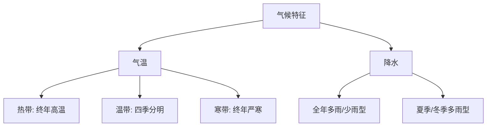

# 第三节 聚落

标签：#中考高频 #基础 #人地协调

## 一、聚落的类型

| 类型 | 规模 | 主要从事产业 | 建筑特点 |
|---|---|---|---|
| 乡村 | 较小 | 农业、林业、牧业、渔业 | 低矮、分散 |
| 城市 | 较大 | 工业、服务业、商业 | 高大、密集 |

## 二、聚落形成的有利条件

| 条件 | 说明 |
|---|---|
| 地形平坦 | 便于建设和耕作 |
| 土壤肥沃 | 利于农业发展 |
| 水源充足 | 满足生产生活用水 |
| 气候适宜 | 适合人类居住 |
| 交通便利 | 便于物资运输和人员往来 |
| 自然资源丰富 | 提供发展原料 |

## 三、聚落与自然环境的关系

| 自然环境 | 聚落形态 |
|---|---|
| 平原地区 | 团块状、规模较大 |
| 山地、丘陵 | 条带状、沿山谷或河流分布 |
| 河流沿岸 | 多呈条带状发展 |
| 沙漠绿洲 | 点状、规模较小 |

## 四、聚落发展与保护

### 传统聚落的价值

1. 反映当地居民的生活方式和文化传统。
2. 是重要的历史文化遗产。

### 保护措施

- 控制游客数量，防止过度商业化。
- 保持原有风貌，避免大拆大建。
- 制定法律法规，加强监督管理。

## 五、要点小结

- 聚落分乡村和城市，二者在规模、产业、景观上有明显差异。
- 聚落形成受地形、土壤、水源、气候、交通等因素影响。
- 保护传统聚落就是保护人类的文化多样性。

## 六、知识联系

- 聚落分布与[[第一节 人口和人种]]的人口稠密区高度重合。
- 聚落建筑特点深受[[第二节 主要的气候类型]]影响。
- 传统聚落保护是[[第二节 国际经济合作]]中文化交流的重要内容。

<svg viewBox="0 0 800 360" xmlns="http://www.w3.org/2000/svg" font-family="sans-serif">
  <rect width="800" height="360" fill="#f0fdfa" rx="12"/>
  <text x="400" y="28" text-anchor="middle" font-size="17" font-weight="bold" fill="#134e4a">聚落的形成条件与城乡差异</text>
  <!-- Formation conditions -->
  <text x="200" y="55" text-anchor="middle" font-size="14" font-weight="bold" fill="#134e4a">聚落形成的六大有利条件</text>
  <!-- 6 condition cards in 2 rows -->
  <rect x="20" y="65" width="115" height="65" rx="8" fill="#134e4a" stroke="#5eead4" stroke-width="2"/>
  <text x="77" y="90" text-anchor="middle" font-size="22">🏔️</text>
  <text x="77" y="120" text-anchor="middle" font-size="11" font-weight="bold" fill="#5eead4">地形平坦</text>
  <rect x="148" y="65" width="115" height="65" rx="8" fill="#0d9488" stroke="#5eead4" stroke-width="1.5"/>
  <text x="205" y="90" text-anchor="middle" font-size="22">💧</text>
  <text x="205" y="120" text-anchor="middle" font-size="11" font-weight="bold" fill="white">水源充足</text>
  <rect x="276" y="65" width="115" height="65" rx="8" fill="#0f766e" stroke="#5eead4" stroke-width="1.5"/>
  <text x="333" y="90" text-anchor="middle" font-size="22">🌱</text>
  <text x="333" y="120" text-anchor="middle" font-size="11" font-weight="bold" fill="white">土壤肥沃</text>
  <rect x="20" y="143" width="115" height="65" rx="8" fill="#14b8a6" stroke="#0d9488" stroke-width="1.5"/>
  <text x="77" y="168" text-anchor="middle" font-size="22">🌤️</text>
  <text x="77" y="198" text-anchor="middle" font-size="11" font-weight="bold" fill="#134e4a">气候适宜</text>
  <rect x="148" y="143" width="115" height="65" rx="8" fill="#5eead4" stroke="#0d9488" stroke-width="1.5"/>
  <text x="205" y="168" text-anchor="middle" font-size="22">🛤️</text>
  <text x="205" y="198" text-anchor="middle" font-size="11" font-weight="bold" fill="#134e4a">交通便利</text>
  <rect x="276" y="143" width="115" height="65" rx="8" fill="#ccfbf1" stroke="#0d9488" stroke-width="1.5"/>
  <text x="333" y="168" text-anchor="middle" font-size="22">⛏️</text>
  <text x="333" y="198" text-anchor="middle" font-size="11" font-weight="bold" fill="#134e4a">资源丰富</text>
  <!-- Big arrow to settlement -->
  <polygon points="395,148 420,140 420,156" fill="#0d9488"/>
  <text x="410" y="138" text-anchor="middle" font-size="11" fill="#0d9488">→</text>
  <!-- Settlement -->
  <rect x="425" y="100" width="100" height="65" rx="8" fill="#dc2626" stroke="#fca5a5" stroke-width="2"/>
  <text x="475" y="128" text-anchor="middle" font-size="12" font-weight="bold" fill="white">聚落</text>
  <text x="475" y="148" text-anchor="middle" font-size="10" fill="#fca5a5">城市/乡村</text>
  <!-- City vs Village comparison -->
  <text x="650" y="55" text-anchor="middle" font-size="14" font-weight="bold" fill="#134e4a">城市 vs 乡村</text>
  <rect x="540" y="65" width="115" height="200" rx="8" fill="#e0f2fe" stroke="#0284c7" stroke-width="2"/>
  <text x="597" y="92" text-anchor="middle" font-size="13" font-weight="bold" fill="#0c4a6e">🏙️ 城市</text>
  <text x="597" y="112" text-anchor="middle" font-size="10" fill="#0c4a6e">规模大</text>
  <text x="597" y="128" text-anchor="middle" font-size="10" fill="#0c4a6e">建筑高密集</text>
  <text x="597" y="144" text-anchor="middle" font-size="10" fill="#0c4a6e">工业服务业</text>
  <text x="597" y="160" text-anchor="middle" font-size="10" fill="#0c4a6e">交通道路多</text>
  <text x="597" y="176" text-anchor="middle" font-size="10" fill="#0c4a6e">人口密度大</text>
  <text x="597" y="192" text-anchor="middle" font-size="10" fill="#0c4a6e">绿地少</text>
  <text x="597" y="248" text-anchor="middle" font-size="10" fill="#0c4a6e" font-weight="bold">←演变</text>
  <rect x="668" y="65" width="115" height="200" rx="8" fill="#dcfce7" stroke="#22c55e" stroke-width="2"/>
  <text x="725" y="92" text-anchor="middle" font-size="13" font-weight="bold" fill="#14532d">🌾 乡村</text>
  <text x="725" y="112" text-anchor="middle" font-size="10" fill="#14532d">规模小</text>
  <text x="725" y="128" text-anchor="middle" font-size="10" fill="#14532d">建筑低分散</text>
  <text x="725" y="144" text-anchor="middle" font-size="10" fill="#14532d">农林牧渔业</text>
  <text x="725" y="160" text-anchor="middle" font-size="10" fill="#14532d">道路少简单</text>
  <text x="725" y="176" text-anchor="middle" font-size="10" fill="#14532d">人口密度小</text>
  <text x="725" y="192" text-anchor="middle" font-size="10" fill="#14532d">绿地多</text>
  <!-- Special house styles -->
  <rect x="20" y="230" width="500" height="115" rx="8" fill="#ccfbf1" stroke="#0d9488" stroke-width="1.5"/>
  <text x="270" y="252" text-anchor="middle" font-size="13" font-weight="bold" fill="#134e4a">气候→民居形态记忆</text>
  <text x="100" y="275" text-anchor="middle" font-size="11" fill="#0d9488" font-weight="bold">湿热地区</text>
  <text x="100" y="292" text-anchor="middle" font-size="10" fill="#0f766e">高脚屋（东南亚）</text>
  <text x="100" y="308" text-anchor="middle" font-size="9" fill="#0f766e">通风防潮防野兽</text>
  <text x="270" y="275" text-anchor="middle" font-size="11" fill="#0d9488" font-weight="bold">干旱地区</text>
  <text x="270" y="292" text-anchor="middle" font-size="10" fill="#0f766e">平顶厚墙小窗（西亚）</text>
  <text x="270" y="308" text-anchor="middle" font-size="9" fill="#0f766e">隔热防风沙</text>
  <text x="430" y="275" text-anchor="middle" font-size="11" fill="#0d9488" font-weight="bold">严寒地区</text>
  <text x="430" y="292" text-anchor="middle" font-size="10" fill="#0f766e">冰屋（北极）</text>
  <text x="430" y="308" text-anchor="middle" font-size="9" fill="#0f766e">雪/冰保温隔风</text>
  <line x1="188" y1="260" x2="188" y2="335" stroke="#0d9488" stroke-width="1" opacity="0.5"/>
  <line x1="358" y1="260" x2="358" y2="335" stroke="#0d9488" stroke-width="1" opacity="0.5"/>
  <!-- Cultural heritage note -->
  <rect x="540" y="280" width="245" height="60" rx="8" fill="#fef3c7" stroke="#f59e0b" stroke-width="1.5"/>
  <text x="662" y="303" text-anchor="middle" font-size="12" font-weight="bold" fill="#92400e">⚠️ 聚落文化保护</text>
  <text x="662" y="322" text-anchor="middle" font-size="10" fill="#78350f">传统聚落→人类文化遗产</text>
  <text x="662" y="337" text-anchor="middle" font-size="10" fill="#78350f">应妥善保护·不随意拆除</text>
</svg>

## 七、自测题

1. 聚落主要分为哪两种类型？
2. 聚落形成有哪些有利条件？
3. 山地地区的聚落形态一般呈什么形状？
4. 为什么要保护传统聚落？

### 气候类型分布与特征

