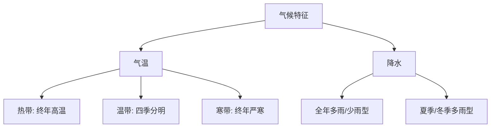

# 第三节 世界地理区域的划分（选学）

标签：#提高 #了解 #综合

## 一、区域划分的依据

世界地理区域划分通常综合考虑**地理位置、自然地理特征、人文地理特征**等因素。

| 划分依据 | 示例 |
|---|---|
| 地理位置 | 东亚、西亚、欧洲西部 |
| 自然特征 | 热带草原气候区、温带大陆性气候区 |
| 人文特征 | 发达国家集中区、佛教文化区 |

## 二、常见世界地理区域

| 区域 | 主要范围 | 突出特征 |
|---|---|---|
| 东亚 | 中国、日本、韩国等 | 季风气候显著、人口稠密 |
| 东南亚 | 中南半岛、马来群岛 | 热带气候、盛产热带经济作物 |
| 南亚 | 印度半岛 | 热带季风气候、人口众多 |
| 西亚和北非 | 阿拉伯半岛、北非 | 干旱气候、石油资源丰富 |
| 撒哈拉以南非洲 | 非洲中南部 | 黑色人种故乡、热带草原广布 |
| 欧洲西部 | 欧洲西半部 | 发达国家集中、温带海洋性气候 |
| 北美 | 美国、加拿大、墨西哥 | 经济发达、地形分三大纵列带 |
| 拉丁美洲 | 墨西哥以南的美洲 | 混血人种多、热带雨林和草原广布 |
| 大洋洲 | 澳大利亚大陆及岛屿 | 独占一块大陆、干旱区广 |
| 南极洲 | 南极大陆 | 酷寒、干燥、烈风 |

## 三、区域比较方法

比较不同区域时，可从以下角度入手：

1. **位置与范围**：纬度位置、海陆位置。
2. **自然环境**：地形、气候、河流、资源。
3. **人文特征**：人口、人种、语言、宗教、经济。

## 四、要点小结

- 区域划分依据多样，可按位置、自然或人文特征划分。
- 掌握各大洲主要区域的名称、位置和突出特征。
- 区域比较要从位置、自然、人文多角度系统分析。

## 五、知识联系

- 区域自然特征离不开[[第一节 气温与降水的分布和变化]]和[[第二节 主要的气候类型]]。
- 区域人文特征与[[第一节 人口和人种]]、[[第二节 语言和宗教]]相通。
- 区域发展水平差异见[[第一节 发展中国家和发达国家]]。

<svg viewBox="0 0 800 320" xmlns="http://www.w3.org/2000/svg" font-family="sans-serif">
  <rect width="800" height="320" fill="#f0fdfa" rx="12"/>
  <text x="400" y="28" text-anchor="middle" font-size="16" font-weight="bold" fill="#134e4a">世界地理区域划分 · 10大区域速记卡</text>
  <!-- 10 region cards in 2 rows of 5 -->
  <!-- Row 1 -->
  <rect x="15" y="48" width="144" height="115" rx="8" fill="#134e4a" stroke="#5eead4" stroke-width="2"/>
  <text x="87" y="75" text-anchor="middle" font-size="13" font-weight="bold" fill="#5eead4">东亚</text>
  <text x="87" y="95" text-anchor="middle" font-size="10" fill="#ccfbf1">中·日·韩·蒙·朝</text>
  <text x="87" y="113" text-anchor="middle" font-size="9" fill="#ccfbf1">季风气候显著</text>
  <text x="87" y="130" text-anchor="middle" font-size="9" fill="#5eead4">人口稠密·经济活跃</text>
  <text x="87" y="153" text-anchor="middle" font-size="16">🗾</text>
  <rect x="170" y="48" width="144" height="115" rx="8" fill="#0f766e" stroke="#5eead4" stroke-width="2"/>
  <text x="242" y="75" text-anchor="middle" font-size="13" font-weight="bold" fill="white">东南亚</text>
  <text x="242" y="95" text-anchor="middle" font-size="10" fill="#ccfbf1">中南半岛+马来群岛</text>
  <text x="242" y="113" text-anchor="middle" font-size="9" fill="#ccfbf1">马六甲海峡★</text>
  <text x="242" y="130" text-anchor="middle" font-size="9" fill="#ccfbf1">热带农业·旅游业</text>
  <text x="242" y="153" text-anchor="middle" font-size="16">🌴</text>
  <rect x="325" y="48" width="144" height="115" rx="8" fill="#0d9488" stroke="#5eead4" stroke-width="2"/>
  <text x="397" y="75" text-anchor="middle" font-size="13" font-weight="bold" fill="white">南亚</text>
  <text x="397" y="95" text-anchor="middle" font-size="10" fill="#ccfbf1">印度半岛·印度为核心</text>
  <text x="397" y="113" text-anchor="middle" font-size="9" fill="#ccfbf1">热带季风气候</text>
  <text x="397" y="130" text-anchor="middle" font-size="9" fill="#ccfbf1">人口众多·农业为主</text>
  <text x="397" y="153" text-anchor="middle" font-size="16">🕌</text>
  <rect x="480" y="48" width="144" height="115" rx="8" fill="#14b8a6" stroke="#0d9488" stroke-width="2"/>
  <text x="552" y="75" text-anchor="middle" font-size="13" font-weight="bold" fill="#134e4a">西亚北非</text>
  <text x="552" y="95" text-anchor="middle" font-size="10" fill="#134e4a">阿拉伯半岛·北非</text>
  <text x="552" y="113" text-anchor="middle" font-size="9" fill="#134e4a">石油宝库★</text>
  <text x="552" y="130" text-anchor="middle" font-size="9" fill="#134e4a">干旱沙漠·伊斯兰</text>
  <text x="552" y="153" text-anchor="middle" font-size="16">🛢️</text>
  <rect x="635" y="48" width="150" height="115" rx="8" fill="#5eead4" stroke="#0d9488" stroke-width="2"/>
  <text x="710" y="75" text-anchor="middle" font-size="13" font-weight="bold" fill="#134e4a">撒哈拉以南非洲</text>
  <text x="710" y="95" text-anchor="middle" font-size="10" fill="#134e4a">非洲中南部</text>
  <text x="710" y="113" text-anchor="middle" font-size="9" fill="#0f766e">黑色人种故乡</text>
  <text x="710" y="130" text-anchor="middle" font-size="9" fill="#0f766e">热带草原广布</text>
  <text x="710" y="153" text-anchor="middle" font-size="16">🐘</text>
  <!-- Row 2 -->
  <rect x="15" y="180" width="144" height="120" rx="8" fill="#dbeafe" stroke="#1d4ed8" stroke-width="2"/>
  <text x="87" y="207" text-anchor="middle" font-size="13" font-weight="bold" fill="#1e40af">欧洲西部</text>
  <text x="87" y="225" text-anchor="middle" font-size="10" fill="#1e40af">发达国家集中</text>
  <text x="87" y="242" text-anchor="middle" font-size="9" fill="#1e40af">温带海洋性气候</text>
  <text x="87" y="258" text-anchor="middle" font-size="9" fill="#1e40af">旅游·乳畜业发达</text>
  <text x="87" y="285" text-anchor="middle" font-size="16">🏰</text>
  <rect x="170" y="180" width="144" height="120" rx="8" fill="#fde68a" stroke="#d97706" stroke-width="2"/>
  <text x="242" y="207" text-anchor="middle" font-size="13" font-weight="bold" fill="#78350f">北美</text>
  <text x="242" y="225" text-anchor="middle" font-size="10" fill="#78350f">美国·加拿大</text>
  <text x="242" y="242" text-anchor="middle" font-size="9" fill="#78350f">世界最发达经济区</text>
  <text x="242" y="258" text-anchor="middle" font-size="9" fill="#78350f">三大地形纵列带</text>
  <text x="242" y="285" text-anchor="middle" font-size="16">🗽</text>
  <rect x="325" y="180" width="144" height="120" rx="8" fill="#bbf7d0" stroke="#22c55e" stroke-width="2"/>
  <text x="397" y="207" text-anchor="middle" font-size="13" font-weight="bold" fill="#14532d">拉丁美洲</text>
  <text x="397" y="225" text-anchor="middle" font-size="10" fill="#14532d">墨西哥以南</text>
  <text x="397" y="242" text-anchor="middle" font-size="9" fill="#14532d">热带雨林·草原</text>
  <text x="397" y="258" text-anchor="middle" font-size="9" fill="#14532d">巴西最大</text>
  <text x="397" y="285" text-anchor="middle" font-size="16">☕</text>
  <rect x="480" y="180" width="144" height="120" rx="8" fill="#ede9fe" stroke="#7c3aed" stroke-width="2"/>
  <text x="552" y="207" text-anchor="middle" font-size="13" font-weight="bold" fill="#4c1d95">大洋洲</text>
  <text x="552" y="225" text-anchor="middle" font-size="10" fill="#4c1d95">澳大利亚为核心</text>
  <text x="552" y="242" text-anchor="middle" font-size="9" fill="#4c1d95">骑羊背·坐矿车</text>
  <text x="552" y="258" text-anchor="middle" font-size="9" fill="#4c1d95">气候带东西向</text>
  <text x="552" y="285" text-anchor="middle" font-size="16">🦘</text>
  <rect x="635" y="180" width="150" height="120" rx="8" fill="#e0f2fe" stroke="#0284c7" stroke-width="2"/>
  <text x="710" y="207" text-anchor="middle" font-size="13" font-weight="bold" fill="#0c4a6e">极地地区</text>
  <text x="710" y="225" text-anchor="middle" font-size="10" fill="#0c4a6e">南极·北极</text>
  <text x="710" y="242" text-anchor="middle" font-size="9" fill="#0c4a6e">北极：北冰洋</text>
  <text x="710" y="258" text-anchor="middle" font-size="9" fill="#0c4a6e">南极：大陆·最冷</text>
  <text x="710" y="285" text-anchor="middle" font-size="16">🐧</text>
</svg>

## 六、自测题

1. 世界地理区域划分主要依据哪些因素？
2. 欧洲西部为什么成为发达国家集中区？
3. 撒哈拉以南非洲主要是什么人种？
4. 澳大利亚大陆最突出的自然特征是什么？

### 气候类型分布与特征

