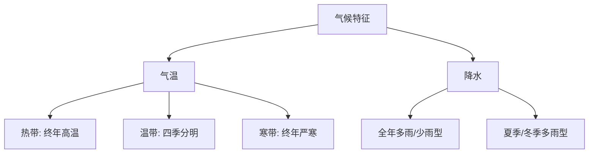

# 第一节 中国地理区域的划分

标签：#中国分区 #区域划分 #地理界线

## 一、本节定位

中图北京版地理八年级下册 **第五章 中国地理区域的划分与地方文化景观 · 第一节**。本节回答"中国为什么要划分区域、依据什么划分、划分出哪些区域"，是学习[[第一节 北方地区]]、[[第二节 南方地区]]、[[第三节 青藏地区]]、[[第四节 西北地区]]的总纲。

## 二、核心概念

| 术语 | 定义 |
|---|---|
| 地理区域 | 依据地理事物的相似性或差异性划分出的空间单元 |
| 自然区域 | 按气候、地形等自然要素划分，如季风区与非季风区 |
| 经济区域 | 按经济发展水平或类型划分，如经济特区 |
| 行政区域 | 按管理需要划分，如省、市、县 |
| 综合区域 | 综合自然与人文要素划分，如四大地理区域 |

## 三、知识梳理

### 1. 区域划分的类型与目的

- 同一地区可以同时属于多种区域（如北京既是行政区，又属北方地区）。
- 区域划分尺度有大有小：大到大洲，小到一个乡村。
- 目的：认识区域差异，因地制宜发展生产、安排生活。

### 2. 四大地理区域及分界线

| 区域 | 分界线 | 主导因素 |
|---|---|---|
| 北方地区与南方地区 | **秦岭—淮河一线** | 气候（气温、降水） |
| 北方地区与西北地区 | **400 毫米年等降水量线**大体一致 | 降水（季风影响） |
| 青藏地区与其他三区 | **昆仑山—祁连山—横断山脉**（地势第一、二级阶梯界线） | 地形地势（海拔） |

### 3. 秦岭—淮河一线的地理意义

- 约为 **1 月 0℃ 等温线**通过的地方。
- 约为 **800 毫米年等降水量线**通过的地方。
- 亚热带与暖温带、湿润区与半湿润区的分界。
- 河流冬季结冰与不结冰、水田与旱地、水稻与小麦的大致分界。

## 四、读图与技能：四大地理区域图判读

1. 先找**秦岭—淮河**，横向分开南北。
2. 再沿 400 毫米等降水量线找到西北地区与北方地区的界线。
3. 沿昆仑山—祁连山—横断山脉圈出青藏地区。
4. 判断某省区归属时，注意跨区域省份（如甘肃跨北方、西北、青藏三区）。

## 五、易混辨析

| 对比项 | 季风区/非季风区 | 四大地理区域 |
|---|---|---|
| 划分依据 | 夏季风能否影响 | 自然与人文综合 |
| 界线 | 大兴安岭—阴山—贺兰山—巴颜喀拉山—冈底斯山 | 秦岭—淮河等三条界线 |
| 区域数量 | 2 个 | 4 个 |

## 六、背记要点

1. 区域类型：自然、经济、行政、综合等，同一地方可属多种区域。
2. 四大地理区域：北方地区、南方地区、西北地区、青藏地区。
3. 北方与南方的界线：秦岭—淮河一线。
4. 北方与西北的界线：大体沿 400 毫米年等降水量线。
5. 青藏地区界线：昆仑山—祁连山—横断山脉，主导因素是地形地势。
6. 秦岭—淮河 ≈ 1 月 0℃ 等温线 ≈ 800 毫米年等降水量线。

## 七、自测小题

1. 我国四大地理区域中，以秦岭—淮河为界的是______地区和______地区。
2. 划分青藏地区的主导因素是（A. 气候 B. 地形地势 C. 河流）。
3. 400 毫米年等降水量线大体是______地区与______地区的分界线。
4. 秦岭—淮河一线大致与 1 月______℃ 等温线、______毫米年等降水量线一致。
5. 判断：一个地区只能属于一种地理区域。（对/错）

**答案**：1. 北方；南方 2. B 3. 北方；西北 4. 0；800 5. 错

相关：[[第二节 自然环境与地方文化景观]] ｜ [[第一节 北方地区]] ｜ [[第四节 西北地区]]

### 气候类型分布与特征

