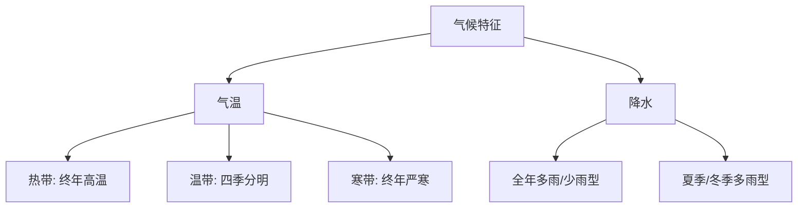

# 第二节 南方地区

标签：#南方地区 #水田农业 #鱼米之乡

## 一、本节定位

中图北京版地理八年级下册 **第六章 · 第二节**。南方地区与[[第一节 北方地区]]隔秦岭—淮河相望，"水田—旱地""水稻—小麦""水乡—旱塬"的南北对比是中考高频考点。

## 二、核心概念

| 术语 | 定义 |
|---|---|
| 南方地区 | 秦岭—淮河以南、青藏高原以东的地区 |
| 水田农业 | 以水稻种植为主、需要蓄水灌溉的耕作方式 |
| 鱼米之乡 | 长江中下游平原河湖密布、盛产稻米和淡水鱼的美称 |
| 红壤 | 南方丘陵广布的酸性土壤，需改良后耕种 |

## 三、知识梳理

### 1. 位置与范围

- 界线：北到**秦岭—淮河**，西依青藏高原，东、南临东海和南海。
- 主要地形区：**长江中下游平原、四川盆地、云贵高原、东南丘陵**。
- 地形特点：平原、盆地、高原、丘陵交错分布。

### 2. 自然环境

- 气候：**亚热带季风气候**为主（南部有热带季风气候），夏季高温多雨、冬季温和少雨。
- 年降水量在 **800 毫米以上**，属湿润区。
- 河流：长江、珠江，水量大、汛期长、冬季**不结冰**，航运价值高。
- 植被：亚热带常绿阔叶林；紫色盆地（四川盆地）、红土地（丘陵）各具特色。

### 3. 农业与生活

- 耕地以**水田**为主，主要作物：水稻、油菜、棉花，一年**两熟到三熟**。
- 经济作物：茶叶、柑橘、甘蔗（热带地区还有橡胶、椰子）。
- 主食以**大米**为主；传统民居屋顶坡度大、墙体高，利于排水散热。
- 水运发达，"南船北马"。

## 四、读图与技能：南北方对照读图

1. 沿秦岭—淮河比较两侧的1月均温（0℃上下）与年降水量（800毫米上下）。
2. 找四大地形区，注意四川盆地被山地环绕的封闭形态。
3. 沿长江干流认识主要港口城市与"鱼米之乡"的位置。
4. 对比南北方河流流量过程线：南方汛期长、流量大。

## 五、易混辨析（南北方对比总表）

| 对比项 | 北方地区 | 南方地区 |
|---|---|---|
| 1月均温 | 低于0℃ | 高于0℃ |
| 年降水量 | 400~800毫米 | 800毫米以上 |
| 耕地/作物 | 旱地/小麦 | 水田/水稻 |
| 熟制 | 一年一熟~两年三熟 | 一年两熟~三熟 |
| 河流冬季 | 结冰 | 不结冰 |
| 传统交通 | 马车 | 船 |

## 六、背记要点

1. 南方地区：秦岭—淮河以南、青藏高原以东，湿润区。
2. 气候：亚热带季风气候为主，雨热同期。
3. 四大地形区：长江中下游平原、四川盆地、云贵高原、东南丘陵。
4. 农业：水田为主，水稻+油菜，一年两熟到三熟。
5. "鱼米之乡"指长江中下游平原。
6. 民居屋顶坡度大——降水多；河流不结冰——冬季温和。

## 七、自测小题

1. 南方地区的耕地类型以______为主，粮食作物以______为主。
2. 被称为"鱼米之乡"的是______平原。
3. 南方地区大部分属于（A. 温带季风 B. 亚热带季风 C. 热带雨林）气候。
4. 四川盆地因土壤颜色被称为"______盆地"。
5. 南方民居屋顶坡度大的主要原因是______多。
6. 判断：南方地区河流冬季普遍结冰。（对/错）

**答案**：1. 水田；水稻 2. 长江中下游 3. B 4. 紫色 5. 降水 6. 错

相关：[[第一节 北方地区]] ｜ [[第三节 青藏地区]] ｜ [[第二节 自然环境与地方文化景观]]

### 气候类型分布与特征

