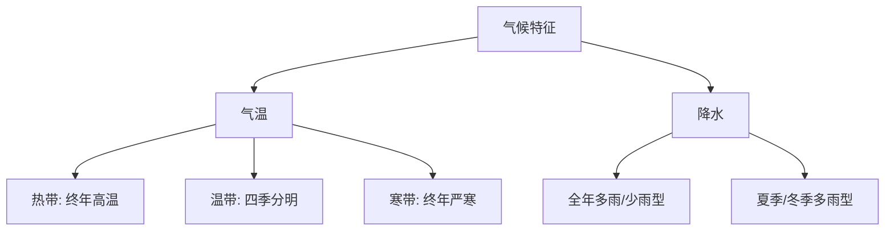

# 第三节 青藏地区

标签：#青藏地区 #高寒 #河谷农业

## 一、本节定位

中图北京版地理八年级下册 **第六章 · 第三节**。青藏地区以"**高寒**"为最突出的自然特征，与[[第四节 西北地区]]的"干旱"并称两大非季风区特征，是理解"自然环境决定生产生活"的典型案例。

## 二、核心概念

| 术语 | 定义 |
|---|---|
| 青藏地区 | 横断山脉以西、昆仑山—祁连山以南的地区，主体是青藏高原 |
| 高寒气候 | 因海拔高而形成的气温低、日照强、昼夜温差大的气候 |
| 河谷农业 | 分布在海拔较低、热量较好的河谷地带的种植业 |
| 高寒牧区 | 以牦牛、藏绵羊等耐寒牲畜为主的放牧区 |

## 三、知识梳理

### 1. 位置与自然环境

- 范围：主要包括西藏、青海和四川西部，平均海拔 **4000 米以上**，号称"世界屋脊"。
- 地形：**远看是山，近看是川**——雪山连绵、冰川广布，高原面起伏和缓。
- 气候特征：**高寒**——气温低、降水较少、空气稀薄、日照强、太阳能丰富。
- 河湖：**三江源**（长江、黄河、澜沧江发源地），被誉为"中华水塔"；青海湖是我国最大湖泊。

### 2. 农牧业

| 类型 | 分布 | 代表 |
|---|---|---|
| 河谷农业 | 雅鲁藏布江谷地、湟水谷地 | 青稞、小麦（穗大粒饱，因日照强、温差大） |
| 高寒牧业 | 高原面广大牧场 | 牦牛（"高原之舟"）、藏绵羊、藏山羊 |

### 3. 生活与交通

- 饮食：**糌粑**（青稞炒面）、酥油茶、牛羊肉。
- 服饰：**藏袍**——适应昼夜温差大。
- 民居：平顶碉房，石墙厚实。
- 交通：**青藏铁路**（西宁—拉萨），世界海拔最高铁路。
- 能源：太阳能、地热能（羊八井）丰富。

<svg viewBox="0 0 820 400" xmlns="http://www.w3.org/2000/svg" font-family="sans-serif">
  <rect width="820" height="400" fill="#f0fdfa" rx="12"/>
  <text x="410" y="28" text-anchor="middle" font-size="17" font-weight="bold" fill="#134e4a">青藏地区 · 高寒特征 + 垂直地带性</text>
  <!-- Left: Tibet map simplified -->
  <rect x="20" y="45" width="370" height="310" rx="8" fill="#dbeafe" stroke="#0d9488" stroke-width="1.5"/>
  <text x="205" y="66" text-anchor="middle" font-size="13" font-weight="bold" fill="#134e4a">青藏高原示意图</text>
  <!-- Plateau outline -->
  <path d="M40,100 L140,75 L270,80 L360,110 L360,280 L280,310 L150,320 L60,300 L35,240 Z" fill="#a5f3fc" stroke="#0d9488" stroke-width="2" opacity="0.7"/>
  <!-- Mountains -->
  <polygon points="60,130 85,90 110,130" fill="#6b7280" stroke="#4b5563" stroke-width="1.5"/>
  <text x="85" y="142" text-anchor="middle" font-size="9" fill="#1f2937">昆仑山</text>
  <polygon points="230,80 260,48 290,80" fill="#6b7280" stroke="#4b5563" stroke-width="2"/>
  <text x="260" y="42" text-anchor="middle" font-size="10" font-weight="bold" fill="#dc2626">喜马拉雅山</text>
  <text x="260" y="92" text-anchor="middle" font-size="9" fill="#dc2626">珠峰 8848.86m</text>
  <!-- Rivers -->
  <path d="M100,200 Q150,210 200,240 Q240,265 280,280" fill="none" stroke="#1d4ed8" stroke-width="2"/>
  <text x="200" y="258" text-anchor="middle" font-size="9" fill="#1d4ed8">雅鲁藏布江</text>
  <!-- Lakes -->
  <ellipse cx="190" cy="175" rx="25" ry="15" fill="#60a5fa" opacity="0.7"/>
  <text x="190" y="162" text-anchor="middle" font-size="9" fill="#1e3a8a">青海湖</text>
  <!-- Qinghai-Tibet Railway -->
  <path d="M50,270 Q150,260 280,265 Q330,268 360,280" fill="none" stroke="#dc2626" stroke-width="2.5" stroke-dasharray="8,4"/>
  <text x="200" y="290" text-anchor="middle" font-size="9" fill="#dc2626" font-weight="bold">青藏铁路（西宁→拉萨）</text>
  <!-- Cities -->
  <circle cx="280" cy="220" r="6" fill="#dc2626" stroke="white" stroke-width="1.5"/>
  <text x="305" y="218" text-anchor="start" font-size="9" fill="#dc2626">拉萨★</text>
  <!-- N arrow -->
  <polygon points="50,60 44,80 50,73 56,80" fill="#134e4a"/>
  <text x="50" y="54" text-anchor="middle" font-size="12" font-weight="bold" fill="#134e4a">N</text>
  <!-- Right: Vertical zonation + key features -->
  <rect x="408" y="45" width="395" height="150" rx="8" fill="white" stroke="#0d9488" stroke-width="1.5"/>
  <text x="606" y="68" text-anchor="middle" font-size="13" font-weight="bold" fill="#134e4a">高山垂直地带性</text>
  <!-- Mountain profile -->
  <polygon points="605,185 450,135 760,135" fill="none" stroke="#6b7280" stroke-width="2"/>
  <!-- Snow line -->
  <line x1="505" y1="135" x2="700" y2="135" stroke="white" stroke-width="3"/>
  <text x="606" y="130" text-anchor="middle" font-size="9" fill="#0284c7">雪线（冰雪）</text>
  <!-- Alpine meadow -->
  <line x1="510" y1="148" x2="700" y2="148" stroke="#a7f3d0" stroke-width="6"/>
  <text x="770" y="152" text-anchor="start" font-size="9" fill="#059669">高山草甸</text>
  <!-- Forest belt -->
  <line x1="520" y1="162" x2="690" y2="162" stroke="#22c55e" stroke-width="6"/>
  <text x="770" y="166" text-anchor="start" font-size="9" fill="#15803d">针叶林带</text>
  <!-- Shrub -->
  <line x1="535" y1="174" x2="672" y2="174" stroke="#86efac" stroke-width="6"/>
  <text x="770" y="178" text-anchor="start" font-size="9" fill="#166534">灌木丛</text>
  <!-- Farmland -->
  <line x1="545" y1="186" x2="662" y2="186" stroke="#fcd34d" stroke-width="6"/>
  <text x="770" y="190" text-anchor="start" font-size="9" fill="#92400e">农田（河谷）</text>
  <!-- Key features cards -->
  <rect x="408" y="208" width="185" height="145" rx="8" fill="#ccfbf1" stroke="#0d9488" stroke-width="1.5"/>
  <text x="500" y="230" text-anchor="middle" font-size="12" font-weight="bold" fill="#134e4a">高寒特征记忆</text>
  <text x="500" y="252" text-anchor="middle" font-size="11" fill="#0d9488">🌬️ 气温低·空气稀薄</text>
  <text x="500" y="270" text-anchor="middle" font-size="11" fill="#0d9488">☀️ 日照强·太阳能丰富</text>
  <text x="500" y="288" text-anchor="middle" font-size="11" fill="#0d9488">🌡️ 昼夜温差大</text>
  <text x="500" y="308" text-anchor="middle" font-size="11" fill="#dc2626">→糌粑·酥油茶</text>
  <text x="500" y="325" text-anchor="middle" font-size="11" fill="#dc2626">→藏袍·平顶碉房</text>
  <text x="500" y="342" text-anchor="middle" font-size="11" fill="#dc2626">→牦牛 = "高原之舟"</text>
  <rect x="604" y="208" width="200" height="145" rx="8" fill="#fef3c7" stroke="#f59e0b" stroke-width="1.5"/>
  <text x="704" y="230" text-anchor="middle" font-size="12" font-weight="bold" fill="#92400e">河谷农业</text>
  <text x="704" y="252" text-anchor="middle" font-size="11" fill="#78350f">雅鲁藏布江谷地</text>
  <text x="704" y="270" text-anchor="middle" font-size="11" fill="#78350f">湟水谷地</text>
  <text x="704" y="290" text-anchor="middle" font-size="10" fill="#78350f">海拔低→气温较高</text>
  <text x="704" y="308" text-anchor="middle" font-size="11" fill="#dc2626">青稞·小麦</text>
  <text x="704" y="325" text-anchor="middle" font-size="10" fill="#78350f">粒大饱满</text>
  <text x="704" y="342" text-anchor="middle" font-size="10" fill="#78350f">（日照强·温差大）</text>
  <!-- Bottom: Three rivers source -->
  <rect x="20" y="363" width="780" height="30" rx="6" fill="#134e4a" stroke="#5eead4" stroke-width="1.5"/>
  <text x="410" y="383" text-anchor="middle" font-size="12" fill="#ccfbf1">三江源：长江·黄河·澜沧江（湄公河）→ 中华水塔 | 青海湖 = 中国最大湖泊</text>
</svg>

## 四、读图与技能：青藏地区图判读

1. 沿昆仑山—祁连山—横断山脉描出区域边界。
2. 找三江源位置（青海南部），理解"中华水塔"。
3. 找两大河谷农业区：雅鲁藏布江谷地、湟水谷地。
4. 沿青藏铁路认识西宁、格尔木、拉萨等城市。

## 五、易混辨析

| 对比项 | 青藏地区 | 西北地区 |
|---|---|---|
| 突出特征 | 高寒（海拔高） | 干旱（离海远） |
| 农业类型 | 河谷农业 | 灌溉农业 |
| 代表牲畜 | 牦牛 | 三河马、三河牛、细毛羊 |
| 主要制约 | 热量不足 | 水源不足 |

## 六、背记要点

1. 青藏地区自然特征一个词：**高寒**；主导因素：地形地势（海拔）。
2. 平均海拔 4000 米以上，"世界屋脊""远看是山，近看是川"。
3. 三江源=长江+黄河+澜沧江源头，"中华水塔"。
4. 河谷农业两谷地：雅鲁藏布江谷地、湟水谷地；作物青稞。
5. 牦牛是"高原之舟"；糌粑、酥油茶、藏袍。
6. 青藏铁路是世界上海拔最高的铁路。

## 七、自测小题

1. 青藏地区最突出的自然特征是______。
2. 被称为"中华水塔"的地区是______。
3. 青藏地区的主要粮食作物是（A. 水稻 B. 青稞 C. 玉米）。
4. "高原之舟"指的是______。
5. 青藏地区的种植业主要分布在______地带，原因是这里海拔较低、______较充足。
6. 判断：青藏地区降水丰富，所以农业发达。（对/错）

**答案**：1. 高寒 2. 三江源 3. B 4. 牦牛 5. 河谷；热量 6. 错

相关：[[第四节 西北地区]] ｜ [[第一节 中国地理区域的划分]] ｜ [[第二节 自然环境与地方文化景观]]

### 气候类型分布与特征

