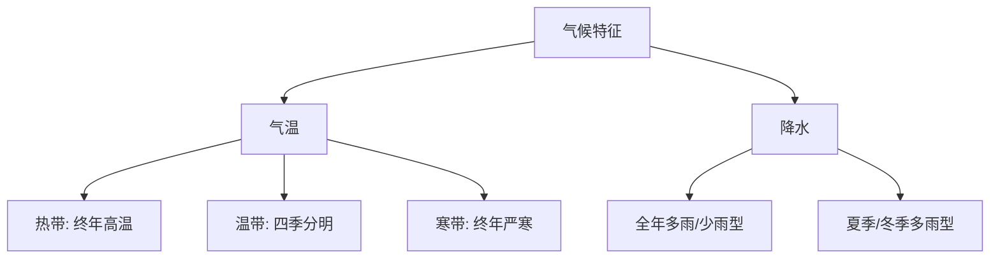

# 第四节 西北地区

标签：#西北地区 #干旱 #绿洲农业

## 一、本节定位

中图北京版地理八年级下册 **第六章 · 第四节**。西北地区以"**干旱**"为最突出的自然特征，与[[第三节 青藏地区]]的"高寒"相对照；其自东向西的景观变化是"降水递减规律"的活教材。

## 二、核心概念

| 术语 | 定义 |
|---|---|
| 西北地区 | 大兴安岭以西、长城—昆仑山—阿尔金山以北的地区 |
| 干旱 | 深居内陆、距海遥远、降水稀少的气候特征 |
| 绿洲 | 干旱区中因高山冰雪融水或地下水滋润而水草丰美的地方 |
| 坎儿井 | 新疆利用地下暗渠引冰雪融水灌溉的古老水利工程 |
| 灌溉农业 | 依靠河水、冰雪融水等人工引水维持的农业 |

## 三、知识梳理

### 1. 位置与自然环境

- 范围：主要包括内蒙古、新疆、宁夏和甘肃大部。
- 地形：**内蒙古高原**东部坦荡开阔；新疆"**三山夹两盆**"——阿尔泰山、天山、昆仑山夹准噶尔盆地、塔里木盆地。
- 气候：温带大陆性气候，冬冷夏热、降水稀少（多在 400 毫米以下）。
- 景观自东向西：**草原 → 荒漠草原 → 荒漠**（因距海越来越远、降水递减）。
- 河流：多内流河，**塔里木河**是我国最大内流河；水源主要靠冰雪融水。

### 2. 农牧业

| 类型 | 分布 | 代表 |
|---|---|---|
| 草原牧场 | 内蒙古高原 | 三河马、三河牛 |
| 山地牧场 | 新疆天山等 | 细毛羊 |
| 灌溉农业 | 河套平原、宁夏平原（"塞外江南"） | 小麦、水稻 |
| 绿洲农业 | 新疆盆地边缘绿洲 | 棉花、葡萄、哈密瓜 |

- 瓜果特别甜的原因：**日照充足、昼夜温差大**，利于糖分积累。

### 3. 生活与发展

- 民居：蒙古包（游牧）；晾房（吐鲁番晾葡萄干）。
- 能源：石油、天然气丰富，**西气东输**从塔里木盆地输往东部。
- 生态问题：过度放牧、过度开垦导致**土地荒漠化**，需退耕还林还草。

<svg viewBox="0 0 840 380" xmlns="http://www.w3.org/2000/svg" font-family="sans-serif">
  <rect width="840" height="380" fill="#fffbeb" rx="14"/>
  <text x="420" y="30" text-anchor="middle" font-size="17" font-weight="bold" fill="#92400e">🏜️ 西北地区 · 干旱是灵魂，牢记这张图！</text>
  <!-- Top strip: landscape gradient -->
  <rect x="20" y="42" width="800" height="56" rx="8" fill="#d1fae5" stroke="#059669" stroke-width="1.5"/>
  <text x="70" y="60" text-anchor="middle" font-size="11" fill="#065f46" font-weight="bold">草原</text>
  <text x="70" y="76" text-anchor="middle" font-size="10" fill="#065f46">🌿🌿🌿</text>
  <line x1="135" y1="45" x2="135" y2="95" stroke="#aaa" stroke-width="1" stroke-dasharray="4,3"/>
  <rect x="140" y="42" width="160" height="56" rx="0" fill="#fef9c3" stroke="none"/>
  <text x="220" y="60" text-anchor="middle" font-size="11" fill="#92400e" font-weight="bold">荒漠草原</text>
  <text x="220" y="76" text-anchor="middle" font-size="10" fill="#92400e">🌾🌾·</text>
  <line x1="305" y1="45" x2="305" y2="95" stroke="#aaa" stroke-width="1" stroke-dasharray="4,3"/>
  <rect x="310" y="42" width="510" height="56" rx="0" fill="#fde68a" stroke="none"/>
  <text x="560" y="60" text-anchor="middle" font-size="11" fill="#92400e" font-weight="bold">荒漠（最广）</text>
  <text x="560" y="76" text-anchor="middle" font-size="10" fill="#92400e">🏜️🏜️🏜️🏜️🏜️</text>
  <rect x="20" y="98" width="800" height="18" rx="0" fill="none"/>
  <text x="420" y="108" text-anchor="middle" font-size="11" fill="#7c3aed">← 从东向西：离海越来越远，降水越来越少，景观越来越干旱 →</text>
  <!-- Three columns: cards -->
  <!-- Col 1: 地形"三山夹两盆" -->
  <rect x="20" y="125" width="255" height="218" rx="10" fill="white" stroke="#0d9488" stroke-width="2"/>
  <rect x="20" y="125" width="255" height="36" rx="10" fill="#0d9488"/>
  <text x="147" y="148" text-anchor="middle" font-size="13" fill="white" font-weight="bold">🏔️ 新疆地形口诀</text>
  <text x="147" y="182" text-anchor="middle" font-size="16" font-weight="bold" fill="#dc2626">三山夹两盆</text>
  <text x="147" y="208" text-anchor="middle" font-size="11" fill="#374151">阿尔泰山（北）</text>
  <text x="147" y="228" text-anchor="middle" font-size="11" fill="#374151">↕ 准噶尔盆地</text>
  <text x="147" y="248" text-anchor="middle" font-size="11" fill="#374151">天山（中）</text>
  <text x="147" y="268" text-anchor="middle" font-size="11" fill="#374151">↕ 塔里木盆地</text>
  <text x="147" y="288" text-anchor="middle" font-size="11" fill="#374151">昆仑山（南）</text>
  <text x="147" y="312" text-anchor="middle" font-size="11" fill="#059669">塔里木河 = 最大内流河</text>
  <!-- Col 2: 农牧业 -->
  <rect x="292" y="125" width="255" height="218" rx="10" fill="white" stroke="#f59e0b" stroke-width="2"/>
  <rect x="292" y="125" width="255" height="36" rx="10" fill="#f59e0b"/>
  <text x="419" y="148" text-anchor="middle" font-size="13" fill="white" font-weight="bold">🐑 农牧业分布</text>
  <rect x="305" y="170" width="230" height="40" rx="6" fill="#d1fae5"/>
  <text x="420" y="187" text-anchor="middle" font-size="11" fill="#065f46" font-weight="bold">草原牧场（内蒙古高原）</text>
  <text x="420" y="202" text-anchor="middle" font-size="10" fill="#065f46">→ 三河马·三河牛</text>
  <rect x="305" y="218" width="230" height="40" rx="6" fill="#fef3c7"/>
  <text x="420" y="235" text-anchor="middle" font-size="11" fill="#92400e" font-weight="bold">灌溉农业（河套·宁夏平原）</text>
  <text x="420" y="250" text-anchor="middle" font-size="10" fill="#92400e">→ "塞外江南" 小麦·水稻</text>
  <rect x="305" y="265" width="230" height="65" rx="6" fill="#fce7f3"/>
  <text x="420" y="282" text-anchor="middle" font-size="11" fill="#9d174d" font-weight="bold">绿洲农业（新疆盆地边缘）</text>
  <text x="420" y="298" text-anchor="middle" font-size="11" fill="#9d174d">棉花·葡萄·哈密瓜</text>
  <text x="420" y="315" text-anchor="middle" font-size="10" fill="#dc2626">甜！→ 日照足·温差大→糖分多</text>
  <!-- Col 3: 坎儿井 + 西气东输 -->
  <rect x="564" y="125" width="256" height="218" rx="10" fill="white" stroke="#8b5cf6" stroke-width="2"/>
  <rect x="564" y="125" width="256" height="36" rx="10" fill="#8b5cf6"/>
  <text x="692" y="148" text-anchor="middle" font-size="13" fill="white" font-weight="bold">💧 坎儿井 + 西气东输</text>
  <!-- Karez diagram -->
  <text x="692" y="177" text-anchor="middle" font-size="11" fill="#374151" font-weight="bold">坎儿井（地下暗渠）</text>
  <path d="M580,185 Q620,195 660,185 Q700,175 740,185 Q760,192 800,190" fill="none" stroke="#60a5fa" stroke-width="2" stroke-dasharray="6,3"/>
  <path d="M580,195 L800,195" fill="none" stroke="#3b82f6" stroke-width="2"/>
  <text x="692" y="213" text-anchor="middle" font-size="10" fill="#1d4ed8">高山冰雪融水 → 地下引水</text>
  <text x="692" y="228" text-anchor="middle" font-size="10" fill="#1d4ed8">防蒸发·防沙埋</text>
  <line x1="575" y1="240" x2="808" y2="240" stroke="#e5e7eb" stroke-width="1.5"/>
  <text x="692" y="262" text-anchor="middle" font-size="11" fill="#374151" font-weight="bold">西气东输</text>
  <rect x="580" y="270" width="235" height="32" rx="6" fill="#ede9fe"/>
  <text x="692" y="283" text-anchor="middle" font-size="11" fill="#5b21b6">塔里木盆地（天然气）</text>
  <text x="692" y="298" text-anchor="middle" font-size="10" fill="#7c3aed">→ 管道 → 东部城市</text>
  <text x="692" y="320" text-anchor="middle" font-size="10" fill="#dc2626">⚠️ 生态问题：荒漠化</text>
  <!-- Bottom banner -->
  <rect x="20" y="350" width="800" height="24" rx="6" fill="#134e4a"/>
  <text x="420" y="366" text-anchor="middle" font-size="12" fill="#ccfbf1">干旱口诀：深居内陆 → 水汽少 → 草原→荒漠草原→荒漠（东→西）</text>
</svg>

## 四、读图与技能：西北地区图判读

1. 描出"三山夹两盆"轮廓，记住天山居中。
2. 沿自东向西方向观察草原—荒漠草原—荒漠的景观带变化。
3. 找塔里木河与塔克拉玛干沙漠的位置关系。
4. 找河套平原、宁夏平原在黄河沿岸的位置。

## 五、易混辨析

| 对比项 | 绿洲农业 | 灌溉农业（宁夏、河套） |
|---|---|---|
| 水源 | 高山冰雪融水、地下水（坎儿井） | 黄河水 |
| 分布 | 新疆盆地边缘 | 黄河沿岸平原 |
| 代表作物 | 棉花、瓜果 | 小麦、水稻 |

## 六、背记要点

1. 西北地区自然特征一个词：**干旱**；成因：深居内陆、距海遥远。
2. 新疆地形"三山夹两盆"。
3. 景观自东向西：草原→荒漠草原→荒漠。
4. 塔里木河是我国最大内流河，水源来自冰雪融水。
5. 宁夏平原、河套平原被称为"塞外江南"。
6. 瓜果甜的原因：光照强+昼夜温差大；坎儿井引冰雪融水。

## 七、自测小题

1. 西北地区最突出的自然特征是______，主要原因是______。
2. 新疆的地形特点可概括为"______"。
3. 我国最大的内流河是（A. 黄河 B. 塔里木河 C. 黑河）。
4. 被称为"塞外江南"的是______平原和______平原。
5. 新疆瓜果特别甜，主要因为日照充足、______大。
6. 判断：西北地区的河流大多为外流河。（对/错）

**答案**：1. 干旱；深居内陆、距海遥远 2. 三山夹两盆 3. B 4. 宁夏；河套 5. 昼夜温差 6. 错

相关：[[第三节 青藏地区]] ｜ [[第一节 北方地区]] ｜ [[第一节 践行绿色发展理念]]

### 气候类型分布与特征

