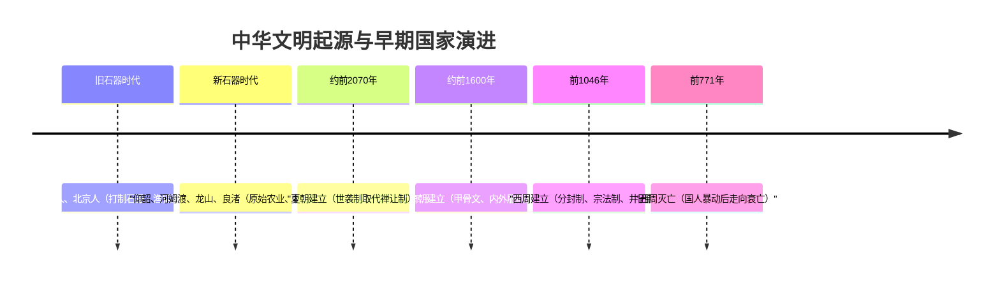

# 第1课 中华文明的起源与早期国家

## 时空坐标

- 约170万年前：元谋人（已知最早的中国境内古人类）
- 约70万-20万年前：北京人（会使用天然火）
- 约7000-5000年前：仰韶文化（彩陶、粟）、河姆渡文化（水稻、干栏式建筑）
- 约5000年前：龙山文化（黑陶）、红山文化、良渚文化（玉器、祭坛）
- 约公元前2070年：禹建立夏朝
- 约公元前1600年：汤建立商朝
- 公元前1046年：武王伐纣，西周建立
- 公元前771年：犬戎攻破镐京，西周灭亡

## 知识梳理

| 比较项 | 商朝 | 西周 |
| --- | --- | --- |
| 管理制度 | 内外服制（间接松散） | 分封制+宗法制（等级严密） |
| 王权特点 | 神权色彩浓厚（占卜） | "天命"观念，家国同构 |
| 文字史料 | 甲骨文、青铜铭文 | 青铜铭文（金文） |
| 土地制度 | 奴隶主土地国有 | 井田制（"普天之下，莫非王土"） |

## 重点精讲

1. **中华文明起源的特点**：多元一体、中原核心。新石器文化遗存星罗棋布（多元），后逐渐向中原汇聚（一体），良渚、陶寺等已具备早期国家形态（私有制、阶级分化、公共权力）。
2. **分封制与宗法制的关系**（高考高频）：分封制是权力分配制度（"封建亲戚，以蕃屏周"），宗法制是权力继承制度（嫡长子继承制为核心），二者互为表里；分封制是宗法制在政治上的体现，宗法制是分封制的血缘纽带。礼乐制度则是维护等级秩序的工具。
3. **早期国家的政治特点**：以血缘为纽带、家国一体；神权与王权结合；最高统治集团尚未实现权力的高度集中（与秦以后中央集权对比是高考常考角度）。

## 典型例题

**例1（选择题）** 西周分封制下，受封诸侯对周天子承担的义务不包括（　）
A. 镇守疆土　B. 随从作战　C. 缴纳赋税、朝觐述职　D. 直接任免天子朝中官员
**解析**：分封制下诸侯义务为镇守疆土、随从作战、交纳贡赋、朝觐述职，诸侯无权干预天子朝政。选 **D**。

**例2（材料题）** 材料："大道之行也，天下为公，选贤与能……今大道既隐，天下为家。"——《礼记·礼运》
问：材料反映了什么制度变化？有何影响？
**解析**：反映禹传子启，王位世袭制取代禅让制，"公天下"变为"家天下"。影响：私有制和阶级社会发展的必然结果，标志着中国早期国家的形成与发展，此后世袭制为历代王朝沿用。

## 易错点

- 误认为夏朝已有确切文字记载：目前甲骨文只能证实**商朝**信史地位，夏朝主要靠二里头遗址等考古佐证。
- 混淆内外服制与分封制：内外服是商对方国的间接控制；分封制通过血缘亲戚层层分封，控制更严密。
- "多元一体"不等于各地文明同时同步发展，而是多源起、渐融合。

## 背记要点

1. 中华文明起源特点：多元一体，中原核心
2. 约前2070年禹建夏，世袭制取代禅让制
3. 商朝：甲骨文（成熟文字）、内外服制、神权色彩
4. 西周三大制度：分封制、宗法制（嫡长子继承）、井田制
5. 早期国家特点：血缘政治、神权与王权结合、尚未高度集权

## 自测题

1. 简述中华文明起源"多元一体"的表现。
2. 分封制与宗法制是什么关系？各自核心内容是什么？
3. 商朝的内外服制与西周分封制有何不同？
4. 中国早期国家的政治制度有哪些主要特点？

## 相关知识点

分封制的瓦解与变法兴起见 [[第2课 诸侯纷争与变法运动]]；血缘政治向官僚政治的转变见 [[第3课 秦统一多民族封建国家的建立]]。
