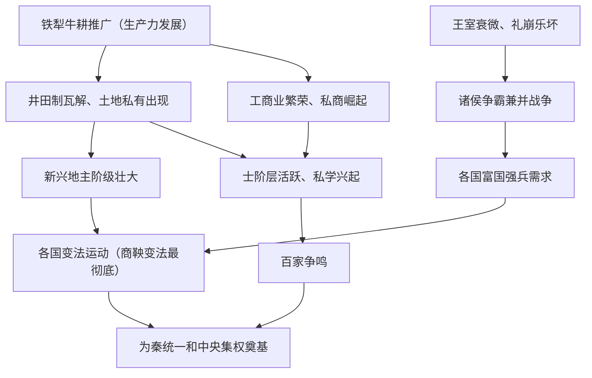

# 第2课 诸侯纷争与变法运动

## 时空坐标

- 公元前770年：周平王东迁洛邑，东周开始（春秋：前770-前476；战国：前475-前221）
- 春秋：齐桓公、晋文公等"春秋五霸"相继称霸
- 战国：三家分晋、田氏代齐后形成"战国七雄"
- 公元前356年起：商鞅在秦国两次变法
- 春秋晚期：孔子、老子创立儒家、道家
- 战国：百家争鸣局面形成

## 知识梳理

| 学派 | 代表 | 核心主张 |
| --- | --- | --- |
| 儒家 | 孔子、孟子、荀子 | 仁、礼；仁政、民贵君轻；隆礼重法 |
| 道家 | 老子、庄子 | 道法自然、无为而治、朴素辩证法 |
| 法家 | 韩非 | 以法治国、中央集权（顺应统一趋势） |
| 墨家 | 墨子 | 兼爱、非攻、尚贤、节用（下层平民立场） |

## 重点精讲

1. **社会转型的根本动力**（高考核心逻辑）：铁犁牛耕→生产力发展→井田制瓦解、土地私有→阶级关系变动（新兴地主崛起）→上层建筑变革（变法运动）→思想解放（百家争鸣）。这是"经济基础决定上层建筑"的典型链条。
2. **商鞅变法内容**（高频考点）：经济上"废井田、开阡陌"，重农抑商、奖励耕织；政治上普遍推行**县制**、什伍连坐；军事上奖励军功、剥夺限制贵族特权（废世卿世禄）。意义：顺应历史潮流，使秦国国富兵强，为统一奠定基础；县制开官僚政治先河。
3. **华夏认同**：春秋战国民族交往交流交融加强，戎狄蛮夷逐渐融入华夏族，华夏族更加稳定、分布更广泛。

## 典型例题

**例1（选择题）** 商鞅变法措施中，对旧贵族打击最直接的是（　）
A. 重农抑商　B. 奖励军功、废除世卿世禄　C. 什伍连坐　D. 统一度量衡
**解析**：世卿世禄使贵族凭血缘世袭爵禄，奖励军功以战功授爵，直接剥夺旧贵族特权。选 **B**。

**例2（材料题）** 材料："为田开阡陌封疆，而赋税平……有军功者，各以率受上爵。"——《史记·商君列传》
问：概括材料中的变法措施，并分析其对秦国社会结构的影响。
**解析**：措施：废井田、承认土地私有、按亩纳税；奖励军功、按军功授爵。影响：确立封建土地私有制，新兴地主阶级政治经济地位上升；打破血缘贵族垄断，形成军功地主阶层，社会由贵族政治向官僚政治过渡。

## 易错点

- 百家争鸣的根本原因是**社会大变革（生产力发展）**，不是私学兴起（私学只是直接条件）。
- 商鞅虽死，"商君之法"未废——人亡政未息。
- 春秋争霸与战国兼并性质不同：前者尊王攘夷式争霸，后者以灭国统一为目标。
- 孔子的"仁"与孟子的"仁政"层次不同：前者是伦理观念，后者是治国方略。

## 背记要点

1. 春秋战国总特征：大动荡、大变革、大发展、大交融
2. 经济：铁犁牛耕出现并推广，井田制瓦解
3. 商鞅变法：废井田、奖军功、行县制、重农抑商（最彻底）
4. 百家争鸣是中国历史上第一次思想解放运动
5. 法家思想顺应了建立中央集权、走向统一的时代潮流

## 自测题

1. 用因果链说明春秋战国经济变动如何引发变法运动。
2. 列举商鞅变法的政治、经济、军事措施各一项。
3. 儒、法、道三家治国主张有何不同？哪家最受当时君主青睐？为什么？
4. 什么是"华夏认同"？它在春秋战国有何表现？

## 相关知识点

早期国家制度背景见 [[第1课 中华文明的起源与早期国家]]；县制到郡县制的发展见 [[第3课 秦统一多民族封建国家的建立]]。
