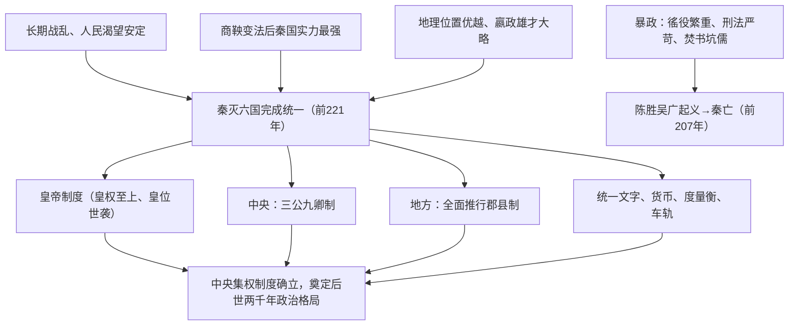

# 第3课 秦统一多民族封建国家的建立

## 时空坐标

- 公元前230-前221年：秦先后灭韩、赵、魏、楚、燕、齐
- 公元前221年：秦统一，嬴政称"始皇帝"
- 统一后：北击匈奴、筑长城，南征百越、设三郡
- 公元前209年：陈胜、吴广大泽乡起义
- 公元前207年：刘邦入关，秦朝灭亡
- 前206-前202年：楚汉战争，刘邦胜出

## 知识梳理

| 比较项 | 分封制 | 郡县制 |
| --- | --- | --- |
| 基础 | 血缘关系 | 地域关系 |
| 官员产生 | 世袭 | 皇帝任免、不得世袭 |
| 与中央关系 | 诸侯国相对独立 | 中央垂直管理地方 |
| 政治形态 | 贵族政治 | 官僚政治 |
| 影响 | 后期割据混战 | 加强中央集权，利于统一 |

## 重点精讲

1. **秦中央集权制度三层结构**（高考核心）：皇帝制度（权力顶端）—三公九卿（中央，丞相、太尉、御史大夫分掌行政、军事、监察）—郡县制（地方）。特点：皇权至上，家国同治（九卿多管皇家事务），中央垂直管理地方。
2. **郡县制的意义**：官僚政治取代贵族政治的重要标志；实现了中央对地方的直接有效控制；是秦"废分封、行郡县"的历史选择，被后世长期沿用。
3. **秦统一的历史意义**：建立第一个统一多民族封建国家；奠定历代疆域基本版图；统一的文字、货币、度量衡促进各地经济文化交流；"大一统"成为中国历史主流意识。
4. **秦速亡原因**：暴政（根本），即赋役沉重、法律严苛、思想专制，激化阶级矛盾。

## 典型例题

**例1（选择题）** "秦之所以革之者，其为制，公之大者也……公天下之端自秦始。"柳宗元此语肯定的是（　）
A. 皇帝制度　B. 三公九卿制　C. 郡县制　D. 焚书坑儒
**解析**：柳宗元《封建论》认为郡县制官员由皇帝任免、不世袭，打破贵族垄断，是"公天下"的开端。选 **C**。

**例2（材料题）** 材料："天下之事无小大皆决于上……丞相诸大臣皆受成事，倚办于上。"——《史记·秦始皇本纪》
问：材料反映秦朝政治制度的什么特点？结合所学分析其影响。
**解析**：特点：皇权至上、皇帝独裁，大臣仅承旨办事。影响：积极——政令统一，效率提高，巩固统一多民族国家；消极——皇帝个人素质决定国家命运，暴政缺乏制约，成为秦速亡的制度因素。

## 易错点

- 郡县制并非秦首创（春秋战国已有县、郡），秦的贡献是**在全国范围全面推行**。
- 秦亡的根本原因是暴政，而非郡县制本身；汉初部分人归罪郡县属误读。
- "焚书坑儒"打击的重点是儒生和私学，医药、卜筮、种树之书不在焚毁之列。
- 皇帝制度的特征：皇帝独尊、皇权至上（核心）、皇位世袭。

## 背记要点

1. 前221年秦统一，建立第一个统一多民族封建国家
2. 皇帝制度核心：皇权至上
3. 中央三公：丞相（行政）、太尉（军事）、御史大夫（监察）
4. 郡县制：官僚政治取代贵族政治的标志
5. 秦亡于暴政；陈胜吴广起义是中国历史上第一次农民大起义

## 自测题

1. 从制度、经济、军事三方面概括秦巩固统一的措施。
2. 比较分封制与郡县制的三点不同。
3. 三公的职责分工是什么？体现了怎样的设计意图？
4. 分析秦朝速亡的原因及其历史教训。

## 相关知识点

变法奠基见 [[第2课 诸侯纷争与变法运动]]；汉承秦制与郡国并行的调整见 [[第4课 西汉与东汉——统一多民族封建国家的巩固]]。
