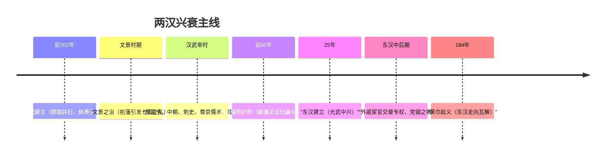

# 第4课 西汉与东汉——统一多民族封建国家的巩固

## 时空坐标

- 公元前202年：刘邦建立西汉，定都长安
- 汉初：休养生息，"文景之治"
- 公元前154年：七国之乱（王国问题激化）
- 汉武帝时期（前141-前87年在位）：推恩令、尊崇儒术、盐铁官营、张骞通西域
- 公元前60年：设西域都护府
- 公元9年：王莽代汉建新；25年刘秀建立东汉，"光武中兴"
- 184年：黄巾起义，东汉名存实亡

## 知识梳理

| 领域 | 汉武帝巩固措施 | 作用 |
| --- | --- | --- |
| 政治 | 推恩令、设中朝、置刺史、任酷吏 | 削弱王国与相权，监察地方 |
| 经济 | 改铸五铢钱、盐铁官营、均输平准、抑制工商 | 加强经济集权，增加财政 |
| 思想 | 接受董仲舒建议，尊崇儒术，设太学 | 儒学成为主流意识形态 |
| 边疆 | 卫青霍去病击匈奴、张骞通西域、设河西四郡 | 开拓疆域，丝绸之路开通 |

## 重点精讲

1. **推恩令**（高考高频）：允许诸侯王把封地分给子弟建立侯国，侯国归郡管辖。妙处在于不动兵戈、以"施德惠"之名使王国越分越小，"众建诸侯而少其力"，和平解决了汉初郡国并行遗留的王国问题。
2. **汉承秦制、有所损益**：继承皇帝制度、三公九卿、郡县制；调整为郡国并行（酿成七国之乱）、以黄老无为代秦苛政；武帝时再度强化集权。体现制度的继承与创新逻辑。
3. **尊崇儒术**：董仲舒糅合诸家提出"大一统""天人感应"；儒学从此确立正统地位，思想统一服务于政治统一。
4. **东汉衰亡因果链**：皇帝幼弱→外戚宦官交替专权→政治黑暗、土地兼并→豪强坐大＋黄巾起义→州牧割据→军阀混战。

## 典型例题

**例1（选择题）** 汉武帝解决王国问题的措施中，最具"不战而屈人之兵"智慧的是（　）
A. 平定七国之乱　B. 颁布推恩令　C. 设置刺史　D. 盐铁官营
**解析**：推恩令以恩惠形式让诸侯自行分割封地，兵不血刃削弱王国。七国之乱为景帝时武力平叛。选 **B**。

**例2（材料题）** 材料："《春秋》大一统者，天地之常经，古今之通谊也……诸不在六艺之科孔子之术者，皆绝其道，勿使并进。"——《汉书·董仲舒传》
问：概括董仲舒的主张，并说明汉武帝采纳该主张的原因和影响。
**解析**：主张：尊崇儒术、罢黜百家，以思想统一维护政治大一统。原因：汉初无为而治已不适应加强集权、反击匈奴的需要，儒学经改造后适应了君主专制和大一统需求。影响：儒学成为封建社会主流意识形态，设太学推动儒学教育官方化，但也禁锢了思想多样性。

## 易错点

- "郡国并行"是汉初制度，不是汉武帝所创；武帝是通过推恩令**解决**其弊端。
- 刺史品级低但代表中央监察高官，"以卑临尊"，不是地方行政官（东汉末州牧才成行政长官）。
- 尊崇儒术的儒学是经董仲舒改造、掺入阴阳法家思想的**新儒学**，非孔孟原貌。
- 西域都护府设立于**汉宣帝**时（前60年），不是汉武帝时期。

## 背记要点

1. 汉初：郡国并行＋黄老无为→文景之治
2. 推恩令：和平削藩，众建诸侯而少其力
3. 中朝（内朝）削弱相权；刺史监察地方（13州部）
4. 尊崇儒术：儒学确立正统地位
5. 前60年设西域都护府；东汉亡于外戚宦官专权与黄巾起义

## 自测题

1. 推恩令为什么能有效解决王国问题？
2. 从政治、经济、思想、边疆四方面列举汉武帝加强大一统的措施。
3. 汉初治国思想与汉武帝时期有何转变？原因是什么？
4. 概述东汉衰亡的因果链条。

## 相关知识点

秦制渊源见 [[第3课 秦统一多民族封建国家的建立]]；汉末分裂后的政权更迭见 [[第5课 三国两晋南北朝的政权更迭与民族交融]]。
