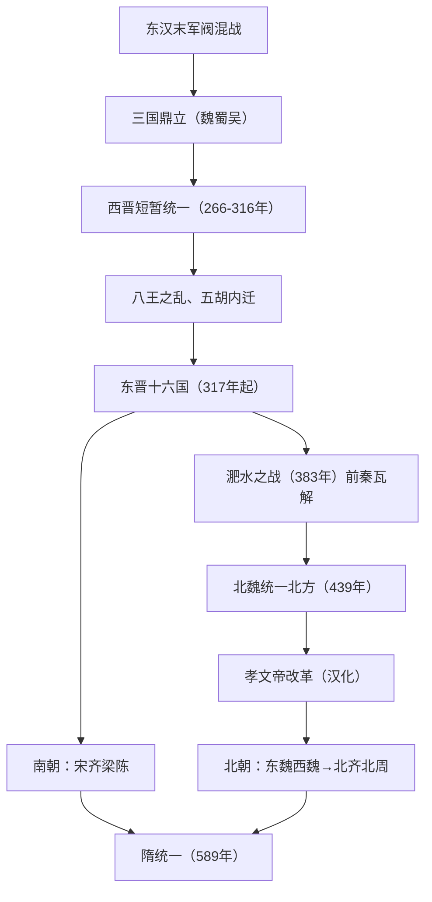

# 第5课 三国两晋南北朝的政权更迭与民族交融

## 时空坐标

- 220年：曹丕称帝，三国鼎立（魏、蜀、吴）开始
- 266年：司马炎建西晋；280年灭吴，短暂统一
- 316年：西晋灭亡；317年司马睿建东晋
- 4世纪下半叶：前秦统一北方；383年淝水之战
- 420年：刘裕建宋，南朝（宋齐梁陈）开始
- 439年：北魏统一北方；北魏孝文帝改革（迁都洛阳约494年）
- 581年：杨坚建隋，589年重归统一

## 知识梳理

| 比较项 | 江南开发 | 孝文帝改革 |
| --- | --- | --- |
| 原因 | 北民南迁带来劳动力与技术；南方相对安定 | 缓和民族矛盾，巩固统治，顺应交融趋势 |
| 内容/表现 | 土地大量开垦，农工商业发展 | 迁都洛阳；易服装、说汉话、改汉姓、通婚姻 |
| 影响 | 南北经济差距缩小，为经济重心南移奠基 | 促进民族交融，为北方统一南方及隋唐盛世奠基 |

## 重点精讲

1. **时代总特征**：国家分裂、政权更迭频繁，但孕育统一因素——民族交融加深、江南得到开发、南北文化趋同，分裂中蕴含着走向统一的历史趋势（高考大题常考角度）。
2. **孝文帝改革**（高频）：全面汉化措施（迁都洛阳、改籍贯、穿汉服、说汉话、改汉姓如拓跋改元、鼓励与汉族高门通婚）。评价：顺应北方民族交往交流交融的历史趋势，缓解民族矛盾，促进北魏经济发展与社会繁荣，为隋唐大一统与繁荣奠定基础。
3. **士族政治**：三国西晋以来自魏晋"九品中正制"发展而来，东晋达到顶峰（"王与马，共天下"）；士族凭门第世代把持高官，是这一时期独特的政治生态，也是理解九品中正制到科举制变革的背景。
4. **民族交融的双向性**：不仅少数民族汉化，汉族也吸收少数民族的畜牧经验、服饰饮食（胡床、胡饼），交融是相互的。

## 典型例题

**例1（选择题）** 北魏孝文帝改革措施中，最能体现"移风易俗"的是（　）
A. 迁都洛阳　B. 整顿吏治　C. 改汉姓、禁胡语、通婚姻　D. 颁行俸禄制
**解析**：改姓氏、语言、婚姻直接改变鲜卑旧俗，属典型移风易俗；迁都是空间前提。选 **C**。

**例2（材料题）** 材料："江南之为国盛矣……地广野丰，民勤本业，一岁或稔，则数郡忘饥。"——《宋书》
问：与《史记》中"楚越之地，地广人希（稀）"相比，江南发生了什么变化？原因何在？
**解析**：变化：从地广人稀、生产落后到田美土肥、物产丰富，江南得到显著开发。原因：北方战乱，北民大量南迁，带来先进技术和劳动力；南方自然条件优越、相对安定；南方政权重视农业。意义：缩小南北差距，为经济重心南移奠定基础。

## 易错点

- 西晋是**短暂统一**（280-316年实际统一仅约30余年），不要与长期分裂印象混淆。
- 淝水之战是**东晋胜前秦**，以少胜多，此后前秦瓦解、北方再度分裂。
- 江南开发≠经济重心南移完成；重心南移完成在**南宋**。
- 民族交融不是单向汉化，而是双向互动。

## 背记要点

1. 政权更迭序列：三国→西晋→东晋十六国→南北朝→隋
2. 江南开发主因：北民南迁带来劳动力和先进技术
3. 孝文帝改革：迁都洛阳＋全面汉化，促进民族交融
4. 东晋士族政治："王与马，共天下"
5. 时代特征：分裂动荡中孕育统一因素

## 自测题

1. 画出三国至隋的政权更迭简图。
2. 江南开发的原因和影响分别是什么？
3. 列举孝文帝改革的四项汉化措施并评价其意义。
4. 为什么说这一时期"分裂中孕育着统一"？

## 相关知识点

东汉衰亡背景见 [[第4课 西汉与东汉——统一多民族封建国家的巩固]]；隋唐统一与盛世见 [[第6课 从隋唐盛世到五代十国]]；九品中正制流变见 [[第7课 隋唐制度的变化与创新]]。
