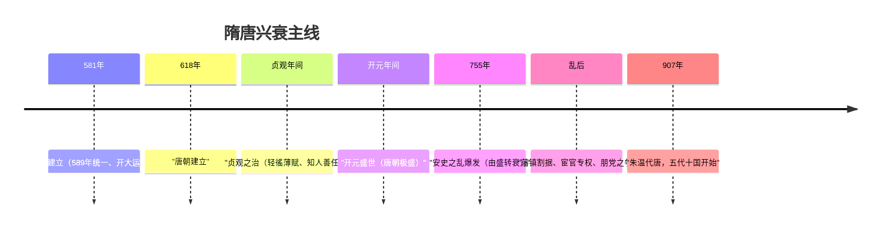

# 第6课 从隋唐盛世到五代十国

## 时空坐标

- 581年：杨坚建隋；589年灭陈统一全国
- 隋炀帝：开通大运河（以洛阳为中心）
- 618年：李渊建唐；唐太宗"贞观之治"
- 武则天：政启开元；唐玄宗前期"开元盛世"
- 755-763年：安史之乱（由盛转衰的转折点）
- 875-884年：黄巢起义；907年朱温废唐建后梁
- 907-960年：五代十国分裂时期

## 知识梳理

| 比较项 | 隋朝 | 秦朝（类比） |
| --- | --- | --- |
| 地位 | 结束长期分裂、重建统一 | 首建统一多民族封建国家 |
| 重大工程 | 大运河、义仓、洛阳城 | 长城、驰道、灵渠 |
| 制度创新 | 开创科举制、三省六部制 | 皇帝制、郡县制 |
| 灭亡原因 | 大兴土木、三征高丽（暴政） | 徭役刑法苛重（暴政） |
| 对后世 | 为唐盛世奠基 | 为汉盛世奠基 |

## 重点精讲

1. **大运河的评价**（辩证分析高频）：贯通南北，促进南北经济交流、巩固统一，泽被后世；但当时滥用民力，加速隋亡。"尽道隋亡为此河，至今千里赖通波"即为辩证视角。
2. **唐朝民族政策**（高考重点）：战争（太宗灭东突厥）、册封（"天可汗"、册封回纥首领怀仁可汗、大祚荣渤海郡王）、和亲（文成公主入藏）、设机构（安西、北庭都护府管理西域）。特点：开明包容、因地制宜、多措并举，促进统一多民族国家发展。
3. **安史之乱的影响**：唐由盛转衰；形成藩镇割据局面（延续至五代）；北民再度南迁，推动经济重心继续南移；边防空虚，吐蕃趁虚而入。
4. **唐亡与五代十国**：藩镇割据＋宦官专权＋朋党之争→黄巢起义致命一击→朱温代唐。五代十国实质是**藩镇割据的延续和扩大**。

## 典型例题

**例1（选择题）** 唐太宗被北方各族尊奉为"天可汗"，主要因为其（　）
A. 武力征服所有民族　B. 开明的民族政策　C. 与各族全部和亲　D. 废除都护府制度
**解析**：太宗"自古皆贵中华、贱夷狄，朕独爱之如一"，战抚并用、开明平等，故获尊号。选 **B**。

**例2（材料题）** 材料："（安史之乱后）方镇相望于内地，大者连州十余，小者犹兼三四……自国门以外，皆分裂于方镇矣。"——《新唐书》
问：材料反映了什么现象？分析其影响。
**解析**：现象：安史之乱后藩镇林立，节度使拥兵自重、割据一方。影响：中央集权严重削弱，唐朝政令不出国门；割据混战延续为五代十国分裂局面；但部分藩镇仍承担防务与赋税，客观上延续了唐朝统治。启示北宋建立后着力收兵权、强干弱枝。

## 易错点

- 隋亡主因是暴政（滥用民力），大运河本身功在千秋，评价需一分为二。
- 安史之乱是唐**由盛转衰**的转折点，但唐朝并未因此立即灭亡（还延续约150年）。
- "天可汗"是**唐太宗**的尊号；文成公主嫁的是吐蕃**松赞干布**（唐蕃是和亲而非隶属）。
- 五代在北方黄河流域相继更替，十国多在南方，二者并存而非先后。

## 背记要点

1. 589年隋统一；大运河以洛阳为中心，贯通南北
2. 贞观之治→开元盛世：唐朝走向极盛
3. 民族政策四手段：战争、和亲、册封、设机构（都护府）
4. 755年安史之乱：由盛转衰，藩镇割据由此始
5. 907年朱温代唐；五代十国是藩镇割据的延续

## 自测题

1. 如何辩证评价隋朝大运河？
2. 举例说明唐朝处理民族关系的四种主要方式。
3. 安史之乱爆发的原因及影响是什么？
4. 为什么说五代十国是藩镇割据局面的延续？

## 相关知识点

分裂到统一的前奏见 [[第5课 三国两晋南北朝的政权更迭与民族交融]]；支撑盛世的制度创新见 [[第7课 隋唐制度的变化与创新]]；北宋对藩镇教训的矫正见 [[第9课 两宋的政治和军事]]。
