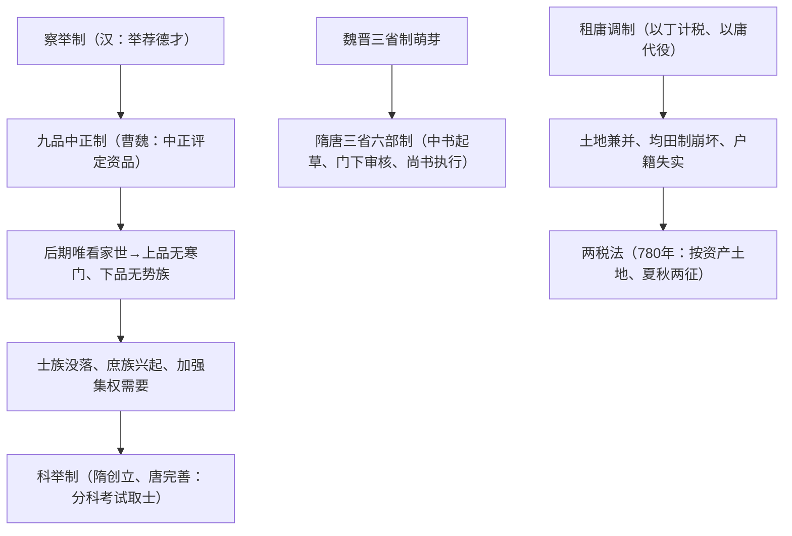

# 第7课 隋唐制度的变化与创新

## 时空坐标

- 汉代：察举制（以德才举荐）
- 曹魏：创立九品中正制
- 隋文帝：开始分科考试；隋炀帝：设进士科，科举制正式形成
- 魏晋：三省制雏形；隋唐：三省六部制定型
- 魏晋至唐前期：租调制→租庸调制
- 780年：唐德宗采纳杨炎建议，实行两税法

## 知识梳理

| 比较项 | 九品中正制 | 科举制 |
| --- | --- | --- |
| 选官标准 | 初重家世道德才能，后期只重**家世门第** | 考试成绩（才学） |
| 选官权 | 地方中正官 | 中央（政府主考） |
| 影响 | 沦为士族垄断仕途的工具 | 扩大统治基础，提高官员素质，加强中央集权 |

| 比较项 | 租庸调制 | 两税法 |
| --- | --- | --- |
| 征税标准 | 以人丁为主 | 以土地财产为主 |
| 征税项目 | 租（粟）、调（绢布）、庸（代役） | 户税＋地税，分夏秋两次 |
| 意义 | 保证农时（纳庸代役） | 减轻人身控制，简化税制，扩大税源 |

## 重点精讲

1. **选官制度演变逻辑**（高考核心线索）：世官制（血缘）→察举制（德才、举荐）→九品中正制（门第）→科举制（考试）。趋势：选官标准由家世门第到才学；方式由举荐到考试；选官权由地方收归中央——趋向公平、开放、集权。
2. **三省六部制**（高频）：中书省草拟诏令→门下省封驳审议→尚书省（下辖吏户礼兵刑工六部）执行。特点：分工明确、彼此制约；相权一分为三，皇权加强；政事堂集议提高效率。意义：中国政治制度的重大变革，为后世沿用。
3. **两税法**（高频）：背景是均田制瓦解、租庸调无法维持。内容："户无主客，以见居为簿；人无丁中，以贫富为差"，量出制入，夏秋两征。意义：征税标准从人丁转向财产，是古代赋税制度的重大转折，减轻了政府对农民的人身控制。

## 典型例题

**例1（选择题）** "上品无寒门，下品无势族"所反映的选官制度的主要弊端是（　）
A. 考试内容僵化　B. 门第成为选官唯一标准　C. 官员由皇帝直接任命　D. 重武轻文
**解析**：九品中正制后期中正官被士族把持，评定只看家世，寒门才俊无进身之阶。选 **B**。

**例2（材料题）** 材料："惟以资产为宗，不以丁身为本，资产少者则其税少，资产多者则其税多。"——陆贽论两税法
问：概括两税法的征税原则，并分析其历史意义。
**解析**：原则：以资产（土地财产）多寡为征税依据，而非人丁。意义：改变自战国以来以人丁为主的赋税传统；政府对农民人身控制减弱；扩大纳税面、增加财政收入；一定程度上体现税负公平；是中国古代赋税制度史上的里程碑。

## 易错点

- 科举制**创立于隋**（炀帝设进士科），唐朝是完善（增科目、武举、殿试）而非创立。
- 门下省的职责是**封驳审议**，不是执行；执行归尚书省六部。
- 三省六部制削弱的是**相权**、加强皇权，属君主专制范畴，不要与中央集权（央地关系）混淆。
- 两税法"两"指**夏秋两次征收**，不是只收两种税。

## 背记要点

1. 选官演变：察举制→九品中正制→科举制（标准：德才→门第→才学）
2. 科举制意义：扩大统治基础、加强中央集权、促进社会流动
3. 三省六部：中书拟、门下审、尚书行；分割相权、加强皇权
4. 赋税演变：租调制→租庸调制→两税法（780年）
5. 两税法转折意义：征税标准由人丁转向财产

## 自测题

1. 概括中国古代选官制度演变的三大趋势。
2. 简述三省六部制的运行机制及其特点。
3. 两税法实行的背景、内容和意义各是什么？
4. "庸"的含义是什么？它有何积极作用？

## 相关知识点

士族政治背景见 [[第5课 三国两晋南北朝的政权更迭与民族交融]]；制度支撑的盛世见 [[第6课 从隋唐盛世到五代十国]]；赋税制度后续发展（一条鞭法、摊丁入亩）见 [[第14课 明至清中叶的经济与文化]]。
