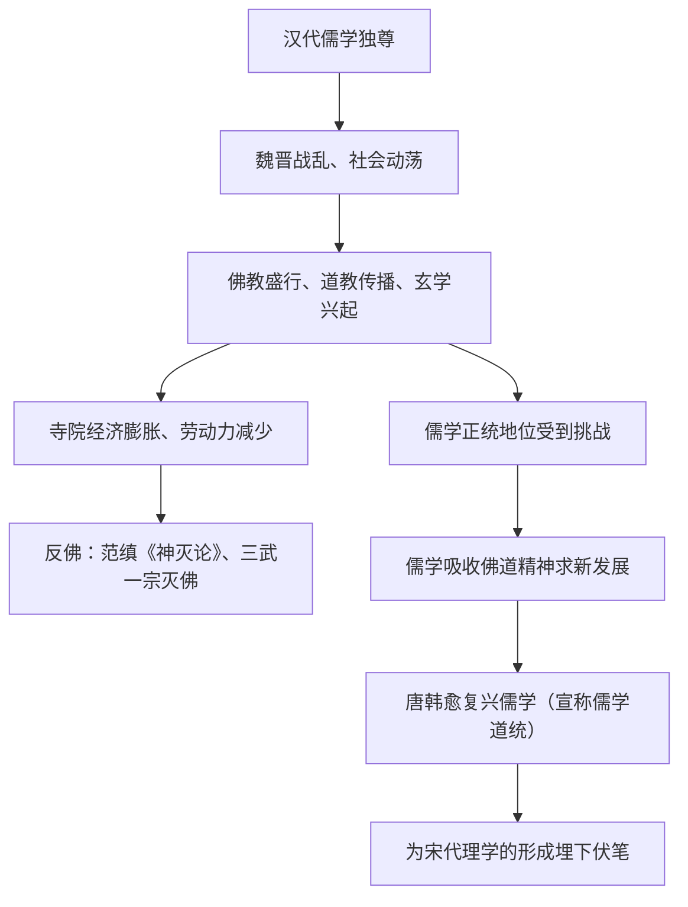

# 第8课 三国至隋唐的文化

## 时空坐标

- 两汉之际：佛教传入中国
- 东汉末：道教兴起（太平道、五斗米道）
- 魏晋南北朝：玄学盛行，儒学正统受冲击，佛教盛行
- 南朝：范缜著《神灭论》；北魏太武帝、北周武帝灭佛
- 唐朝：韩愈提出复兴儒学；玄奘西行、鉴真东渡
- 唐朝：诗歌鼎盛（李白、杜甫），颜筋柳骨，吴道子画圣

## 知识梳理

| 领域 | 魏晋南北朝 | 隋唐 |
| --- | --- | --- |
| 思想 | 儒佛道并行、玄学兴起 | 三教并行→韩愈复兴儒学 |
| 文学 | 建安文学、田园诗、骈文、民歌 | 诗歌黄金时代（李白"诗仙"、杜甫"诗圣"） |
| 书画 | 王羲之"书圣"、顾恺之"以形写神" | 颜真卿、柳公权楷书；吴道子"画圣" |
| 科技 | 祖冲之圆周率、贾思勰《齐民要术》 | 雕版印刷、火药、僧一行测子午线、《千金方》 |
| 中外交流 | 法显西行取经 | 玄奘西行、鉴真东渡、遣唐使来华 |

## 重点精讲

1. **儒学地位的波动**（高考线索题）：汉代独尊→魏晋受佛道冲击（社会动荡使宣扬因果轮回、修炼养生的佛道更抚慰人心）→隋唐"三教合归儒"主张与三教并行政策→韩愈用天命论、封建纲常反佛，掀起复兴儒学运动。理解这一起伏是把握宋明理学产生背景的关键。
2. **佛教的传播与反佛**：佛教盛行原因——战乱中民众寻求精神寄托、统治者借以安定人心。反佛原因——寺院经济与政府争夺劳力税源（经济矛盾是根本）。范缜《神灭论》从形神关系批判"神不灭"。
3. **唐文化繁荣的原因**（大题模板）：国家统一强盛、经济繁荣（物质基础）；开放包容的对外与民族政策；继承魏晋以来文化积淀；科举制推动（诗赋取士）；中外与民族之间交流频繁。
4. **中外文化交流双向性**：既有输入（佛教东传、玄奘取经），也有输出（鉴真东渡传戒律、日本遣唐使学制度文化），长安成为国际大都会。

## 典型例题

**例1（选择题）** 唐诗繁荣与下列制度关联最直接的是（　）
A. 三省六部制　B. 科举制以诗赋取士　C. 两税法　D. 府兵制
**解析**：进士科重诗赋，士人竞相研习诗歌，直接推动唐诗兴盛。选 **B**。

**例2（材料题）** 材料："舍宅为寺者三分且一……天下户口，几亡其半。"（概述南北朝寺院侵夺人口赋税之弊）
问：据材料并结合所学，分析统治者灭佛的原因及儒学面临的处境。
**解析**：原因：寺院经济过度膨胀，占有大量土地人口，僧尼不入户籍、不纳赋税，与政府争夺税源兵源，威胁统治。处境：佛道盛行冲击儒学正统地位，儒学独尊局面被打破，面临信仰竞争，促使儒学吸收佛道思想自我更新（至唐韩愈倡复兴，至宋形成理学）。

## 易错点

- 佛教**两汉之际**传入，不是魏晋才传入；魏晋是"盛行"期。
- "三教并行"是唐朝的**政策**（奉老子、尊孔子、礼佛），不等于三教合一。
- 《齐民要术》是**北朝贾思勰**所著，中国现存最早最完整的农书，勿归入唐朝。
- 雕版印刷、火药出现于唐朝，但火药**广泛用于军事**在宋朝。

## 背记要点

1. 思想线索：儒学独尊→佛道冲击→三教并行→韩愈复兴儒学
2. 反佛代表：范缜《神灭论》；"三武一宗"灭佛
3. 文艺高峰：李白杜甫、颜筋柳骨、吴道子、王羲之"书圣"
4. 科技：祖冲之圆周率、《齐民要术》、雕版印刷、火药
5. 交流：玄奘西行、鉴真东渡，长安为国际大都会

## 自测题

1. 魏晋南北朝时期佛教为何盛行？统治者为何又屡次灭佛？
2. 概括儒学从汉到唐地位变化的过程。
3. 从四个角度分析唐朝文化繁荣的原因。
4. 举出唐朝中外文化交流"引进来"与"走出去"各一例。

## 相关知识点

时代背景见 [[第5课 三国两晋南北朝的政权更迭与民族交融]] 与 [[第6课 从隋唐盛世到五代十国]]；儒学复兴的最终成果理学见 [[第11课 辽宋夏金元的经济、社会与文化]]。
