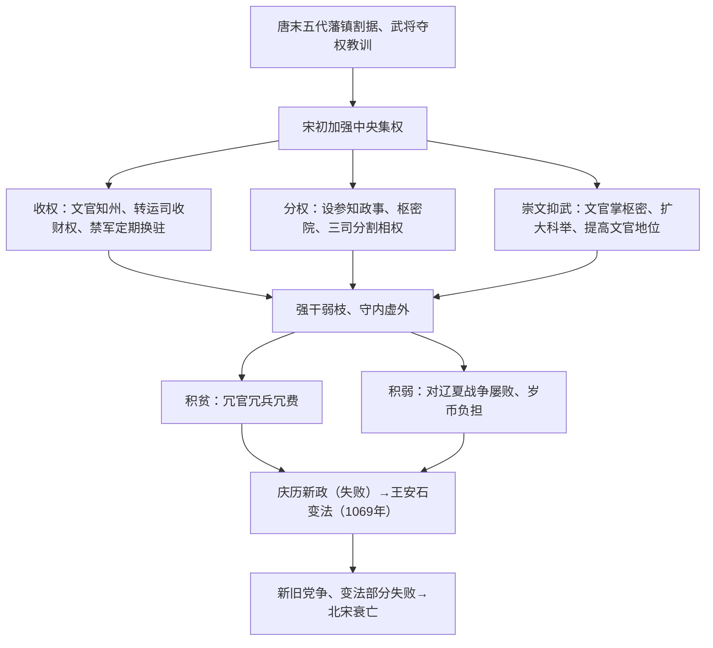

# 第9课 两宋的政治和军事

## 时空坐标

- 960年：陈桥兵变，赵匡胤建立北宋，定都东京（开封）
- 1005年：宋辽澶渊之盟
- 1044年：宋夏庆历和议
- 1069年：宋神宗任用王安石变法
- 1127年：靖康之变，北宋灭亡；赵构建南宋，定都临安
- 1141年：绍兴和议（宋金以淮水—大散关为界）

## 知识梳理

| 比较项 | 澶渊之盟（宋辽） | 绍兴和议（宋金） |
| --- | --- | --- |
| 时间 | 1005年 | 1141年 |
| 内容 | 兄弟相称，北宋岁币 | 南宋称臣，岁贡，划淮水—大散关为界 |
| 影响 | 此后宋辽维持长期和平 | 南北对峙格局确定 |

## 重点精讲

1. **宋初集权措施**（高频）：针对"方镇太重、君弱臣强"，从三方面入手——①中央派文官任知州、设诸路转运司统管地方财政、将地方精锐编入禁军；②分割相权（参知政事分行政、枢密院分军政、三司分财政），枢密院与"三衙"分掌调兵与统兵；③实行崇文抑武方针。特点：分化事权、内外相制、重文轻武。评价：有效防止割据、强化集权，但导致行政效率低下与"三冗"积贫积弱。
2. **王安石变法**（高频）：目的富国强兵。富国——青苗法、募役法、农田水利法、均输法、市易法、方田均税法；强兵——保甲法、将兵法。成效：增加了财政收入，一定程度改善积贫。局限：强兵效果不明显；部分措施执行中加重人民负担；触犯官僚地主利益，引发激烈党争，最终大部分被废。
3. **南宋偏安**：岳飞抗金战功卓著却以"莫须有"被害，反映崇文抑武国策下对武将的猜忌延续。

## 典型例题

**例1（选择题）** 宋太祖"杯酒释兵权"及此后一系列措施的核心目的在于（　）
A. 提高军队战斗力　B. 防止武将专权、加强中央集权　C. 减少财政开支　D. 笼络士大夫
**解析**：宋初制度设计皆围绕吸取唐末五代武将夺权教训、强化皇权与中央集权展开。选 **B**。

**例2（材料题）** 材料："以文官任知州……又设通判以牵制之；财赋尽归转运使；天下劲兵悉聚京师。"（大意）
问：概括北宋加强对地方控制的措施，并辩证评价。
**解析**：措施：行政上文官任知州、通判监督；财政上转运司收缴地方财赋；军事上强壮士兵编入中央禁军。评价：积极——铲除藩镇割据的土壤，维护统一安定；消极——地方权力被削夺过度，财政困窘、边防无力，机构重叠造成冗官冗费，埋下积贫积弱的祸根。

## 易错点

- "崇文抑武"抑制的是**武将权势**，不是不要军队——北宋兵员反而膨胀（冗兵）。
- 澶渊之盟中宋辽是**兄弟之国**；绍兴和议中南宋对金**称臣**，地位不同。
- 王安石变法失败的根本原因是触犯大官僚大地主利益、执行走样，而非措施全错；其"富国"目标部分实现。
- 枢密院有**调兵权无统兵权**，三衙有统兵权无调兵权，二者互相牵制。

## 背记要点

1. 960年陈桥兵变建北宋；国策：崇文抑武、守内虚外
2. 收地方权：文官知州＋通判、转运司、禁军
3. 分割相权：参知政事、枢密院、三司
4. 弊端："三冗"（冗官冗兵冗费）→积贫积弱
5. 1069年王安石变法：富国有效、强兵不显、党争而败

## 自测题

1. 北宋初年从哪三方面加强中央集权？各举一项措施。
2. 如何辩证评价宋初加强集权的举措？
3. 王安石变法"富国"类措施有哪些？变法为何失败？
4. 比较澶渊之盟与绍兴和议的异同。

## 相关知识点

藩镇割据教训见 [[第6课 从隋唐盛世到五代十国]]；辽夏金政权情况见 [[第10课 辽夏金元的统治]]；宋代经济文化繁荣见 [[第11课 辽宋夏金元的经济、社会与文化]]。
