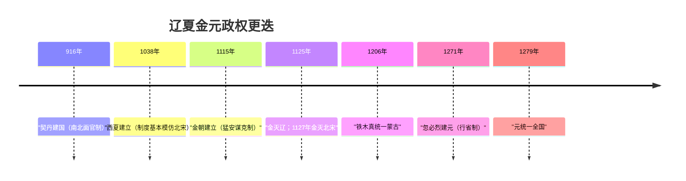

# 第10课 辽夏金元的统治

## 时空坐标

- 916年：耶律阿保机建契丹国（后称辽）
- 1038年：元昊建立西夏
- 1115年：完颜阿骨打建金；1125年金灭辽；1127年金灭北宋
- 金世宗时期："大定之治"
- 1206年：铁木真统一蒙古，尊号"成吉思汗"
- 1271年：忽必烈定国号大元；1276年占临安，1279年崖山之战统一全国
- 元朝：设行省、宣政院（管西藏）、澎湖巡检司（管台湾）

## 知识梳理

| 政权 | 民族 | 特色制度 | 特点 |
| --- | --- | --- | --- |
| 辽 | 契丹 | 南北面官制（北面官治契丹、南面官治汉人） | 因俗而治、蕃汉分治 |
| 西夏 | 党项 | 模仿北宋官制，另有蕃号官称 | 汉蕃双轨 |
| 金 | 女真 | 猛安谋克制（兵农合一） | 军政合一、迁都燕京后加速汉化 |
| 元 | 蒙古 | 行省制、驿传制度、四等人制 | 大一统下的制度创新与民族差别对待 |

## 重点精讲

1. **行省制**（高考核心）：中央设中书省总理全国政务（一省制），地方设10个行中书省，"行省"即中书省的派出机构；今晋冀鲁地区由中书省直辖（"腹里"）。特点：辖区广、军政大权集中而受中央节制；犬牙交错划界防止地方凭险割据。意义：提高行政效率，巩固多民族国家统一，是中国**省制的开端**，对后世地方行政影响深远——中央集权与地方分权的有效结合。
2. **因俗而治的智慧**：辽南北面官、金猛安谋克（迁入中原后与州县制并行），说明北方民族政权在学习中原制度同时保留本族传统，是民族交融在制度层面的体现。
3. **元朝边疆管理**（高频）：吐蕃——宣政院直接管辖（西藏正式纳入中央版图）；西域——北庭都元帅府等；台湾——澎湖巡检司。边疆管理呈现与内地**一体化**趋向。
4. **四等人制**：蒙古人、色目人、汉人、南人，民族差别对待激化矛盾，是元朝速亡原因之一；但民族交融仍在发展（回族前身"回回"形成）。

## 典型例题

**例1（选择题）** 元代行省"掌国庶务，统郡县，镇边鄙……凡钱粮、兵甲、屯种、漕运、军国重事，无不领之"，但"不敢专决大政，咨中书（省）而后行"。这表明行省（　）
A. 与中书省地位平等　B. 权力大而不专，受制于中央　C. 只管军事不管民政　D. 是完全独立的地方政权
**解析**：行省事权广泛但重大事务须报中书省批准，体现集权与分权结合。选 **B**。

**例2（材料题）** 材料："自封建（分封）变为郡县，有天下者，汉、隋、唐、宋为盛，然幅员之广，咸不逮元……元东南所至不下汉、唐，而西北则过之。"——《元史·地理志》
问：结合所学，说明元朝如何实现对空前辽阔疆域的有效治理。
**解析**：措施：①实行行省制度，分区统辖、犬牙交错；②修筑驿道、设驿站和急递铺，保障政令传递；③因地制宜管理边疆——宣政院辖吐蕃、澎湖巡检司管台湾、都元帅府辖西域。意义：将边疆与内地一体化管理，巩固空前统一的多民族国家，行省制为后世沿用。

## 易错点

- 行省是**中书省的派出机构**（"行中书省"），并非独立的一级自治政府。
- 西藏归属中央始于**元朝（宣政院）**，不是清朝；清朝是设驻藏大臣加强管理。
- 猛安谋克是女真的**兵农合一**制度，勿与八旗（清）混淆——二者性质类似但朝代不同。
- 元朝民族矛盾尖锐与民族交融加强**并存**，不矛盾。

## 背记要点

1. 辽：南北面官制——因俗而治
2. 金：猛安谋克——兵农合一；"大定之治"
3. 1271年建元，1279年统一
4. 行省制：省制开端，犬牙交错、权大不专
5. 宣政院管西藏、澎湖巡检司管台湾——边疆内地一体化

## 自测题

1. 辽的南北面官制内容是什么？体现了怎样的治理思想？
2. 行省制有哪些特点？为什么说它加强了中央集权？
3. 元朝管理西藏、台湾的机构分别是什么？
4. 如何看待元朝民族矛盾与民族交融并存的现象？

## 相关知识点

与两宋的和战关系见 [[第9课 两宋的政治和军事]]；元代经济与社会见 [[第11课 辽宋夏金元的经济、社会与文化]]；行省制的后续演变见 [[第12课 从明朝建立到清军入关]]。
