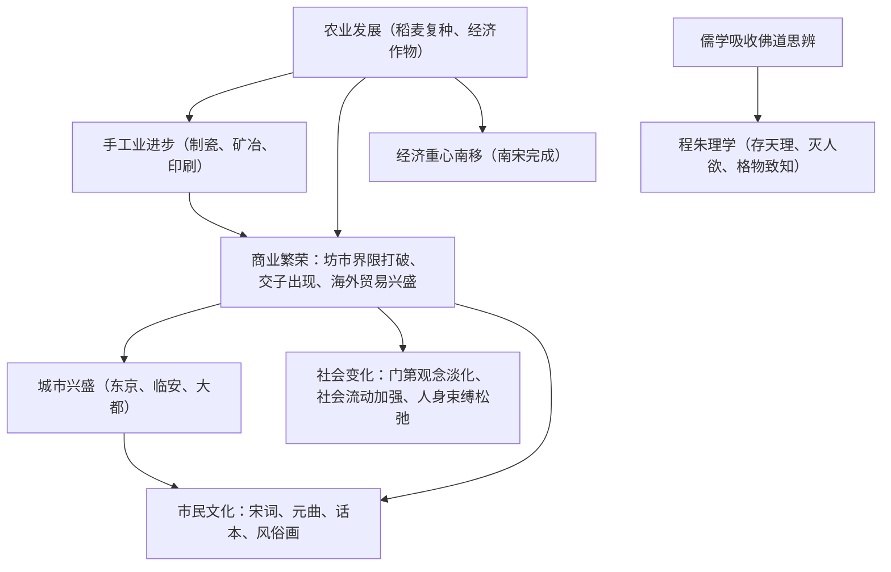

# 第11课 辽宋夏金元的经济、社会与文化

## 时空坐标

- 宋朝：稻麦复种制推广；出现固定专业分工的手工业市镇
- 北宋：四川出现世界最早纸币"交子"
- 两宋：五大名窑；泉州、广州为外贸大港，设市舶司
- 南宋：经济重心南移完成（"苏湖熟，天下足"）
- 两宋：程朱理学形成（程颢、程颐、朱熹）
- 宋元：活字印刷（毕昇）、指南针用于航海、火药广泛用于军事
- 元朝：郭守敬《授时历》、王祯《农书》、元曲兴盛

## 知识梳理

| 领域 | 主要表现 | 高考关键词 |
| --- | --- | --- |
| 商业 | 打破坊市界限与时间限制、交子、榷场贸易 | 商业革命 |
| 外贸 | 市舶司、泉州广州大港、外贸税成重要财源 | 海上丝绸之路 |
| 社会 | 取士不问家世、婚姻不问阀阅、租佃契约关系 | 平民社会趋向 |
| 思想 | 程朱理学；南宋后期起成为官方哲学 | 三纲五常、格物致知 |
| 科技 | 三大发明成熟（活字印刷、火药、指南针） | 影响世界进程 |

## 重点精讲

1. **经济重心南移**（高考主线）：过程——魏晋南北朝奠基（江南开发）→唐安史之乱后加速→**南宋完成**。表现："苏湖熟，天下足"；元朝重开大运河并创海运，均为将南方财赋北运，反证经济重心已在南方。影响：带动南方文化教育兴盛（科举南北分卷之由）。
2. **宋朝社会新变化**（高频）：①门第观念淡化——科举更公平，"取士不问家世"；②社会成员身份趋于平等——贱民减少、奴婢契约化、租佃制下佃农人身依附减弱；③国家对社会控制相对松弛——土地买卖不加干预（"不抑兼并"）、迁移住所更自由。根源：商品经济发展。
3. **程朱理学**：主张"理"是万物本原，提出"存天理、灭人欲"，方法论为"格物致知"。朱熹编《四书章句集注》，元朝起成为科举标准。评价：以哲学思辨重塑儒学，强化伦理纲常，利于塑造民族气节，但后期束缚思想。
4. **三大发明的世界意义**：活字印刷推动文化传播（欧洲文艺复兴、宗教改革）；火药助欧洲资产阶级摧毁封建骑士阶层；指南针为新航路开辟提供条件。

## 典型例题

**例1（选择题）** 与唐代长安"坊市分离、按时启闭"相比，北宋东京商业的显著变化是（　）
A. 出现了草市　B. 打破坊市界限，出现夜市晓市　C. 商业完全由官府经营　D. 开始使用金属货币
**解析**：宋代坊市界限与经营时间限制被打破，夜市、晓市、瓦子兴盛，是"商业革命"的核心表现。选 **B**。

**例2（材料题）** 材料："贫富无定势，田宅无定主，有钱则买，无钱则卖。"——袁采《袁氏世范》
问：材料反映宋代怎样的社会现象？分析其原因。
**解析**：现象：土地频繁买卖流转，贫富分化流动加快，门第世袭的稳定格局被打破。原因：宋代实行"不抑兼并"的土地政策；商品经济繁荣，财富成为社会地位的重要标尺；科举制完善使社会阶层流动加强。反映宋代社会向平民化、流动化方向变化。

## 易错点

- 交子出现于**北宋四川**，是世界最早**纸币**，但并未取代铜钱成为主币。
- 经济重心南移**完成于南宋**，不是唐朝（唐只是加速）。
- 理学不是对儒学的否定，而是儒学吸收佛道后的**新发展**（新儒学）。
- "程朱理学成为官方哲学"始于**南宋后期至元**，北宋时理学尚未独尊。

## 背记要点

1. 商业革命：坊市打破、交子、市舶司外贸
2. 经济重心南移：南宋完成，"苏湖熟，天下足"
3. 社会三变化：门第淡化、身份平等化、控制松弛
4. 程朱理学：理为本原、格物致知、《四书章句集注》
5. 三大发明宋元成熟，深刻影响世界历史进程

## 自测题

1. 列举宋代"商业革命"的三个表现。
2. 经济重心南移的过程分几个阶段？完成的标志性说法是什么？
3. 宋代社会出现了哪些新变化？其经济根源是什么？
4. 程朱理学的核心主张与求理方法分别是什么？

## 相关知识点

两宋政治背景见 [[第9课 两宋的政治和军事]]；辽夏金元政权见 [[第10课 辽夏金元的统治]]；明清经济文化的继续发展与局限见 [[第14课 明至清中叶的经济与文化]]。
