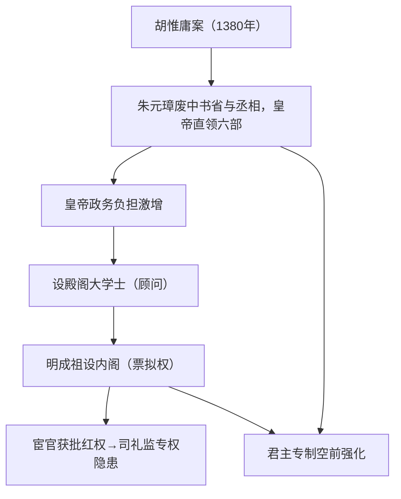

# 第12课 从明朝建立到清军入关

## 时空坐标

- 1368年：朱元璋建立明朝，定都应天府（南京），同年攻占大都灭元
- 洪武年间：废中书省和丞相；明成祖设内阁
- 1405-1433年：郑和七下西洋
- 明中后期：戚继光抗倭；葡萄牙获澳门租住权（1553年）
- 1616年：努尔哈赤建大金（后金）；1636年皇太极改国号大清
- 1644年：李自成攻占北京，明亡；清军入关

## 知识梳理

| 比较项 | 宰相 | 内阁大学士 |
| --- | --- | --- |
| 地位 | 法定中央一级行政机构长官 | 皇帝的侍从顾问（非法定机构） |
| 职权 | 参与决策、统领百官 | 票拟建议，须皇帝批红生效 |
| 权力来源 | 制度赋予 | 皇帝个人信任 |
| 对皇权 | 一定程度制约 | 是君主专制强化的产物 |

## 重点精讲

1. **废丞相与设内阁**（高考核心）：朱元璋以宰相"专权乱政"为由废除自秦以来的丞相制度，六部直属皇帝，君主专制大大加强；但皇帝不堪重负，遂有内阁之设。内阁始终**不是法定的中央行政机构**，其"票拟"须经皇帝"批红"，故内阁权力再大（如张居正）也依附于皇权。宦官通过代行批红（司礼监）得以专权，实质仍是皇权的延伸。
2. **郑和下西洋**：1405-1433年七次远航，最远达非洲东海岸和红海沿岸，是世界航海史壮举。目的主要是"耀兵异域，示中国富强"（政治目的为主），厚往薄来、不计经济效益，缺乏持续动力而终止——与新航路开辟的逐利驱动形成鲜明对比（高考常考对比角度）。
3. **海疆与边疆压力**：东南——倭寇之患，戚继光台州大捷，后政府放松海禁；西方殖民者东来——葡萄牙租住澳门、荷兰西班牙染指台湾。北方——鞑靼瓦剌威胁，后俺答汗与明和议互市；东北——女真崛起建后金、改号大清。
4. **明清易代**：明末政治腐败、天灾赋重→李自成起义（"均田免赋"口号）→1644年明亡→吴三桂引清兵入关，清逐步统一全国。

## 典型例题

**例1（选择题）** 明太祖废丞相后，明成祖设立内阁。内阁的性质是（　）
A. 法定的最高行政机构　B. 皇帝的侍从顾问机构　C. 统领六部的决策机构　D. 独立的监察机构
**解析**：内阁非法定机构、无属官、不辖六部，仅备顾问、拟票供皇帝采择。选 **B**。

**例2（材料题）** 材料："自秦始置丞相，不旋踵而亡……我朝罢丞相，设五府、六部……事皆朝廷总之。以后子孙做皇帝时，并不许立丞相。"——《皇明祖训》
问：指出朱元璋的举措及理由，并分析其影响。
**解析**：举措：废中书省与丞相，权分六部，直属皇帝，并立祖训永不设相。理由：认为丞相专权是历代乱政亡国之源。影响：君主专制空前强化，皇权失去制度性约束；皇帝政务繁重催生内阁与宦官参政，为明代宦官专权埋下伏笔；反映封建制度渐趋衰落时期统治者以强化专制自救。

## 易错点

- 内阁首辅≠宰相：无法定决策权，权力源于皇帝信任，权势再重也可一纸罢免。
- 郑和下西洋早于新航路开辟近一个世纪，但因**政治目的主导、不计成本**而无法持续。
- 明朝的"批红"权属于**皇帝**，宦官只是代行，宦官专权本质上是皇权的变态延伸。
- 1644年灭亡明朝的是**李自成大顺政权**，不是清军；清是入关后击败李自成。

## 背记要点

1. 1368年朱元璋建明；1380年废中书省和丞相
2. 内阁：顾问机构，票拟＋批红，非法定
3. 郑和七下西洋（1405-1433）：政治目的、厚往薄来
4. 戚继光抗倭；1553年葡萄牙租住澳门
5. 1616年后金建立→1636年改号大清→1644年入关

## 自测题

1. 朱元璋为什么废丞相？带来了哪些连锁反应？
2. 从性质、职权、权力来源三方面比较宰相与内阁大学士。
3. 郑和下西洋为何不能持续？与新航路开辟的动机有何不同？
4. 简述明朝面临的海疆与北方边疆问题及应对。

## 相关知识点

元朝制度背景见 [[第10课 辽夏金元的统治]]；清朝专制的进一步强化（军机处）见 [[第13课 清朝前中期的鼎盛与危机]]；明清经济文化见 [[第14课 明至清中叶的经济与文化]]。
