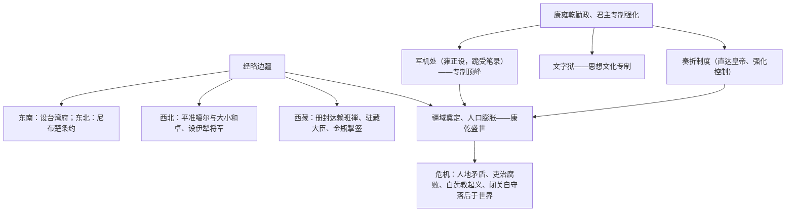

# 第13课 清朝前中期的鼎盛与危机

## 时空坐标

- 1662年：郑成功收复台湾；1684年清设台湾府（隶属福建）
- 1689年：中俄《尼布楚条约》划定东段边界
- 康雍乾时期（1661-1796）："康乾盛世"
- 雍正时期：设军机处、在西南大规模改土归流
- 乾隆时期：平定大小和卓叛乱，设伊犁将军（1762年）
- 1793年：颁布《钦定藏内善后章程》29条；乾隆帝拒绝马戛尔尼使团通商要求
- 清中期：闭关自守，仅留广州一口通商（十三行）

## 知识梳理

| 方向 | 边疆治理措施 | 意义 |
| --- | --- | --- |
| 台湾 | 1684年设台湾府 | 加强东南海防与统一 |
| 东北 | 雅克萨之战、《尼布楚条约》 | 从法律上确定黑龙江乌苏里江流域归属中国 |
| 西北 | 平叛、设伊犁将军 | 巩固对新疆的管辖 |
| 西藏 | 册封制度、驻藏大臣、金瓶掣签 | 中央对西藏管辖制度化 |
| 西南 | 改土归流 | 废土司行流官，强化直接统治 |

## 重点精讲

1. **军机处**（高考高频）：雍正为处理西北军务而设，后成为处理机要的中枢。特点：简（机构人员精干）、速（办事效率高）、密（保密性强）；军机大臣"跪受笔录、承旨遵办"，无决策权。意义：标志君主专制达到**顶峰**。与奏折制度配合，皇帝实现对官僚机构的直接高效控制。
2. **统一多民族国家版图奠定**：清朝通过战争、条约、册封、设机构、改土归流等多种方式治理边疆，奠定了现代中国版图的基础；理藩院掌管边疆民族事务。这是"统一多民族国家巩固发展"主题的高潮，大题常要求分方向归纳。
3. **盛世下的危机**（辩证高频）：内部——人口急剧膨胀致人地矛盾尖锐、政治腐败、贫富分化，白莲教起义爆发；外部——西方工业文明兴起，而清朝以"天朝上国"自居，闭关自守（一口通商），拒绝马戛尔尼使团，逐渐落后于世界潮流，埋下近代被动挨打的伏笔。
4. **闭关自守评价**：对殖民渗透有一定自卫作用，但根本上阻碍中外经济文化交流，使中国错失工业革命机遇。

## 典型例题

**例1（选择题）** "军机大臣者……只供传述缮撰，而不能稍有赞画于其间也。"这表明军机处（　）
A. 掌握最高决策权　B. 是法定行政中枢　C. 仅是承旨办事的机要秘书机构　D. 能够制约皇权
**解析**：军机大臣无决策权，只跪受笔录、上传下达，说明决策权完全集于皇帝，专制达到顶峰。选 **C**。

**例2（材料题）** 材料："天朝物产丰盈，无所不有，原不藉外夷货物以通有无。"——乾隆致英王信（1793年）
问：材料反映了清统治者怎样的心态和政策？结合世界背景分析其影响。
**解析**：心态："天朝上国"、盲目自大，视对外贸易为恩赐。政策：闭关自守、限制通商（广州一口、十三行垄断）。背景：同期英国正开展工业革命、积极开拓世界市场。影响：中国日益隔绝于工业文明之外，科技经济全面落后，为半个世纪后鸦片战争的失败与民族危机埋下祸根。

## 易错点

- 军机处是君主专制**顶峰的标志**，但它不是决策机构，皇帝才是唯一决策者。
- 《尼布楚条约》是中国与外国签订的**平等**边界条约，勿与近代不平等条约混淆。
- 闭关自守≠完全断绝贸易，而是**严格限制**（广州一口通商）。
- 改土归流是**废除土司、改设流官**，加强中央对西南直接管理，雍正朝大规模推行。

## 背记要点

1. 军机处（雍正设）：简速密、跪受笔录——专制顶峰
2. 奏折制度：官员密报直达皇帝
3. 边疆治理：台湾府、《尼布楚条约》、伊犁将军、驻藏大臣＋金瓶掣签、改土归流
4. 清朝奠定现代中国版图基础；理藩院管民族事务
5. 危机：人地矛盾、白莲教起义、闭关自守落后于世界

## 自测题

1. 军机处的设立时间、职能特点及标志意义是什么？
2. 分东北、西北、西藏、台湾四个方向归纳清朝边疆治理措施。
3. "康乾盛世"后期潜伏着哪些内外危机？
4. 如何评价清朝的闭关自守政策？

## 相关知识点

明代专制铺垫见 [[第12课 从明朝建立到清军入关]]；盛世下的经济文化见 [[第14课 明至清中叶的经济与文化]]；危机的总爆发见 [[第15课 两次鸦片战争]]。
