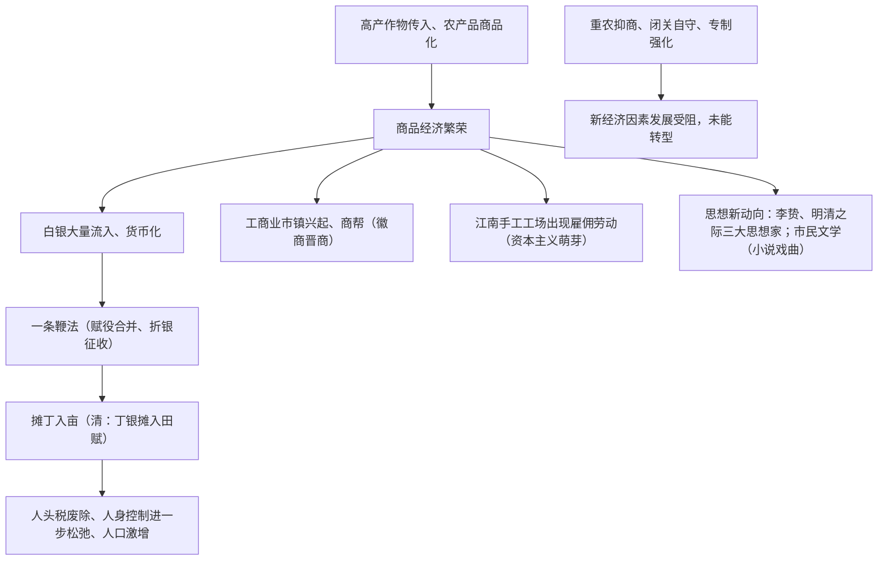

# 第14课 明至清中叶的经济与文化

## 时空坐标

- 明中后期：玉米、甘薯等高产作物传入；江南手工业出现雇佣关系（资本主义萌芽）
- 明万历初：张居正推行一条鞭法（1581年全国推行）
- 明中后期：陆王心学盛行（王守仁"致良知"）
- 明末清初：黄宗羲、顾炎武、王夫之批判专制；《本草纲目》《天工开物》《农政全书》
- 清雍正：摊丁入亩（丁银并入田赋）
- 清乾隆：《四库全书》修成；《红楼梦》问世

## 知识梳理

| 比较项 | 一条鞭法（明） | 摊丁入亩（清雍正） |
| --- | --- | --- |
| 内容 | 赋役合并、部分丁役摊入田亩、折银征收 | 丁银全部摊入田赋，废除人头税 |
| 前提 | 白银货币化 | 康熙"滋生人丁，永不加赋" |
| 意义 | 简化税制，适应商品经济 | 人身依附关系进一步松弛，隐匿人口减少，人口激增 |

## 重点精讲

1. **经济新气象与旧束缚**（高考大题模板）：新气象——高产作物推广、农业多种经营；民营手工业超过官营、出现雇佣关系；白银货币化、长途贩运、商帮、工商业市镇。旧束缚——男耕女织小农经济仍占主导；政府坚持重农抑商与海禁闭关；专制制度压制。结论：新经济因素微弱，中国未能像西方那样实现社会转型。
2. **赋役制度演变终点**：两税法（按资产）→一条鞭法（折银合并）→摊丁入亩（废人头税）。总趋势：征税标准由人丁转向土地财产、由实物到货币、国家对农民人身控制不断松弛。
3. **思想新动向**：王守仁心学"致良知"（主观唯心、强调主体意识）；李贽反对以孔子之是非为是非；黄宗羲抨击君主专制（"天下为主，君为客"）、主张"工商皆本"；顾炎武倡"经世致用"、"天下兴亡，匹夫有责"；王夫之朴素唯物论。实质：商品经济发展与专制腐败在思想领域的反映，是对儒学的批判继承而**非否定儒学**。
4. **文化成就**：小说《三国志通俗演义》《水浒传》《西游记》《红楼梦》；汤显祖戏曲、昆曲；科技总结性巨著李时珍《本草纲目》、宋应星《天工开物》、徐光启《农政全书》；西学东渐（利玛窦与徐光启合译《几何原本》）。

## 典型例题

**例1（选择题）** 清朝雍正年间实行摊丁入亩，其最重要的影响是（　）
A. 加重农民负担　B. 废除人头税，国家对百姓人身束缚进一步减弱　C. 恢复井田制　D. 促进重农抑商
**解析**：丁银并入田赋，中国历史上存在千年的人头税被废除，人身控制松弛，人口迅速增长。选 **B**。

**例2（材料题）** 材料："机户出资，机工出力，相依为命久矣。"——《明神宗实录》
问：材料反映了什么生产关系？为何这种关系在明清未能充分发展？
**解析**：反映江南丝织业中出现"机户出资、机工出力"的雇佣关系，即资本主义萌芽。原因：①小农经济自给自足，国内市场狭小；②重农抑商政策压制商人与手工工场；③海禁与闭关自守隔绝海外市场；④商人多购田置地，缺乏资本积累转化；⑤封建专制制度的整体束缚。故新经济因素始终微弱，未能推动社会转型。

## 易错点

- 一条鞭法在**明朝张居正**时推行，摊丁入亩在**清雍正**时推行，勿混。
- 明清之际思想家批判的是**君主专制**，并未主张推翻封建制度，也不是资产阶级民主思想。
- 《天工开物》等属**总结性**科技著作，反映传统科技的辉煌与近代转型的缺失。
- 资本主义萌芽只出现在**江南部分地区、部分行业**，不能夸大为普遍现象。

## 背记要点

1. 一条鞭法：赋役合并、折银征收；摊丁入亩：废除人头税
2. 新经济因素：白银货币化、商帮、市镇、雇佣关系
3. 王守仁"致良知"；黄宗羲批判君主专制、主张工商皆本
4. 顾炎武经世致用；四大科技总结性著作
5. 阻碍转型三大因素：小农经济、重农抑商、闭关自守

## 自测题

1. 明清经济领域出现了哪些"新气象"？又受到哪些束缚？
2. 比较一条鞭法与摊丁入亩，并概括古代赋役制度演变趋势。
3. 明清之际三大思想家的共同主张有哪些？其思想实质是什么？
4. 资本主义萌芽为何在中国发展缓慢？

## 相关知识点

宋元经济基础见 [[第11课 辽宋夏金元的经济、社会与文化]]；政治背景见 [[第13课 清朝前中期的鼎盛与危机]]；两税法源头见 [[第7课 隋唐制度的变化与创新]]。
