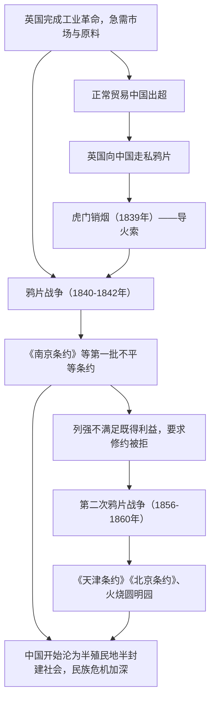

# 第15课 两次鸦片战争

## 时空坐标

- 1839年6月：林则徐虎门销烟
- 1840年6月：鸦片战争爆发；1842年8月《南京条约》签订
- 1843年：《虎门条约》；1844年：中美《望厦条约》、中法《黄埔条约》
- 1856年10月：英法联军发动第二次鸦片战争
- 1858年：《天津条约》；1860年：英法火烧圆明园、《北京条约》
- 19世纪40-60年代：林则徐、魏源"开眼看世界"，《海国图志》提出"师夷之长技以制夷"

## 知识梳理

| 条约 | 时间 | 主要内容 | 危害 |
| --- | --- | --- | --- |
| 《南京条约》 | 1842 | 割香港岛、赔款2100万银元、五口通商、协定关税 | 破坏领土、关税主权 |
| 《虎门条约》等 | 1843-1844 | 领事裁判权、片面最惠国待遇、通商口岸传教居住权 | 破坏司法等主权 |
| 《天津条约》 | 1858 | 增开口岸、外国公使驻京、内河航行 | 侵略深入内地 |
| 《北京条约》 | 1860 | 增开天津、割九龙司、准华工出国、赔款增加 | 危机进一步加深 |

## 重点精讲

1. **鸦片战争爆发的原因**（高考高频）：根本原因——工业革命后英国急需商品市场和原料产地，蓄意打开中国大门；直接原因（导火索）——虎门销烟。切忌把虎门销烟当根本原因："没有虎门销烟，战争也会以别的借口爆发"。
2. **战败的根源**：不只是武器落后，更是**腐朽没落的封建制度无法对抗新兴的资本主义制度**——政治腐败、经济落后、军备废弛、闭目塞听的综合结果。
3. **半殖民地半封建社会**：半殖民地指丧失部分（非全部）主权；半封建指自然经济开始解体、资本主义因素产生但封建制度仍存。鸦片战争是中国**近代史的开端**，社会主要矛盾、革命任务随之改变。
4. **开眼看世界**：林则徐（近代开眼看世界第一人，组织编译《四洲志》）、魏源《海国图志》"师夷之长技以制夷"、徐继畬《瀛寰志略》。局限：仅限少数士人、限于器物层面认识，未付诸实践，但迈出了向西方学习的第一步。

## 典型例题

**例1（选择题）** 有学者说："鸦片战争的爆发，即使没有林则徐禁烟也不可避免。"其依据是（　）
A. 清政府闭关自守　B. 英国工业革命后必然要夺取商品市场和原料产地　C. 中英文化冲突　D. 鸦片贸易利润巨大
**解析**：从根本原因看，战争是英国资本主义扩张的必然产物，禁烟只是借口。选 **B**。

**例2（材料题）** 材料："（协定关税后）中国海关失去保护本国工农业生产的作用……外国商品潮水般涌入。"
问：指出《南京条约》中与材料相关的条款，并分析两次鸦片战争对中国经济的影响。
**解析**：条款：协定关税（英商进出口货物税率须与英方商定）。影响：①中国关税自主权丧失，国门洞开；②西方廉价商品涌入，东南沿海手工业破产，自然经济**开始解体**；③中国被卷入资本主义世界市场，沦为其原料产地和商品市场；④客观上刺激了后来洋务运动和民族资本主义的产生。

## 易错点

- 根本原因（英国打开市场）≠直接原因/导火索（虎门销烟），设问指向要看清。
- 《南京条约》割的是**香港岛**，不是整个香港地区；《北京条约》再割九龙司。
- 火烧圆明园的是**英法联军**（第二次鸦片战争），不是八国联军。
- 第二次鸦片战争期间**沙俄**趁火打劫，侵占中国北方大片领土（约100多万平方公里），是最大获利者之一。

## 背记要点

1. 根本原因：英国工业革命后夺取市场原料；导火索：虎门销烟
2. 《南京条约》：割港岛、赔款、五口通商、协定关税——第一个不平等条约
3. 第二次鸦片战争（1856-1860）：《天津条约》《北京条约》、火烧圆明园
4. 影响：中国开始沦为半殖民地半封建社会，近代史开端
5. 魏源《海国图志》："师夷之长技以制夷"

## 自测题

1. 区分鸦片战争爆发的根本原因与直接原因。
2. 默写《南京条约》四项主要内容及各自破坏的主权。
3. 为什么说第二次鸦片战争是鸦片战争的继续和扩大？
4. "开眼看世界"有哪些代表人物和著作？其意义与局限是什么？

## 相关知识点

战前中国的落伍见 [[第13课 清朝前中期的鼎盛与危机]]；战后各阶层的探索与危机加剧见 [[第16课 国家出路的探索与列强侵略的加剧]]。
