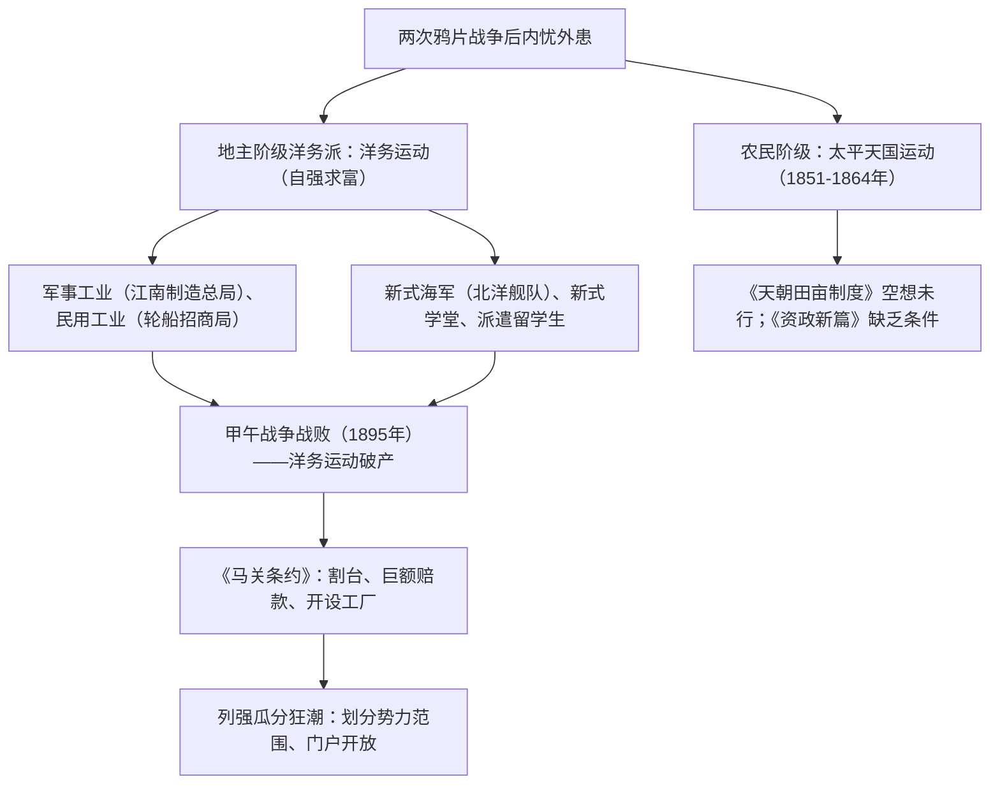

# 第16课 国家出路的探索与列强侵略的加剧

## 时空坐标

- 1851年：金田起义，太平天国运动爆发
- 1853年：定都天京，颁布《天朝田亩制度》
- 1856年：天京事变（由盛转衰）；1859年洪仁玕《资政新篇》
- 1864年：天京陷落，太平天国失败
- 19世纪60-90年代：洋务运动（自强、求富）
- 1883-1885年：中法战争，1885年设台湾省
- 1894-1895年：甲午中日战争；1895年《马关条约》
- 1895年后：列强掀起瓜分中国狂潮（划势力范围）；美国提出"门户开放"

## 知识梳理

| 比较项 | 《天朝田亩制度》 | 《资政新篇》 |
| --- | --- | --- |
| 核心主张 | 平均分配土地，"有田同耕" | 学习西方，发展资本主义 |
| 性质 | 农民阶级绝对平均主义纲领 | 中国最早提出的资本主义改革方案 |
| 局限 | 绝对平均是空想，未真正实行 | 不是农民斗争实践的产物，缺乏实施条件 |

## 重点精讲

1. **太平天国的意义与教训**：沉重打击了清王朝统治秩序与外国侵略势力；引起政治权力结构变化（湘淮系官僚集团崛起、汉人督抚势重）。失败根源：**农民阶级的历史局限性**——缺乏科学理论指导与先进阶级领导，无法提出切实可行的建国方案。
2. **洋务运动**（高考高频）：口号前期"自强"（军事工业：江南制造总局、福州船政局）、后期"求富"（民用工业：轮船招商局、开平煤矿）。评价：引进西方技术，是中国**早期现代化的尝试**，客观上刺激民族资本主义产生、一定程度抵制外国经济侵略；但只学器物不变制度（"中体西用"），以维护封建统治为目的，甲午战败宣告其破产。
3. **《马关条约》的深重危害**：割辽东半岛（后三国干涉还辽）、台湾及澎湖；赔款2亿两；开沙市、重庆、苏州、杭州；**允许日本在华设厂**——列强侵略由商品输出为主转向**资本输出为主**，民族危机空前加剧，刺激瓜分狂潮。
4. **甲午战败的深层原因**：清政府腐败避战求和（李鸿章"避战保船"）、制度落后；日本明治维新后蓄谋已久。教训：单纯学技术不改制度救不了中国——直接推动维新变法兴起。

## 典型例题

**例1（选择题）** 《马关条约》中最能反映列强侵华进入新阶段（资本输出为主）的条款是（　）
A. 割让台湾　B. 赔款二亿两白银　C. 允许日本在通商口岸开设工厂　D. 增开通商口岸
**解析**：设厂利用中国原料劳力，产品就地销售，是典型的资本输出方式。选 **C**。

**例2（材料题）** 材料："中国文武制度，事事远出西人之上，独火器万不能及……中国欲自强，则莫如学习外国利器。"——李鸿章
问：概括李鸿章的主张，指出其实践活动并评价。
**解析**：主张：认为中国制度优越、仅武器不如人，主张学习西方军事技术以自强（"中体西用"）。实践：创办江南制造总局等军工企业、轮船招商局等民用企业、筹建北洋舰队、办新式学堂派留学生。评价：迈出中国近代化第一步，客观上诱导民族资本主义产生；但拒不变革腐朽制度，仅移植技术，甲午战败证明"中体西用"道路走不通。

## 易错点

- 《天朝田亩制度》与《资政新篇》方向相反：前者否定私有、平均主义；后者发展资本主义——同属太平天国文件但**不能混为一谈**。
- 洋务运动的军事工业属**封建官办**性质，不是资本主义企业；民用企业多为官督商办，带有资本主义色彩。
- 洋务运动破产的标志是**甲午战争北洋舰队全军覆没**，不是戊戌变法失败。
- "门户开放"是**美国**提出的，主张利益均沾，反映美国分享侵华权益的要求。

## 背记要点

1. 太平天国：1851金田起义→1853定都天京→1856天京事变→1864失败
2. 两大纲领：《天朝田亩制度》（平均）、《资政新篇》（资本主义方案）
3. 洋务运动："自强""求富"、中体西用、近代化开端
4. 《马关条约》：割台、赔2亿、开四口、允设厂（资本输出）
5. 1895年后瓜分狂潮；美国"门户开放"政策

## 自测题

1. 比较《天朝田亩制度》与《资政新篇》的主张与局限。
2. 洋务运动创办了哪两类企业？各举一例，并评价洋务运动。
3. 《马关条约》为什么标志列强侵华进入新阶段？
4. 甲午战败给中国的探索之路带来什么教训？

## 相关知识点

侵略起点见 [[第15课 两次鸦片战争]]；制度变革的尝试与民族危亡的抗争见 [[第17课 挽救民族危亡的斗争]]。
