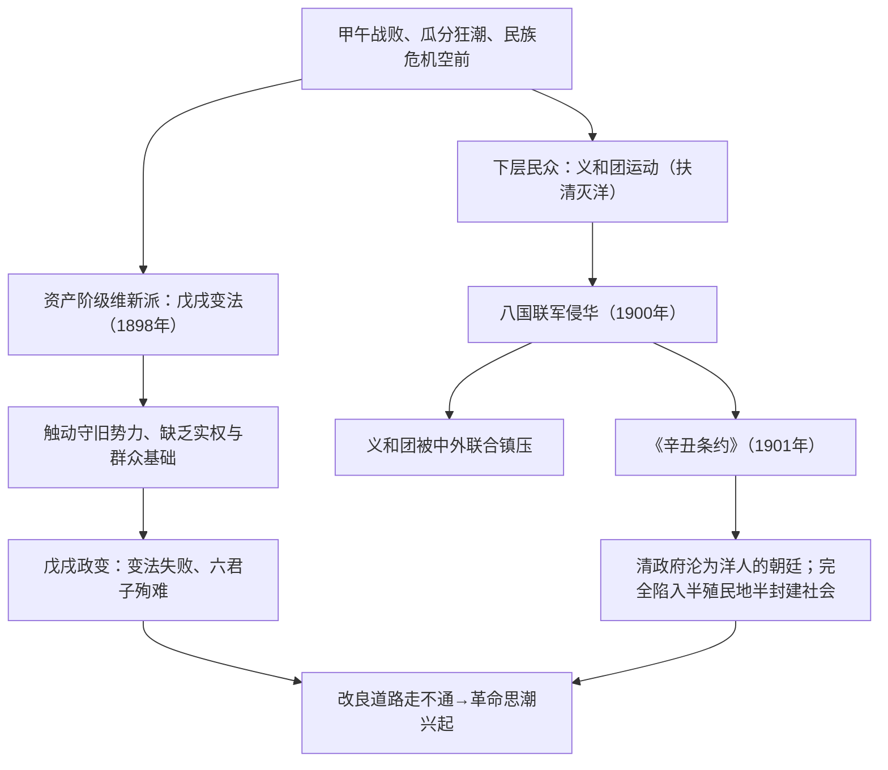

# 第17课 挽救民族危亡的斗争

## 时空坐标

- 1895年：《马关条约》签订，康有为等发起"公车上书"（拉开维新序幕）
- 1898年6月11日-9月21日：戊戌变法（百日维新），慈禧政变、六君子就义
- 1898-1900年：义和团运动兴起（"扶清灭洋"）
- 1900年6月：八国联军侵华；慈禧西逃、"东南互保"
- 1901年9月：《辛丑条约》签订，中国完全陷入半殖民地半封建社会深渊

## 知识梳理

| 比较项 | 戊戌变法 | 义和团运动 |
| --- | --- | --- |
| 领导阶级 | 资产阶级维新派（康有为、梁启超） | 农民等下层民众 |
| 主张口号 | 变法图强、君主立宪取向 | "扶清灭洋" |
| 对西方态度 | 学习西方制度 | 盲目排外 |
| 结果 | 政变失败（仅京师大学堂保留） | 被中外势力联合镇压 |
| 意义/局限 | 思想启蒙；脱离群众、依靠无实权皇帝 | 展现反帝爱国力量、粉碎瓜分企图；愚昧排外、扶清放松对清警惕 |

## 重点精讲

1. **戊戌变法**（高考高频）：理论准备——康有为《新学伪经考》《孔子改制考》（托古改制）、梁启超《时务报》发表《变法通议》。内容涉及政治（裁冗署冗员、允许上书言事）、经济（提倡实业）、军事（编练新军）、文教（废八股、办京师大学堂）。失败原因：守旧势力强大；维新派缺乏可靠社会基础与严密组织，把希望寄托于没有实权的皇帝。意义：起到**思想启蒙**作用，冲击旧式官僚体制，证明改良主义道路在半殖民地半封建的中国走不通。
2. **义和团运动评价**（辩证）：具有强烈的反帝爱国倾向，其英勇斗争使列强认识到"瓜分一事，实为下策"（粉碎瓜分企图）；但"扶清灭洋"口号存在盲目排外的局限，且对清政府缺乏警惕，最终被中外反动势力联合绞杀。
3. **《辛丑条约》**（必背）：赔款白银4.5亿两（本息合计约9.8亿两）；划**东交民巷**为使馆区（国中之国）；拆除大沽及至北京沿线炮台、准列强驻军；**惩办"首祸"、永远禁止中国人成立或参加反帝组织**（最能体现清政府沦为"洋人的朝廷"）。影响：中国**完全陷入**半殖民地半封建社会的深渊。
4. **"东南互保"**：南方督抚与列强达成协议拒不参战，严重动摇清政府统治根基，反映中央权威下移。

## 典型例题

**例1（选择题）** 《辛丑条约》中最能说明清政府已成为"洋人的朝廷"的条款是（　）
A. 赔款4.5亿两白银　B. 划定使馆区　C. 永远禁止中国人成立或加入反帝组织　D. 拆除大沽炮台
**解析**：清政府承诺镇压本国人民的反帝斗争，表明其已成为列强统治中国的工具。选 **C**。

**例2（材料题）** 材料："（变法诏令）如春冰虹影，转瞬即逝……百日之间，维新之诏，联翩而下，然抵制者众，卒归于败。"
问：结合所学分析戊戌变法失败的原因及其历史意义。
**解析**：原因：①以慈禧为首的守旧势力力量强大；②维新派自身局限——缺乏坚强组织、脱离人民群众、缺乏社会基础；③将希望寄托于没有实权的光绪皇帝；④变法急于求成，树敌过多。意义：是一场救亡图存的爱国政治运动和思想启蒙运动，传播了西方政治学说与科学知识，冲击了封建思想；其失败证明温和改良道路走不通，客观上为辛亥革命准备了思想条件。

## 易错点

- 戊戌变法**没有**实行君主立宪（未开国会、未定宪法），变法诏令以行政、经济、文教改革为主。
- 变法后**唯一保留**的成果是京师大学堂。
- 《辛丑条约》**没有割地、没有开新商埠**，其核心是政治军事控制——与《南京条约》《马关条约》的侧重不同。
- 赔款数字勿混：《马关条约》2亿两；《辛丑条约》4.5亿两（本息约9.8亿两）。
- 八国联军侵华的直接原因是镇压义和团，根本目的是维护扩大在华侵略权益。

## 背记要点

1. 1895公车上书→1898百日维新→戊戌政变、六君子
2. 变法意义：思想启蒙；教训：改良道路走不通
3. 义和团："扶清灭洋"，粉碎列强瓜分企图但盲目排外
4. 《辛丑条约》四要点：赔4.5亿、使馆区、拆炮台驻军、禁反帝
5. 影响：清政府沦为"洋人的朝廷"，中国完全陷入半殖民地半封建社会

## 自测题

1. 戊戌变法失败的原因有哪些？留下了什么历史意义与教训？
2. 如何辩证评价义和团运动及其"扶清灭洋"口号？
3. 默写《辛丑条约》的主要内容及各条款的危害。
4. 梳理1840-1901年中国半殖民地化程度加深的三个关键节点（条约）。

## 相关知识点

民族危机的由来见 [[第15课 两次鸦片战争]] 与 [[第16课 国家出路的探索与列强侵略的加剧]]；早期国家统一主题的开端可回溯 [[第1课 中华文明的起源与早期国家]]。
