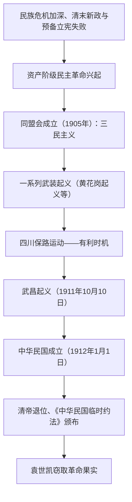

# 第18课 辛亥革命

## 时空坐标

- 1894年11月：孙中山在檀香山创立兴中会
- 1905年8月：中国同盟会在日本东京成立，提出十六字纲领
- 1911年4月：黄花岗起义；5月：清政府"皇族内阁"出台、保路运动兴起
- 1911年10月10日：武昌起义爆发
- 1912年1月1日：中华民国临时政府在南京成立
- 1912年2月12日：清帝退位；3月：颁布《中华民国临时约法》
- 1912年3月：袁世凯在北京就任临时大总统，革命果实旁落

## 知识梳理

| 项目 | 内容 | 意义/局限 |
| --- | --- | --- |
| 三民主义 | 民族（驱除鞑虏，恢复中华）、民权（创立民国）、民生（平均地权） | 较完整的资产阶级革命纲领；未明确反帝、未彻底解决土地问题 |
| 《临时约法》 | 主权在民、自由平等、三权分立、责任内阁制 | 中国历史上第一部具有资产阶级共和国宪法性质的重要文件 |
| 辛亥革命性质 | 比较完全意义上的近代民族民主革命 | 推翻帝制但未改变社会性质 |

## 重点精讲

1. **革命爆发的背景**：《辛丑条约》后民族危机空前严重；清末新政和预备立宪未能挽救统治，"皇族内阁"使立宪派失望，转而支持革命；民族资本主义发展与资产阶级革命派力量壮大；革命思想（章炳麟、邹容、陈天华）广泛传播。
2. **三民主义评价**：是孙中山对同盟会纲领的阐发，指导了辛亥革命。局限在于没有明确提出反对帝国主义的主张，没有彻底的土地革命纲领，这决定了资产阶级革命派难以充分发动群众。
3. **《中华民国临时约法》**：规定中华民国主权属于全体国民；按三权分立原则构建政治体制；实行**责任内阁制**（针对袁世凯，限制其权力）。实际意义在于以法律形式否定君主专制。
4. **辛亥革命的历史意义与局限**（史学观点）：意义——推翻清王朝统治，结束两千多年的君主专制制度，建立共和政体；传播民主共和理念，推动思想解放；促进社会经济、风俗习惯的新变化。局限——没有解决近代中国社会的根本矛盾，没有完成民族独立、人民解放的历史任务；缺乏科学的革命纲领、不能发动广大民众、缺乏坚强有力的革命政党领导。所谓"失败"是指反帝反封建任务未完成，而非一无所成。

## 典型例题

**例1（选择题）** 《中华民国临时约法》规定实行责任内阁制，其直接目的是（　）
A. 落实三权分立学说　B. 限制袁世凯的权力　C. 效仿美国政体　D. 保障人民民主权利
**解析**：约法制定于袁世凯即将接任临时大总统之际，改总统制为责任内阁制，意在以内阁牵制总统专权。选 **B**。

**例2（材料题）** 材料：辛亥革命后，"敢有帝制自为者，天下共击之"渐成社会心理。
问：结合材料和所学，说明辛亥革命在思想层面的影响，并指出其局限性。
**解析**：影响：①结束君主专制，使民主共和观念深入人心；②冲击封建纲常礼教，推动思想解放和社会生活习俗变革（剪辫、易服、废止跪拜等）。局限：①未提出彻底的反帝反封建纲领；②未广泛发动农民群众；③革命果实被袁世凯窃取，中国半殖民地半封建社会性质没有改变。

## 易错点

- 辛亥革命推翻的是**君主专制制度**（帝制），不是"封建制度/封建思想"整体。
- 武昌起义时孙中山不在国内；中华民国成立于1912年1月1日，清帝退位在其后（2月12日）。
- 《临时约法》实行**责任内阁制**而非总统制，针对对象是袁世凯。
- 同盟会纲领与三民主义是同一内容的不同表述，三民主义是对纲领的阐发。

## 背记要点

1. 1905年同盟会成立：第一个全国性资产阶级革命政党，纲领即三民主义
2. 1911年10月10日武昌起义；1912年1月1日中华民国成立
3. 1912年2月12日清帝退位，两千多年君主专制终结
4. 《临时约法》：主权在民、三权分立、责任内阁制——第一部资产阶级共和国宪法性质文件
5. 局限：未改变半殖民地半封建社会性质，果实被袁世凯窃取

## 自测题

1. 简述辛亥革命爆发的历史背景（政治、经济、思想、组织四方面）。
2. 默写三民主义的内容并评价其进步性与局限性。
3. 《中华民国临时约法》体现了哪些原则？为何规定责任内阁制？
4. 如何全面评价辛亥革命的历史功绩与局限？

## 相关知识点

清末统治危机与新政背景见 [[第17课 挽救民族危亡的斗争]]；革命果实旁落后的政局见 [[第19课 北洋军阀统治时期的政治、经济与文化]]。
