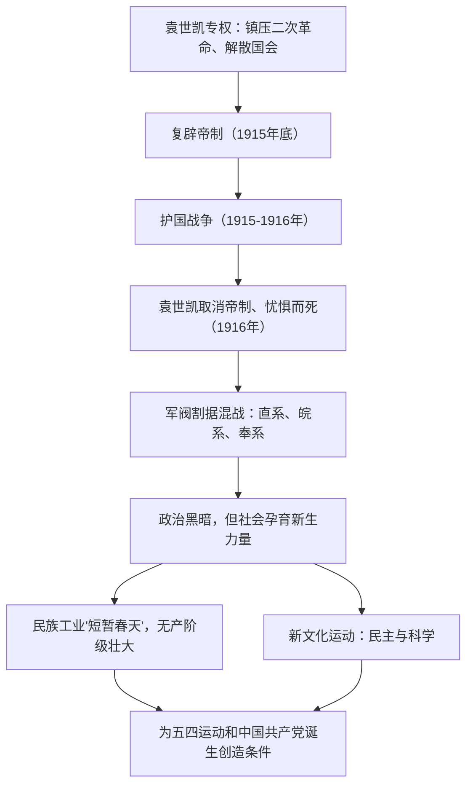

# 第19课 北洋军阀统治时期的政治、经济与文化

## 时空坐标

- 1912年3月：袁世凯就任中华民国临时大总统，北洋军阀统治开始
- 1913年：宋教仁遇刺、"二次革命"失败
- 1915年5月：袁世凯被迫签订"中日民四条约"；12月称帝，护国战争爆发
- 1915年9月：陈独秀在上海创办《青年杂志》，新文化运动兴起
- 1916年6月：袁世凯死，北洋军阀分裂为直、皖、奉等派系
- 1917年：张勋复辟失败；孙中山发起护法运动；中国参加第一次世界大战
- 1912-1919年：民族工业迎来发展"短暂春天"

## 知识梳理

| 领域 | 主要表现 | 原因/影响 |
| --- | --- | --- |
| 政治 | 袁世凯复辟、军阀混战、府院之争、张勋复辟 | 民主共和与专制复辟激烈斗争 |
| 经济 | 民族工业迅速发展（"短暂春天"） | 一战期间列强放松侵略、民国建立扫除障碍、反帝爱国运动 |
| 社会 | 剪辫易服、改称谓、新式婚丧 | 共和政体建立与西俗东渐 |
| 文化 | 新文化运动：民主、科学、白话文 | 动摇封建思想统治地位，思想解放 |

## 重点精讲

1. **袁世凯复辟帝制及其失败**：镇压二次革命→强迫国会选其为正式大总统→解散国会→改责任内阁制为总统制→接受日本"二十一条"大部分要求换取支持→1915年底称帝。失败原因：辛亥革命后**民主共和观念深入人心**，复辟逆历史潮流；护国战争的军事打击；北洋集团内部离心。
2. **民族工业"短暂春天"**：外因——第一次世界大战期间西方列强忙于欧战，暂时放松对华经济侵略；内因——中华民国建立扫除政治障碍、政府鼓励兴办实业、群众性反帝爱国运动（抵制日货、提倡国货）。以纺织、面粉业为代表。深远影响：**中国产业工人队伍壮大**，为中国共产党成立奠定阶级基础。
3. **新文化运动**：1915年《青年杂志》（后改名《新青年》）创刊为标志，代表人物陈独秀、李大钊、胡适、鲁迅等，北京大学（蔡元培主张"兼容并包"）和《新青年》是主要阵地。内容：拥护"德先生"（民主）与"赛先生"（科学），反对旧道德、提倡新道德，提倡白话文。
4. **对新文化运动的评价**（史学观点）：它是一次伟大的思想解放运动，高举民主与科学旗帜，动摇了封建礼教的统治地位，为马克思主义在中国的传播创造了条件；但其局限在于主要局限于知识分子群体，且对东西方文化的评判存在一定绝对化倾向。理解北洋时期"政治黑暗与社会进步并存"是本课主线。

## 典型例题

**例1（选择题）** 1912-1919年中国民族工业出现"短暂春天"，其最主要的外部原因是（　）
A. 辛亥革命扫除障碍　B. 群众抵制日货　C. 一战期间列强放松对华经济侵略　D. 政府奖励实业
**解析**：题目限定"外部原因"，A、B、D 均为内因。选 **C**。"短暂"也正因大战结束后列强卷土重来。

**例2（材料题）** 材料：陈独秀说："我们现在认定只有这两位先生，可以救治中国政治上、道德上、学术上、思想上一切的黑暗。"
问：材料中"两位先生"指什么？结合所学评价新文化运动。
**解析**："两位先生"即民主（德先生）与科学（赛先生）。评价：①进步性——猛烈冲击封建思想的统治地位，促进思想解放尤其是青年觉醒；推动白话文普及与文学革命；为马克思主义传播开辟道路。②局限性——未与工农群众相结合；对传统文化与西方文化的评判存在绝对化倾向。

## 易错点

- 护国战争反对的是**袁世凯称帝**；护法运动维护的是**《临时约法》和国会**，二者对象不同。
- "短暂春天"主要发展**轻工业**（纺织、面粉），重工业基础依然薄弱，未形成独立完整的工业体系。
- 新文化运动前期宣传资产阶级民主与科学，**后期**（俄国十月革命后）才开始传播马克思主义。
- 袁世凯死于1916年后北洋军阀分裂割据，北洋政府并未垮台，统治延续到1928年。

## 背记要点

1. 袁世凯复辟：1915年底称帝→护国战争→1916年取消帝制、忧惧而死
2. 军阀派系：直系（冯国璋）、皖系（段祺瑞）、奉系（张作霖）
3. 短暂春天原因：一战列强放松侵略＋民国建立＋实业救国＋反帝爱国运动
4. 新文化运动：1915年《青年杂志》创刊，民主与科学，北大与《新青年》主阵地
5. 意义：无产阶级壮大＋思想解放，为五四运动和建党准备条件

## 自测题

1. 梳理袁世凯从专权到复辟帝制的主要步骤及其失败原因。
2. 分析民族工业"短暂春天"出现的内外因及其阶级影响。
3. 概述新文化运动的兴起标志、代表人物、主要内容和评价。
4. 如何理解北洋军阀统治时期"政治黑暗与社会进步并存"？

## 相关知识点

革命果实为何旁落见 [[第18课 辛亥革命]]；新文化运动与工人阶级壮大的结果见 [[第20课 五四运动与中国共产党的诞生]]。
