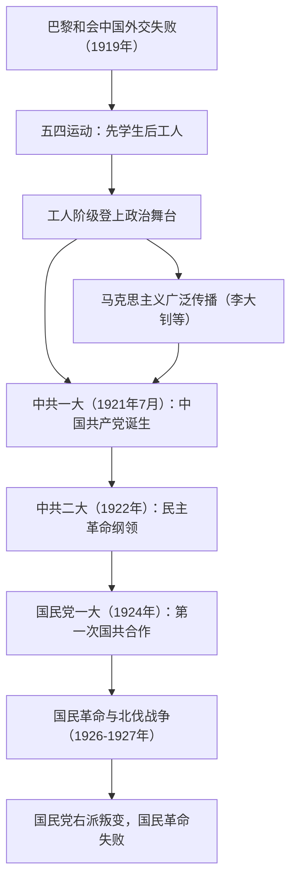

# 第20课 五四运动与中国共产党的诞生

## 时空坐标

- 1919年1月：巴黎和会召开，中国外交失败成为导火索
- 1919年5月4日：北京学生游行示威，五四运动爆发
- 1919年6月5日起：运动中心由北京转到上海，工人阶级登上政治舞台
- 1920年：陈独秀在上海、李大钊在北京先后建立共产党早期组织
- 1921年7月：中国共产党第一次全国代表大会在上海（后转嘉兴南湖）召开
- 1922年7月：中共二大提出反帝反封建的民主革命纲领
- 1924年1月：国民党一大召开，第一次国共合作正式形成
- 1926年7月：国民革命军出师北伐；1927年：四一二、七一五反革命政变，国民革命失败

## 知识梳理

| 阶段 | 时间/中心 | 主力 | 结果 |
| --- | --- | --- | --- |
| 五四运动第一阶段 | 5月4日起，北京 | 学生 | 遭到北洋政府镇压 |
| 五四运动第二阶段 | 6月5日起，上海 | 工人阶级（"三罢"斗争） | 释放被捕学生、罢免曹汝霖等、拒签和约 |
| 中共一大 | 1921年7月，上海—嘉兴 | 13名代表 | 确定党的名称与奋斗目标 |
| 中共二大 | 1922年7月，上海 | — | 提出反帝反封建民主革命纲领 |

## 重点精讲

1. **五四运动的性质与意义**：是一场以先进青年知识分子为先锋、广大人民群众参加的彻底反帝反封建的伟大爱国革命运动；工人阶级以独立姿态登上政治舞台；促进了马克思主义与中国工人运动的结合，为中国共产党成立作了思想上、干部上的准备；是中国**旧民主主义革命走向新民主主义革命的转折点**。
2. **"新"民主主义革命之"新"**（史学观点）：新的领导阶级（无产阶级）、新的指导思想（马克思主义）、新的前途（社会主义）。革命性质仍是资产阶级民主革命，任务仍是反帝反封建，这是"变与不变"的辩证理解。
3. **中国共产党成立的意义**："开天辟地的大事变"——中国革命有了坚强的领导力量、有了科学的指导思想（马克思主义）、有了新的奋斗目标，中国革命的面貌焕然一新。中共二大第一次明确提出**反帝反封建的民主革命纲领**（最低纲领），指明了革命方向。
4. **第一次国共合作与国民革命**：合作方式为党内合作（共产党员以个人身份加入国民党）；政治基础是新三民主义。北伐基本推翻北洋军阀反动统治，但因国民党右派叛变（蒋介石四一二政变、汪精卫七一五政变）而失败。教训：必须坚持无产阶级对革命的**领导权**，必须掌握**革命武装**。

## 典型例题

**例1（选择题）** 五四运动成为中国新民主主义革命开端的最主要依据是（　）
A. 运动取得初步胜利　B. 具有反帝反封建性质　C. 无产阶级开始登上政治舞台并发挥主力军作用　D. 马克思主义开始传入中国
**解析**：新旧民主革命的根本区别在领导阶级。五四运动中工人阶级以独立姿态登上政治舞台，选 **C**。B 项旧民主主义革命同样具备；D 项在五四之前已开始。

**例2（材料题）** 材料：中共二大宣言指出，党的最高纲领是实现社会主义、共产主义，现阶段纲领是"消除内乱，打倒军阀……推翻国际帝国主义的压迫"。
问：概括中共二大的主要贡献，并说明其历史意义。
**解析**：贡献：分析中国半殖民地半封建的社会性质，第一次明确提出反帝反封建的民主革命纲领，区分了最高纲领与最低纲领。意义：为中国革命指明了方向，表明中国共产党开始把马克思主义基本原理同中国革命具体实际相结合。

## 易错点

- 五四运动的导火索是**巴黎和会上中国外交的失败**，不是"二十一条"本身。
- 五四运动取得的是**初步胜利**（拒签和约等），反帝反封建任务并未完成。
- 反帝反封建民主革命纲领由**中共二大**提出，中共一大确定的是推翻资产阶级政权、实现社会主义的目标。
- 第一次国共合作是**党内合作**，与抗战时期的党外合作（第二次国共合作）不同。

## 背记要点

1. 五四导火索：巴黎和会外交失败；口号："外争主权，内除国贼"
2. 两阶段：北京学生→上海工人"三罢"，工人阶级登上政治舞台
3. 1921年7月中共一大（上海—嘉兴南湖）：开天辟地大事变
4. 1922年中共二大：第一次提出反帝反封建民主革命纲领
5. 1924年国民党一大：国共合作（党内合作）→北伐→1927年国民革命失败

## 自测题

1. 说明五四运动是新民主主义革命开端的依据。
2. 比较中共一大与二大的纲领内容及其进步。
3. 第一次国共合作的方式、政治基础和主要成果是什么？
4. 国民革命失败留下了哪些经验教训？

## 相关知识点

思想与阶级准备见 [[第19课 北洋军阀统治时期的政治、经济与文化]]；大革命失败后的道路探索见 [[第21课 南京国民政府的统治和中国共产党开辟革命新道路]]。
