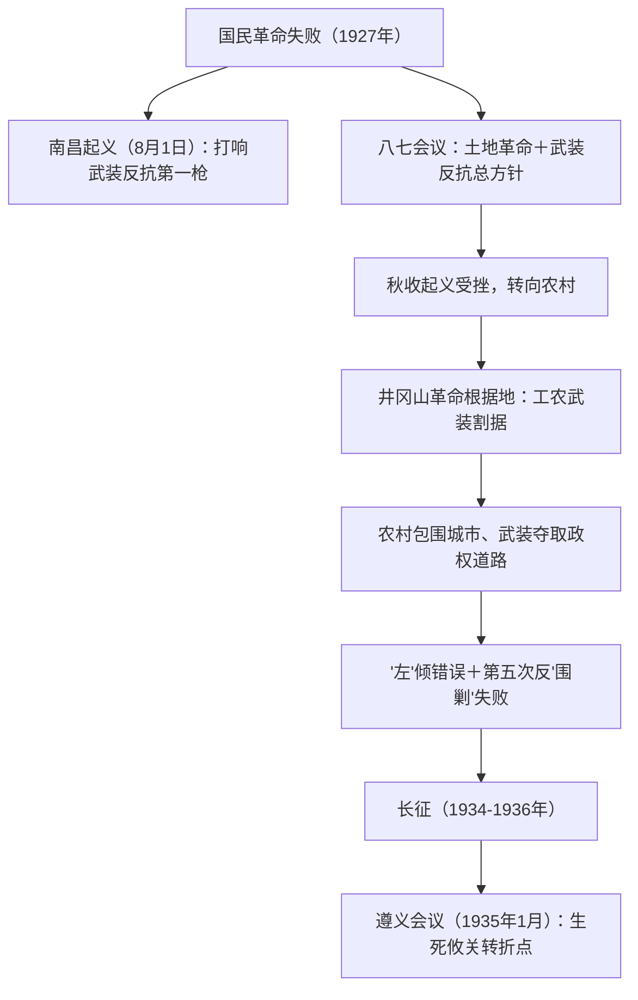

# 第21课 南京国民政府的统治和中国共产党开辟革命新道路

## 时空坐标

- 1927年4月：南京国民政府建立；8月1日：南昌起义
- 1927年8月7日：八七会议，确定土地革命和武装反抗国民党反动派的总方针
- 1927年9月：秋收起义；10月：毛泽东率部创建井冈山革命根据地
- 1928年底：张学良"东北易帜"，国民政府在形式上基本统一全国
- 1931年11月：中华苏维埃共和国临时中央政府在瑞金成立
- 1934年10月：中央红军开始长征；1935年1月：遵义会议
- 1935年10月：中央红军到达陕北吴起镇；1936年10月：红军三大主力会宁地区会师，长征胜利结束

## 知识梳理

| 项目 | 南京国民政府统治 | 中国共产党探索 |
| --- | --- | --- |
| 政治 | 宁汉合流、东北易帜形式统一、一党专政 | 建立农村革命根据地、苏维埃政权 |
| 经济 | 民族工业有一定发展，官僚资本聚敛财富 | 开展土地革命，农民分得土地 |
| 军事 | 对根据地连续"围剿" | 反"围剿"斗争、红军长征 |

## 重点精讲

1. **南京国民政府的统治**：1927年"宁汉合流"标志国民党专制统治确立；1928年"东北易帜"使国民政府**在形式上基本统一全国**（新军阀混战不断，并非真正统一）。经济上民族工业有较快发展（国民经济建设运动、改订新约等因素），但官僚资本凭借国家权力聚敛巨额财富，压制民族工业。
2. **革命新道路的开辟**：南昌起义打响武装反抗国民党反动派第一枪，是中国共产党独立领导武装斗争、创建人民军队的开始；八七会议纠正右倾错误，毛泽东提出"政权是由枪杆子中取得的"；井冈山根据地的创建，点燃"工农武装割据"的星星之火，开辟出**农村包围城市、武装夺取政权**的中国革命新道路——马克思主义基本原理同中国具体实际相结合的典范（史学观点：这一道路突破了以城市为中心的俄国模式，体现实事求是的思想路线）。
3. **土地革命**："打土豪、分田地"，使广大农民获得土地，激发革命热情，是根据地存在发展的社会基础。
4. **遵义会议**（1935年1月）：集中解决**军事和组织问题**，纠正"左"倾错误军事路线，事实上确立了以毛泽东为主要代表的马克思主义正确路线在党中央的领导地位。意义：在极其危急时刻挽救了党、挽救了红军、挽救了中国革命，是党的历史上一个生死攸关的转折点，标志着中国共产党从幼年走向成熟。
5. **长征精神与意义**：实现了红军的战略大转移，宣传了党的主张，铸就了伟大的长征精神，打开了中国革命的新局面。

## 典型例题

**例1（选择题）** 毛泽东开辟"农村包围城市、武装夺取政权"道路的根本依据是（　）
A. 俄国十月革命的经验　B. 中国半殖民地半封建的具体国情　C. 城市敌人力量强大　D. 农民占人口多数
**解析**：C、D 是具体表现，根本依据是从中国国情出发——半殖民地半封建社会中反动势力盘踞城市、农村是薄弱环节。选 **B**。

**例2（材料题）** 材料：遵义会议决议指出，必须"改正军事领导上的错误"，会议增选毛泽东为中央政治局常委。
问：结合材料和所学，说明遵义会议解决的主要问题及其历史意义。
**解析**：主要问题：集中纠正博古、李德等人在军事指挥上和组织上的"左"倾错误（未全面清算政治路线）。意义：①事实上确立了以毛泽东为主要代表的马克思主义正确路线在党中央的领导地位；②在极端危急关头挽救了党、红军和中国革命；③是党第一次独立自主运用马克思主义原理解决自身路线、方针问题，标志党由幼年走向成熟。

## 易错点

- "东北易帜"只是**形式上**基本统一，不能表述为"完成全国统一"。
- 南昌起义是武装反抗第一枪；**八七会议**才确定土地革命总方针，二者时序勿颠倒（起义在会议之前）。
- 遵义会议解决的是**军事和组织问题**，并未全面清算"左"倾政治路线。
- 长征结束的标志是1936年10月**红军三大主力会宁地区会师**，不是1935年中央红军到达陕北。

## 背记要点

1. 1927年：南昌起义（8月1日）→八七会议→秋收起义→井冈山根据地
2. 新道路：农村包围城市、武装夺取政权（工农武装割据：武装斗争＋土地革命＋根据地建设）
3. 1931年中华苏维埃共和国临时中央政府成立于瑞金
4. 长征：1934年10月出发→1935年1月遵义会议（转折点）→1936年10月三大主力会师
5. 国民政府：宁汉合流、东北易帜、官僚资本、新军阀混战

## 自测题

1. 概述南京国民政府在形式上统一全国的过程及其局限。
2. "工农武装割据"包括哪三方面内容？其相互关系如何？
3. 遵义会议召开的背景、内容和意义是什么？
4. 为什么说农村包围城市道路是马克思主义中国化的成功范例？

## 相关知识点

大革命失败的教训见 [[第20课 五四运动与中国共产党的诞生]]；民族矛盾上升后的局势转变见 [[第22课 从局部抗战到全面抗战]]。
