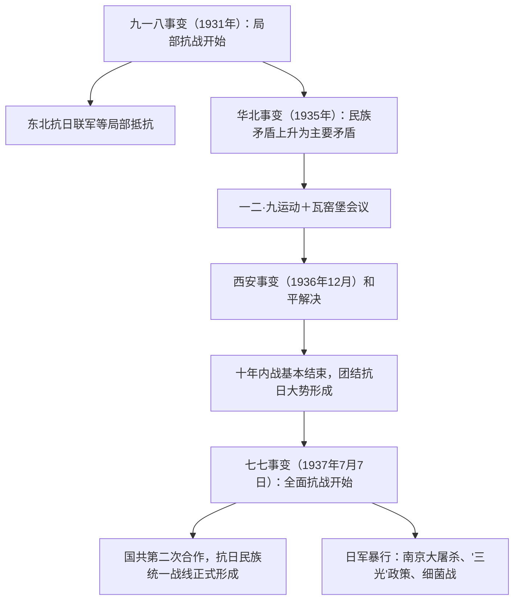

# 第22课 从局部抗战到全面抗战

## 时空坐标

- 1931年9月18日：九一八事变，中国人民抗日战争的起点，局部抗战开始
- 1932年：一·二八事变；日本扶植伪满洲国（1932年3月）
- 1935年：华北事变，中日民族矛盾上升为主要矛盾；12月9日：一二·九运动
- 1935年12月：中共瓦窑堡会议确定建立抗日民族统一战线方针
- 1936年12月12日：西安事变及其和平解决
- 1937年7月7日：卢沟桥事变（七七事变），全面抗战开始
- 1937年9月：国民党发表国共合作宣言，抗日民族统一战线正式形成
- 1937年12月：南京大屠杀，遇难同胞30万以上

## 知识梳理

| 事件 | 时间 | 意义/影响 |
| --- | --- | --- |
| 九一八事变 | 1931.9.18 | 抗日战争起点，揭开世界反法西斯战争序幕 |
| 华北事变 | 1935 | 中日民族矛盾上升为中国社会主要矛盾 |
| 西安事变和平解决 | 1936.12 | 十年内战基本结束，全国团结抗战局面初步形成 |
| 七七事变 | 1937.7.7 | 全面抗战由此开始 |
| 统一战线正式形成 | 1937.9 | 国共第二次合作，全民族抗战局面形成 |

## 重点精讲

1. **局部抗战**：九一八事变后国民政府推行"攘外必先安内"方针，寄希望于国联；东北人民革命军（后为东北抗日联军，杨靖宇、赵尚志等）坚持抵抗；十九路军淞沪抗战、长城抗战等相继展开。**2017年教育部明确"十四年抗战"概念**，强调1931-1945年抗战的整体性（史学观点：突出中国抗战的持久性与东方主战场地位）。
2. **抗日民族统一战线的形成过程**：华北事变后民族矛盾上升→中共发表"八一宣言"号召停止内战、一致抗日→瓦窑堡会议确定建立抗日民族统一战线的方针→一二·九运动促进民众觉醒→西安事变和平解决（扭转时局的枢纽）→七七事变后国共谈判→1937年9月国民党中央通讯社发表中共中央提交的国共合作宣言，标志统一战线**正式形成**。
3. **西安事变和平解决的意义**：张学良、杨虎城"兵谏"逼蒋抗日；中共从民族大义出发主张和平解决。它成为扭转时局的枢纽，标志十年内战基本结束和全国团结抗战局面初步形成。
4. **日军侵华暴行**：南京大屠杀（1937年12月起六周内屠杀手无寸铁的平民和放下武器的士兵30万人以上）；重庆大轰炸；殖民统治与"以华制华"（扶植汪精卫伪政权，1940年）；"以战养战"经济掠夺；对敌后根据地"烬灭作战"（"三光"政策）；731部队细菌战、慰安妇制度等，铁证如山，不容否认。

## 典型例题

**例1（选择题）** 中日民族矛盾上升为中国社会主要矛盾的标志是（　）
A. 九一八事变　B. 华北事变　C. 西安事变　D. 七七事变
**解析**：华北事变使中华民族面临亡国灭种危机，民族矛盾上升为主要矛盾，国内阶级关系随之调整。选 **B**。九一八是局部抗战开始，七七是全面抗战开始。

**例2（材料题）** 材料：1936年12月，中共中央派周恩来赴西安谈判，主张在蒋介石接受停止内战、联共抗日等条件下释放蒋介石。
问：中国共产党为什么主张和平解决西安事变？这一解决有何意义？
**解析**：原因：①民族矛盾已成为主要矛盾，抗日是全民族最高利益；②杀蒋可能引发更大规模内战，有利于日本侵略；③和平解决可逼蒋联共抗日，建立统一战线。意义：西安事变的和平解决成为扭转时局的枢纽，十年内战基本结束，全国团结抗战的局面初步形成。

## 易错点

- 抗日战争的起点是**九一八事变**（十四年抗战），全面抗战开始于**七七事变**，两个概念不可混淆。
- 抗日民族统一战线**初步形成**于西安事变和平解决，**正式形成**于1937年9月国共合作宣言发表。
- 第二次国共合作是**党外合作**（各自保持独立性），不同于第一次的党内合作。
- 南京大屠杀遇难者为**30万人以上**，须用教材规范表述。

## 背记要点

1. 九一八事变（1931）：抗战起点、局部抗战开始，"十四年抗战"概念
2. 华北事变（1935）：民族矛盾上升为主要矛盾；一二·九运动、瓦窑堡会议
3. 西安事变（1936.12.12）和平解决：扭转时局的枢纽
4. 七七事变（1937.7.7）：全面抗战开始；1937年9月统一战线正式形成
5. 日军暴行：南京大屠杀（30万以上）、731部队、"三光"政策、汪伪政权

## 自测题

1. 简述"十四年抗战"概念的内涵及其史学意义。
2. 梳理抗日民族统一战线从酝酿到正式形成的过程。
3. 分析西安事变和平解决的原因和意义。
4. 列举日本侵华的主要暴行及其表现。

## 相关知识点

国共十年对峙的背景见 [[第21课 南京国民政府的统治和中国共产党开辟革命新道路]]；全面抗战的进程与胜利见 [[第23课 全民族浴血奋战与抗日战争的胜利]]。
