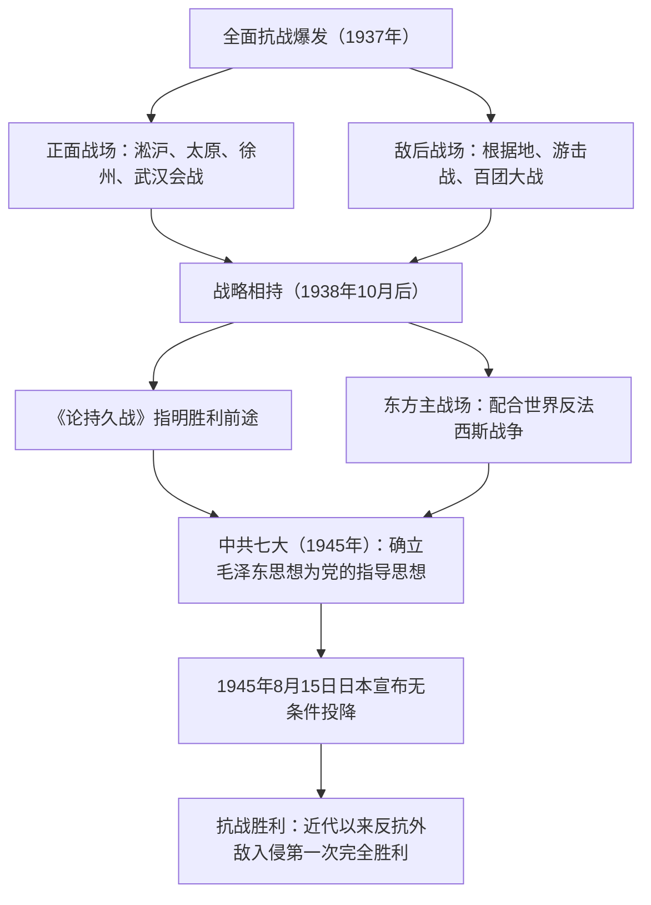

# 第23课 全民族浴血奋战与抗日战争的胜利

## 时空坐标

- 1937年8-11月：淞沪会战，粉碎日军"三个月亡华"企图
- 1937年9月：平型关大捷——全面抗战以来中国军队第一个胜仗
- 1938年春：台儿庄大捷——正面战场最大胜利；6-10月：武汉会战，抗战进入相持阶段
- 1940年下半年：百团大战（彭德怀指挥）
- 1941-1942年：中国远征军入缅作战；1942年毛泽东《论持久战》思想深入实践（发表于1938年）
- 1945年4-6月：中共七大（延安）；参与联合国制宪会议
- 1945年8月15日：日本宣布无条件投降；9月2日签署投降书；10月25日台湾光复

## 知识梳理

| 战场 | 主要战事 | 特点 |
| --- | --- | --- |
| 正面战场 | 淞沪、太原、徐州（台儿庄）、武汉、三次长沙会战 | 国民党军队主导，防御阶段作用重大 |
| 敌后战场 | 平型关大捷、百团大战、反"扫荡" | 游击战为主，逐渐成为抗战主战场 |
| 国外战场 | 中国远征军入缅作战 | 配合盟军，救援英军，保卫滇缅通道 |

## 重点精讲

1. **两个战场的关系**：正面战场与敌后战场相互配合、相互依存，共同构成全民族抗战的整体。防御阶段正面战场是主战场；相持阶段敌后战场逐渐成为**全国抗战的主战场**，中国共产党成为全民族抗战的中流砥柱（史学观点：评价两个战场应坚持全面、辩证，肯定各自贡献）。
2. **持久战思想**：毛泽东1938年发表《论持久战》，科学论证中国既不能速胜、也不会亡国，抗战将经过战略防御、相持、反攻三阶段，最后胜利属于中国，极大鼓舞了全国人民的信心。
3. **中共七大**（1945年4-6月，延安）：提出党的政治路线——放手发动群众，壮大人民力量，在党的领导下打败日本侵略者，解放全国人民，建立新民主主义的中国；确立**毛泽东思想**为党的指导思想；选举以毛泽东为首的中央委员会。意义：为夺取抗战胜利和新民主主义革命在全国的胜利作了重要准备，使全党空前团结统一。
4. **抗战胜利的原因与意义**：根本原因是以国共合作为基础的**抗日民族统一战线下的全民族抗战**；中国共产党发挥中流砥柱作用；世界反法西斯力量的配合。意义：①近代以来中国人民反抗外敌入侵**第一次取得完全胜利**；②重新确立了中国的大国地位（联合国创始会员国、安理会常任理事国）；③开辟了中华民族伟大复兴的光明前景；④中国战场是世界反法西斯战争的**东方主战场**，对胜利作出重大贡献。

## 典型例题

**例1（选择题）** 抗日战争取得胜利的根本原因是（　）
A. 美国投掷原子弹　B. 苏联出兵中国东北　C. 以国共合作为基础的全民族抗战　D. 正面战场的顽强抵抗
**解析**：A、B 是外部因素（重要但非根本），D 只是全民族抗战的一部分。全民族团结抗战是胜利的决定性因素。选 **C**。

**例2（材料题）** 材料：罗斯福曾说，假如没有中国，"日本可以马上打下澳洲，打下印度……和德国配合起来"。
问：结合材料和所学，说明中国抗日战争在世界反法西斯战争中的地位和贡献。
**解析**：地位：中国战场是世界反法西斯战争的**东方主战场**，开始时间最早（1931年）、持续时间最长。贡献：①长期牵制和抗击日本陆军主力，粉碎其"北进"企图、迟滞其"南进"步伐；②有力配合了盟军在太平洋、欧洲战场的作战；③中国远征军入缅作战直接支援盟军；④付出巨大民族牺牲（伤亡3500万以上），为胜利作出不可磨灭的贡献。

## 易错点

- 平型关大捷是**全面抗战以来第一个胜仗**（八路军）；台儿庄大捷是**正面战场最大胜利**（李宗仁指挥），定位勿混。
- 相持阶段开始的标志是1938年10月**广州、武汉失守**，不是百团大战。
- 中共七大确立毛泽东思想为指导思想；遵义会议只是"事实上确立"毛泽东正确路线的领导地位。
- 日本**宣布**投降是8月15日，正式**签署投降书**是9月2日（抗战胜利纪念日为9月3日）。

## 背记要点

1. 四大会战：淞沪（粉碎三个月亡华）、太原（含平型关）、徐州（含台儿庄）、武汉（后入相持）
2. 敌后战场：游击战、百团大战（1940，彭德怀）、根据地建设（三三制政权、减租减息、大生产运动）
3. 《论持久战》（1938）：防御—相持—反攻，胜利属于中国
4. 中共七大（1945，延安）：毛泽东思想写入党章
5. 胜利意义：第一次完全胜利、大国地位重塑、东方主战场、复兴前景

## 自测题

1. 比较正面战场与敌后战场的地位、作用及相互关系。
2. 概述《论持久战》的主要内容及其意义。
3. 中共七大的主要内容和历史意义是什么？
4. 从国内、国际两个角度分析抗战胜利的原因和意义。

## 相关知识点

统一战线的形成过程见 [[第22课 从局部抗战到全面抗战]]；战后中国两种命运的较量见 [[第24课 人民解放战争]]。
