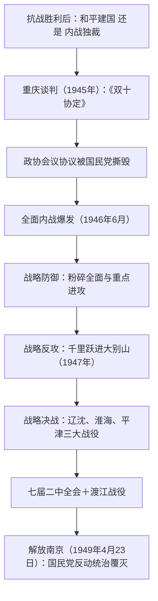

# 第24课 人民解放战争

## 时空坐标

- 1945年8月底-10月：重庆谈判，签署《双十协定》
- 1946年1月：重庆政治协商会议通过和平建国纲领案等五项协议
- 1946年6月：国民党军进攻中原解放区，全面内战爆发
- 1947年3月起：国民党重点进攻陕北、山东解放区被粉碎
- 1947年夏：刘邓大军千里跃进大别山，战略反攻开始；《中国土地法大纲》颁布
- 1948年9月-1949年1月：辽沈、淮海、平津三大战役
- 1949年3月：中共七届二中全会（西柏坡）；4月：北平和谈破裂、渡江战役，4月23日解放南京
- 1949年上半年：毛泽东发表《论人民民主专政》

## 知识梳理

| 战役 | 时间 | 指挥/部队 | 意义 |
| --- | --- | --- | --- |
| 辽沈战役 | 1948.9-11 | 东北野战军 | 解放东北全境，人民解放军数量取得优势 |
| 淮海战役 | 1948.11-1949.1 | 华东、中原野战军 | 长江中下游以北广大地区解放 |
| 平津战役 | 1948.11-1949.1 | 东北、华北野战军 | 基本解放华北全境，北平和平解放 |

## 重点精讲

1. **重庆谈判与政协会议**：中共提出和平、民主、团结三大口号，毛泽东亲赴重庆，签订《双十协定》（和平建国、坚决避免内战、召开政协会议等）。意义在于中国共产党在政治上赢得了主动，在人民面前表明了争取和平的诚意；国民党最终撕毁政协协议，发动内战，暴露其独裁内战的本质。
2. **国统区的统治危机**：恶性通货膨胀、滥发纸币（金圆券改革失败）、官僚资本巧取豪夺，民不聊生；"反饥饿、反内战、反迫害"运动兴起，形成配合武装斗争的**第二条战线**；国民党在政治、经济上陷于全面孤立。
3. **土地改革与战争胜利**：1947年《中国土地法大纲》实行耕者有其田，废除封建性及半封建性剥削的土地制度。亿万农民获得土地，踊跃参军支前，为解放战争胜利提供了源源不断的人力物力支持——理解"人民战争"的胜利（史学观点：民心向背是决定战争胜负的根本因素，"人心是最大的政治"）。
4. **七届二中全会**（1949年3月，西柏坡）：提出党的工作重心由乡村转移到城市；提出革命胜利后党在各方面的基本政策；毛泽东提醒全党务必继续保持谦虚、谨慎、不骄、不躁的作风，务必继续保持艰苦奋斗的作风（"两个务必"）。
5. **新民主主义革命胜利的意义**：从根本上改变了中国社会的发展方向，是20世纪人类历史上最具影响的伟大事件之一；是马克思列宁主义基本原理同中国革命具体实践相结合的毛泽东思想的胜利。

## 典型例题

**例1（选择题）** 1947年刘邓大军千里跃进大别山的战略意义在于（　）
A. 粉碎国民党重点进攻　B. 揭开战略反攻（战略进攻）的序幕　C. 完成战略决战　D. 推翻南京国民政府
**解析**：跃进大别山直插国统区腹地，将战争引向国民党统治区，人民解放军由战略防御转入战略进攻。选 **B**。

**例2（材料题）** 材料：淮海战役中，解放区共出动支前民工543万人，运送弹药物资无数。陈毅说："淮海战役的胜利是人民群众用小车推出来的。"
问：结合材料和所学，分析人民解放战争迅速胜利的原因。
**解析**：①中国共产党的正确领导和毛泽东军事思想的正确指挥；②土地改革使农民获得土地，人民群众全力支援前线（材料所示）；③人民解放军英勇作战；④国统区第二条战线的配合；⑤国民党政治孤立、经济崩溃、军队厌战、贪腐横行，失去民心。根本上是民心向背决定了胜负。

## 易错点

- 全面内战爆发的标志是1946年6月国民党军**进攻中原解放区**，不是重庆谈判破裂。
- 战略反攻序幕是**跃进大别山**（1947），战略决战是**三大战役**（1948-1949），阶段勿混。
- 解放南京（1949.4.23）标志**国民党在大陆反动统治的覆灭**，不等于全国解放，也不是新中国成立。
- 《双十协定》未解决**解放区政权和军队合法地位**问题，谈判成果有限。

## 背记要点

1. 重庆谈判（1945）：《双十协定》——和平建国、避免内战
2. 1946年6月进攻中原解放区→全面内战爆发；1947年跃进大别山→战略反攻
3. 三大战役：辽沈、淮海、平津，基本消灭国民党军主力
4. 七届二中全会：工作重心乡村→城市，"两个务必"
5. 1949年4月23日解放南京：国民党大陆反动统治覆灭

## 自测题

1. 重庆谈判的背景、成果和意义是什么？
2. 简述解放战争由防御到反攻再到决战的进程。
3. 解放区土地改革的内容及其对战争胜利的作用？
4. 概括新民主主义革命胜利的原因和世界意义。

## 相关知识点

抗战胜利后的时局见 [[第23课 全民族浴血奋战与抗日战争的胜利]]；新中国的成立与巩固见 [[第25课 中华人民共和国成立和向社会主义的过渡]]。
