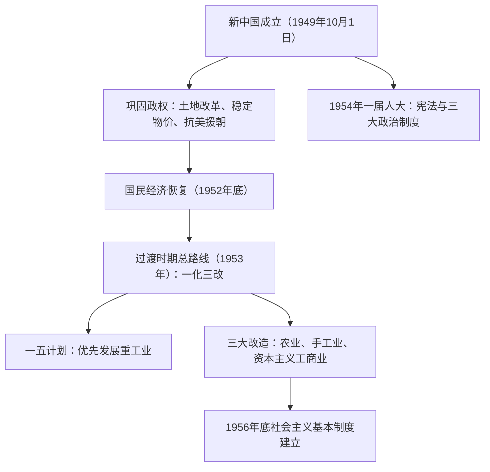

# 第25课 中华人民共和国成立和向社会主义的过渡

## 时空坐标

- 1949年9月：中国人民政治协商会议第一届全体会议召开，通过《共同纲领》
- 1949年10月1日：开国大典，中华人民共和国成立
- 1950年：《中华人民共和国土地改革法》颁布；10月中国人民志愿军入朝作战
- 1950-1952年：土地改革基本完成、国民经济恢复；"银元之战""米棉之战"稳定物价
- 1953年：提出过渡时期总路线，第一个五年计划开始实施；7月《朝鲜停战协定》签订
- 1954年9月：第一届全国人民代表大会召开，通过《中华人民共和国宪法》
- 1953-1956年：三大改造；1956年底基本完成，社会主义制度建立
- 1953年底：周恩来首次提出和平共处五项原则；1955年：万隆会议提出"求同存异"

## 知识梳理

| 领域 | 举措 | 意义 |
| --- | --- | --- |
| 政治 | 一届人大、1954年宪法、人民代表大会制度等 | 初步构建社会主义政治制度体系 |
| 经济 | 土地改革、一五计划、三大改造 | 奠定工业化基础，确立社会主义经济制度 |
| 军事外交 | 抗美援朝、"一边倒"、和平共处五项原则、日内瓦与万隆会议 | 巩固政权，提高国际地位 |

## 重点精讲

1. **新中国成立的意义**：结束了帝国主义、封建主义和官僚资本主义长期压迫和剥削中国各族人民的历史，人民真正成为国家的主人；从根本上改变了中国社会的发展方向，为实现由新民主主义向社会主义过渡创造了前提条件；中华民族开始以崭新姿态自立于世界民族之林。
2. **人民政权的巩固**：①土地改革（1950-1952年底基本完成）废除封建土地制度，农民从封建土地关系束缚中解放；②"银元之战""米棉之战"打击投机、稳定物价，国家赢得经济领导权（毛泽东评价其意义"不下于淮海战役"）；③**抗美援朝**（1950-1953）打出了国威军威，提高了新中国国际地位，形成强大民族凝聚力，涌现黄继光、邱少云等英雄，铸就抗美援朝精神。
3. **过渡时期总路线与"一化三改"**：在一个相当长的时期内，逐步实现国家的社会主义工业化，并逐步实现国家对农业、手工业和资本主义工商业的社会主义改造。特点：社会主义建设与改造**同时并举**。一五计划优先发展重工业（受苏联影响、国防需要、重工业基础薄弱），东北成为重要工业基地。1956年底三大改造基本完成，标志**生产资料公有制占绝对优势的社会主义经济制度**在我国初步建立，中国进入社会主义社会（史学观点：这是中国历史上最深刻的社会变革之一）。
4. **社会主义政治制度体系**：1954年宪法是我国第一部**社会主义类型**的宪法，体现人民民主原则和社会主义原则；确立人民代表大会制度（根本政治制度）、中国共产党领导的多党合作和政治协商制度、民族区域自治制度。
5. **独立自主的和平外交**："另起炉灶""打扫干净屋子再请客""一边倒"三大方针；和平共处五项原则（1953年底提出）标志新中国外交政策的成熟；1954年首次以五大国之一身份参加日内瓦会议；1955年万隆会议提出"求同存异"方针。

## 典型例题

**例1（选择题）** 我国社会主义基本制度建立的标志是（　）
A. 新中国成立　B. 1954年宪法颁布　C. 三大改造基本完成　D. 一五计划超额完成
**解析**：判断社会制度性质的根本标准是生产资料所有制。1956年底三大改造基本完成，公有制占绝对优势。选 **C**。新中国成立标志新民主主义革命基本胜利，不等于进入社会主义。

**例2（材料题）** 材料：1954年宪法规定："中华人民共和国的一切权力属于人民。人民行使权力的机关是全国人民代表大会和地方各级人民代表大会。"
问：指出该宪法的性质、体现的原则及其确立的根本政治制度。
**解析**：性质：我国第一部社会主义类型的宪法。原则：人民民主原则和社会主义原则。根本政治制度：人民代表大会制度。意义：为社会主义民主和法制建设奠定了基础，初步构建了我国社会主义的政治制度体系。

## 易错点

- 《共同纲领》起**临时宪法**作用（新民主主义性质），1954年宪法才是第一部社会主义类型宪法。
- 新中国成立≠社会主义制度建立；进入社会主义的标志是**1956年三大改造基本完成**。
- 土地改革确立的是**农民土地所有制**（仍是私有制），农业合作化才转变为集体公有制。
- 一五计划（1953-1957）与三大改造（1953-1956）时间有重叠但不相同，"一化"完成晚于"三改"。

## 背记要点

1. 1949.10.1 开国大典；《共同纲领》为施政纲领、具有临时宪法作用
2. 巩固政权三件事：土地改革、稳定物价、抗美援朝（1950-1953）
3. 总路线："一化三改"，建设与改造并举；一五计划优先发展重工业
4. 1954年一届人大：第一部社会主义类型宪法，三大政治制度
5. 外交：三大方针、和平共处五项原则、日内瓦会议、万隆会议"求同存异"

## 自测题

1. 从国内、国际角度阐述中华人民共和国成立的伟大意义。
2. 新中国成立初期采取了哪些巩固政权的措施？各有何作用？
3. 概述过渡时期总路线的内容和三大改造完成的意义。
4. 新中国初期取得了哪些外交成就？

## 相关知识点

新民主主义革命的胜利见 [[第24课 人民解放战争]]；社会主义建设的曲折探索见 [[第26课 社会主义建设在探索中曲折发展]]。
