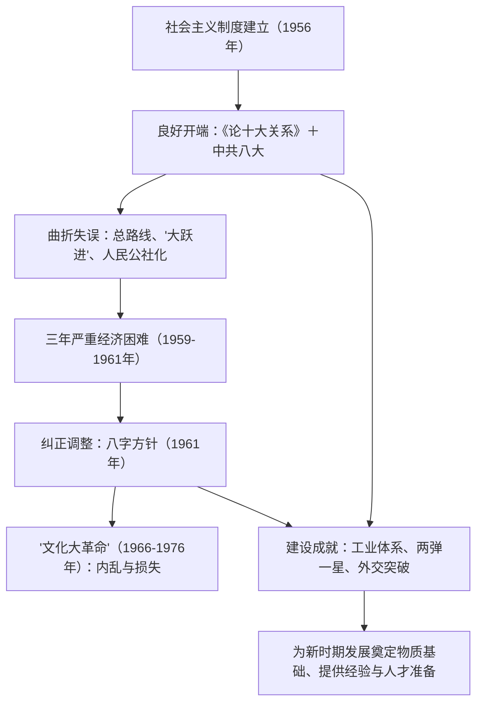

# 第26课 社会主义建设在探索中曲折发展

## 时空坐标

- 1956年：毛泽东《论十大关系》发表；9月中共八大召开
- 1957年：毛泽东提出关于正确处理人民内部矛盾的重要思想
- 1958年：提出社会主义建设总路线，发动"大跃进"和人民公社化运动
- 1959-1961年：国民经济出现严重困难
- 1961年：实行"调整、巩固、充实、提高"八字方针
- 1964年：三线建设推进；提出建设"四个现代化"的伟大目标
- 1966-1976年："文化大革命"
- 1970年"东方红一号"发射；1971年恢复联合国合法席位；1972年中美关系正常化开始、中日建交

## 知识梳理

| 探索 | 内容 | 评价 |
| --- | --- | --- |
| 中共八大（1956） | 主要矛盾：人民对建立先进工业国的要求同落后农业国现实的矛盾；主要任务：集中力量发展生产力 | 对国情的正确分析，良好开端 |
| "大跃进" | 片面追求高速度，"以钢为纲" | 违背经济规律，浮夸风泛滥 |
| 人民公社化 | "一大二公" | 超越生产力水平，挫伤积极性 |
| 八字方针 | 调整、巩固、充实、提高 | 1962年起经济逐步恢复 |

## 重点精讲

1. **良好开端**：《论十大关系》提出调动一切积极因素为社会主义事业服务，标志中国共产党人开始探索适合中国国情的社会主义建设道路；中共八大正确分析国内主要矛盾、确定主要任务，是我国建设社会主义道路的一次成功探索。
2. **探索中的失误及原因**：1958年总路线（"鼓足干劲、力争上游、多快好省地建设社会主义"）反映了广大人民迫切要求改变落后面貌的愿望，但忽视了客观经济规律。"大跃进"和人民公社化运动加上自然灾害等因素，导致1959-1961年严重经济困难。原因：缺乏建设经验、对社会主义建设规律认识不足、急于求成、夸大主观能动性（史学观点：探索中的失误是前进中的曲折，应放在缺乏先例可循的历史条件下辩证评价）。
3. **"文化大革命"**：1966-1976年，由领导者错误发动、被反革命集团利用，给党、国家和各族人民带来严重灾难的**内乱**。1971年粉碎林彪反革命集团；1976年10月粉碎江青反革命集团，"文革"结束。教材定性表述必须准确：不是任何意义上的革命或社会进步。
4. **曲折中的伟大成就**：①工业——建成独立的、比较完整的工业体系和国民经济体系，三线建设增强国防、改善工业布局；②科技国防——"两弹一星"（1964年原子弹、1967年氢弹、1970年人造地球卫星）；③农业与民生——袁隆平籼型杂交水稻（1973年）、屠呦呦团队发现青蒿素；④外交——1971年恢复在联合国的一切合法权利，1972年尼克松访华、中美关系开始正常化，中日正式建交；⑤精神——形成艰苦奋斗、奋发图强的时代精神，涌现雷锋、焦裕禄、王进喜等先进典型。

## 典型例题

**例1（选择题）** 中共八大对我国社会主要矛盾的分析之所以正确，主要是因为它（　）
A. 坚持了以阶级斗争为纲　B. 立足于社会主义改造完成后的基本国情　C. 借鉴了苏联建设经验　D. 提出了建设总路线
**解析**：三大改造完成后，阶级矛盾已不是主要矛盾，八大立足这一国情变化，将主要任务定为发展生产力。选 **B**。

**例2（材料题）** 材料：1957-1966年，我国建成武汉、包头两大钢铁基地，大庆油田使石油实现自给；1964年第一颗原子弹爆炸成功。
问：结合材料和所学，如何认识全面建设社会主义时期的历史地位？
**解析**：①这一时期虽有"大跃进"等严重失误，但取得的成就是主要方面：初步建成独立的、比较完整的工业体系和国民经济体系；②"两弹一星"等尖端成就打破大国核垄断，提高国际地位；③培养了大批骨干人才，积累了正反两方面经验；④为改革开放和社会主义现代化建设奠定了物质技术基础与宝贵经验、理论准备。应以辩证态度看待探索中的曲折。

## 易错点

- 中共八大与1958年总路线不同：前者是**正确探索**，后者忽视客观经济规律。
- "三年严重困难"的主因是"大跃进"、人民公社化等**"左"倾错误**，自然灾害是重要但非唯一因素。
- "文化大革命"是**内乱**，须用教材规范定性，不能称其为"革命运动"。
- "两弹一星"指**核弹（原子弹、氢弹）、导弹、人造地球卫星**，不是"原子弹、氢弹、卫星"的简单并列（导弹勿漏）。

## 背记要点

1. 良好开端：《论十大关系》＋中共八大（主要矛盾、主要任务）
2. 失误：1958年总路线、"大跃进"、人民公社化→三年困难→八字方针调整
3. "文革"（1966-1976）：内乱，两个反革命集团先后被粉碎
4. 成就：完整工业体系、三线建设、"两弹一星"、杂交水稻、青蒿素
5. 外交：1971年重返联合国、1972年中美破冰与中日建交

## 自测题

1. 中共八大的主要内容是什么？为何被视为成功探索？
2. 分析"大跃进"和人民公社化运动失误的原因与教训。
3. 列举全面建设社会主义时期和"文革"期间取得的主要成就。
4. 20世纪70年代初中国外交取得突破的原因和表现是什么？

## 相关知识点

社会主义制度的建立见 [[第25课 中华人民共和国成立和向社会主义的过渡]]；历史转折与改革开放见 [[第27课 中国特色社会主义道路的开辟与发展]]。
