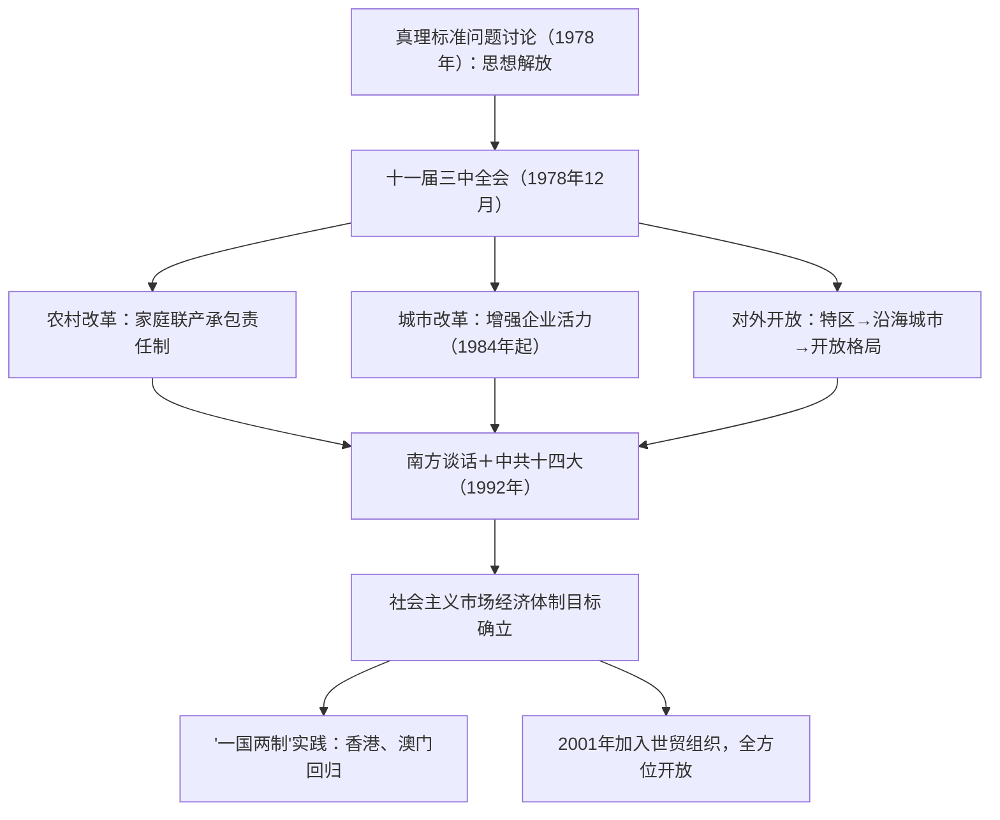

# 第27课 中国特色社会主义道路的开辟与发展

## 时空坐标

- 1978年5月：真理标准问题大讨论，为历史转折作思想准备
- 1978年12月：中共十一届三中全会召开，改革开放拉开序幕
- 1980年：设立深圳、珠海、汕头、厦门四个经济特区
- 1981年6月：十一届六中全会通过《关于建国以来党的若干历史问题的决议》
- 1982年：中共十二大提出"建设有中国特色的社会主义"重大命题
- 1984年：城市经济体制改革全面展开；开放14个沿海港口城市
- 1992年：邓小平南方谈话；中共十四大确立建立社会主义市场经济体制目标
- 1997年香港回归、1999年澳门回归；2001年加入世界贸易组织

## 知识梳理

| 阶段 | 标志事件 | 内容/意义 |
| --- | --- | --- |
| 伟大转折 | 十一届三中全会 | 停止"以阶级斗争为纲"，工作重心转移到经济建设，实行改革开放 |
| 拨乱反正 | 历史决议（1981） | 科学评价毛泽东和毛泽东思想，统一全党思想 |
| 深化改革 | 南方谈话、十四大（1992） | 建立社会主义市场经济体制目标 |
| 祖国统一 | 香港（1997）、澳门（1999）回归 | "一国两制"成功实践 |

## 重点精讲

1. **十一届三中全会的意义**：重新确立解放思想、实事求是的思想路线；停止"以阶级斗争为纲"的错误做法，作出把党和国家工作中心转移到经济建设上来、**实行改革开放**的历史性决策。它实现了新中国成立以来党的历史上具有深远意义的伟大转折，开启了改革开放和社会主义现代化建设新时期。
2. **经济体制改革**：首先在农村突破——家庭联产承包责任制（安徽凤阳小岗村率先包干到户），把土地所有权与经营权分开（土地仍为集体所有），极大调动农民生产积极性；1984年改革重点转向城市，中心环节是**增强企业活力**；1992年中共十四大明确经济体制改革目标是建立**社会主义市场经济体制**（史学观点：改革遵循渐进式路径，"摸着石头过河"与顶层设计相结合）。
3. **对外开放格局**：经济特区（1980年四个，1988年海南）→沿海开放城市（1984年14个）→沿海经济开放区→内地，形成**全方位、多层次、宽领域**的对外开放格局；2001年加入世界贸易组织，标志对外开放进入新阶段。
4. **邓小平南方谈话**（1992年）：阐明社会主义本质是解放和发展生产力；计划和市场都是经济手段，不是社会主义与资本主义的本质区别；"发展才是硬道理"。深刻回答了长期束缚人们思想的重大认识问题，为十四大召开作了重要思想理论准备。
5. **"一国两制"与祖国统一**：邓小平创造性提出"一个国家，两种制度"构想，首先为解决台湾问题提出，率先在香港、澳门问题上成功实践；1997年7月1日中国对香港恢复行使主权，1999年12月20日对澳门恢复行使主权，洗雪百年国耻，是完成祖国统一大业的重要步骤。

## 典型例题

**例1（选择题）** 家庭联产承包责任制之所以能调动农民积极性，主要是因为它（　）
A. 改变了土地公有制性质　B. 使农民获得生产经营自主权　C. 实现了农业机械化　D. 取消了农业税
**解析**：该制度坚持土地集体所有，把经营权承包给农户，农民"交够国家的、留足集体的、剩下都是自己的"，权责利统一。选 **B**。A 项错误——所有制未变。

**例2（材料题）** 材料：邓小平在南方谈话中指出："计划多一点还是市场多一点，不是社会主义与资本主义的本质区别。"
问：结合材料和所学，说明南方谈话的背景和意义。
**解析**：背景：20世纪80年代末90年代初，东欧剧变、苏联解体，国际社会主义运动遭遇挫折；国内改革开放面临"姓资姓社"的思想困扰。意义：①打破把计划经济等同于社会主义、市场经济等同于资本主义的传统观念；②深刻回答了什么是社会主义、怎样建设社会主义的重大问题；③解放了思想，为中共十四大确立社会主义市场经济体制改革目标奠定基础，改革开放进入新阶段。

## 易错点

- 家庭联产承包责任制没有改变土地**集体所有制**，改变的是经营方式与分配方式。
- 经济特区"特"在实行**特殊的经济政策和经济管理体制**，不是政治特区。
- 社会主义市场经济体制目标由**中共十四大**（1992）提出，基本框架由十四届三中全会规划。
- "一国两制"构想最初是为解决**台湾问题**提出的，首先实践于香港。

## 背记要点

1. 十一届三中全会（1978.12）：伟大转折——工作中心转移＋改革开放
2. 农村改革：家庭联产承包责任制（小岗村）；城市改革：增强企业活力
3. 开放格局：特区→沿海城市→开放区→内地，全方位多层次宽领域
4. 1992年：南方谈话＋十四大（社会主义市场经济体制目标）
5. "一国两制"：香港1997、澳门1999回归；2001年加入世贸组织

## 自测题

1. 阐述中共十一届三中全会的主要内容和历史意义。
2. 我国经济体制改革在农村和城市分别如何展开？
3. 概述我国对外开放格局形成的过程和特点。
4. "一国两制"的内涵是什么？其成功实践有哪些？

## 相关知识点

历史转折的前提见 [[第26课 社会主义建设在探索中曲折发展]]；改革开放的理论与建设成就见 [[第28课 改革开放以来的巨大成就]]。
