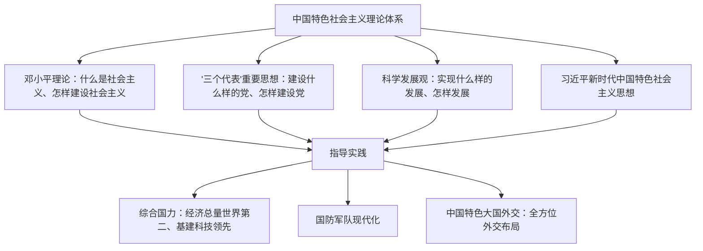

# 第28课 改革开放以来的巨大成就

## 时空坐标

- 1997年：中共十五大将邓小平理论确立为党的指导思想并写入党章
- 2002年：中共十六大将"三个代表"重要思想写入党章
- 2007年：中共十七大将科学发展观写入党章
- 2010年：中国国内生产总值跃居世界第二
- 2017年：中共十九大将习近平新时代中国特色社会主义思想确立为党必须长期坚持的指导思想并写入党章
- 2018年：十三届全国人大一次会议把习近平新时代中国特色社会主义思想载入国家根本法
- 改革开放以来："神舟"飞天、高铁成网、载人深潜等科技成就相继涌现

## 知识梳理

| 理论成果 | 确立会议 | 主要回答的课题 |
| --- | --- | --- |
| 邓小平理论 | 中共十五大（1997） | 什么是社会主义、怎样建设社会主义 |
| "三个代表"重要思想 | 中共十六大（2002） | 建设什么样的党、怎样建设党 |
| 科学发展观 | 中共十七大（2007）写入党章 | 新形势下实现什么样的发展、怎样发展 |
| 习近平新时代中国特色社会主义思想 | 中共十九大（2017） | 新时代坚持和发展什么样的中国特色社会主义、怎样坚持和发展 |

## 重点精讲

1. **中国特色社会主义理论体系的形成与发展**：这一体系是马克思主义中国化的重大成果，各理论成果既一脉相承又与时俱进，共同回答了建设中国特色社会主义的一系列基本问题。复习时应把"理论名称—确立会议—核心课题"对应记忆（见上表）。
2. **综合国力不断提升**：经济上，2010年国内生产总值超过日本，跃居**世界第二**，对世界经济增长贡献率居世界前列；基础设施建设快速突进，高铁、公路、桥梁、港口、水利、电网等领先世界；创新型国家建设成果丰硕——载人航天（"神舟"系列）、探月工程（"嫦娥"）、"蛟龙"深潜、北斗导航、超级计算机、量子通信等进入世界先进行列；文化事业繁荣，人民生活显著改善，谱写了经济快速发展和社会长期稳定"两大奇迹"（史学观点：制度优势是理解"中国之治"的关键变量）。
3. **国防和军队改革**：形成军委管总、战区主战、军种主建的新格局；人民军队实现整体性革命性重塑，武器装备现代化（航母、新型战机等）取得重大进展，为维护国家主权、安全、发展利益提供坚强保障。
4. **中国特色大国外交**：形成全方位、多层次、立体化的外交布局。倡导构建**人类命运共同体**，推进"一带一路"建设，发起成立亚洲基础设施投资银行，举办亚太经合组织领导人非正式会议、二十国集团领导人杭州峰会等主场外交，积极参与全球治理体系改革和建设，国际影响力、感召力、塑造力显著提高。

## 典型例题

**例1（选择题）** 中国特色社会主义理论体系中，集中回答"新时代坚持和发展什么样的中国特色社会主义、怎样坚持和发展中国特色社会主义"的是（　）
A. 邓小平理论　B. "三个代表"重要思想　C. 科学发展观　D. 习近平新时代中国特色社会主义思想
**解析**：抓住设问中"新时代"这一关键词与理论对应的核心课题。选 **D**。

**例2（材料题）** 材料：截至2010年代末，中国高铁营业里程稳居世界第一；"神舟""嫦娥""蛟龙""北斗"等重大科技成果相继问世；中国成为世界第二大经济体。
问：结合材料和所学，概括改革开放以来我国取得巨大成就的原因。
**解析**：①根本在于开辟了中国特色社会主义道路，形成了中国特色社会主义理论体系并不断与时俱进；②坚持中国共产党的领导，发挥社会主义制度集中力量办大事的优势；③坚持改革开放基本国策，融入经济全球化，社会主义市场经济体制激发活力；④全国人民艰苦奋斗，科教兴国、人才强国战略提供支撑；⑤和平稳定的外交环境。

## 易错点

- 各理论成果的**确立会议**易混：邓小平理论—十五大；"三个代表"—十六大；科学发展观写入党章—十七大；习近平新时代中国特色社会主义思想—十九大。
- 中国经济总量2010年跃居世界**第二**，不能表述为"第一"；人均水平仍与发达国家有差距。
- "一带一路"指"丝绸之路经济带"和"21世纪海上丝绸之路"，是合作倡议而非援助计划。
- 理论体系是**一脉相承、与时俱进**的整体，不能割裂或对立各阶段成果。

## 背记要点

1. 理论体系四大成果与对应会议：十五大、十六大、十七大、十九大
2. 综合国力：2010年GDP世界第二；高铁、航天、深潜、北斗等科技成就
3. 国防：军委管总、战区主战、军种主建，人民军队革命性重塑
4. 外交：人类命运共同体、"一带一路"、亚投行、主场外交
5. 成就根源：党的领导＋中国特色社会主义道路＋改革开放

## 自测题

1. 列表梳理中国特色社会主义理论体系各成果的确立会议与核心课题。
2. 从经济、科技、民生角度举例说明改革开放以来综合国力的提升。
3. 概述新时代国防和军队改革的主要内容。
4. 中国特色大国外交有哪些主要理念与实践？

## 相关知识点

道路开辟的历程见 [[第27课 中国特色社会主义道路的开辟与发展]]；新时代的历史方位见 [[第29课 中国特色社会主义进入新时代]]。
