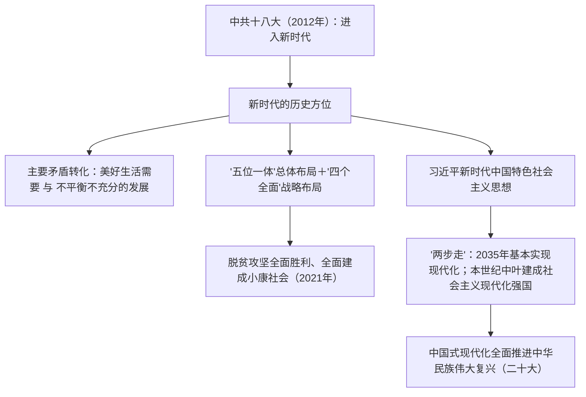

# 第29课 中国特色社会主义进入新时代

## 时空坐标

- 2012年11月：中共十八大召开，确立全面建成小康社会目标，中国特色社会主义进入新时代
- 2013年：提出"一带一路"合作倡议
- 2017年10月：中共十九大，作出社会主要矛盾变化的重大判断，提出"两步走"战略安排
- 2020年：脱贫攻坚战取得全面胜利（2021年宣告），现行标准下农村贫困人口全部脱贫
- 2021年7月：庆祝中国共产党成立100周年，宣告全面建成小康社会，实现第一个百年奋斗目标
- 2021年11月：十九届六中全会通过党的第三个历史决议
- 2022年10月：中共二十大，提出以中国式现代化全面推进中华民族伟大复兴

## 知识梳理

| 概念 | 内容 |
| --- | --- |
| 主要矛盾（十九大） | 人民日益增长的美好生活需要和不平衡不充分的发展之间的矛盾 |
| "五位一体" | 经济、政治、文化、社会、生态文明建设 |
| "四个全面" | 全面建设社会主义现代化国家、全面深化改革、全面依法治国、全面从严治党 |
| "两个一百年" | 建党百年全面建成小康社会；新中国成立百年建成社会主义现代化强国 |

## 重点精讲

1. **新时代的内涵**：中国特色社会主义进入新时代，意味着近代以来久经磨难的中华民族迎来了从站起来、富起来到**强起来**的伟大飞跃；意味着科学社会主义在21世纪的中国焕发出强大生机活力；意味着中国特色社会主义道路、理论、制度、文化不断发展，拓展了发展中国家走向现代化的途径。
2. **社会主要矛盾的变化**：中共十九大指出，我国社会主要矛盾已经转化为人民日益增长的美好生活需要和不平衡不充分的发展之间的矛盾。但**我国仍处于并将长期处于社会主义初级阶段的基本国情没有变**，我国是世界最大发展中国家的国际地位没有变——"变"与"不变"须同时把握。
3. **习近平新时代中国特色社会主义思想**：是当代中国马克思主义、21世纪马克思主义，是中华文化和中国精神的时代精华，实现了马克思主义中国化新的飞跃。中共十九大确立其为党必须长期坚持的指导思想并写入党章，2018年载入宪法。其核心内容概括为"十个明确""十四个坚持""十三个方面成就"。
4. **历史性成就**：打赢脱贫攻坚战——现行标准下近1亿农村贫困人口实现脱贫，832个贫困县全部摘帽，历史性地解决了绝对贫困问题；2021年全面建成小康社会，实现第一个百年奋斗目标（史学观点：这是中华民族发展史和人类减贫史上的重大事件，彰显社会主义制度的优越性）。
5. **战略安排与复兴前景**：十九大提出从2020年到本世纪中叶"两步走"——2035年基本实现社会主义现代化；本世纪中叶建成富强民主文明和谐美丽的社会主义现代化强国。中共二十大进一步提出以**中国式现代化**全面推进中华民族伟大复兴。

## 典型例题

**例1（选择题）** 中共十九大关于我国社会主要矛盾的新表述是（　）
A. 人民对于建立先进工业国的要求同落后农业国现实之间的矛盾　B. 人民日益增长的物质文化需要同落后的社会生产之间的矛盾　C. 人民日益增长的美好生活需要和不平衡不充分的发展之间的矛盾　D. 阶级矛盾
**解析**：A 是中共八大表述，B 是1981年历史决议表述，十九大作出新概括。选 **C**。

**例2（材料题）** 材料：2021年，习近平总书记庄严宣告，我国"历史性地解决了绝对贫困问题""在中华大地上全面建成了小康社会"。
问：结合材料和所学，谈谈全面建成小康社会的历史意义。
**解析**：①实现了第一个百年奋斗目标，兑现了中国共产党对人民、对历史的庄严承诺；②历史性解决绝对贫困问题，是中华民族发展史、人类减贫史上的重大事件，为全球减贫事业作出巨大贡献；③彰显了中国共产党领导和中国特色社会主义制度的显著优势；④为开启全面建设社会主义现代化国家新征程、实现第二个百年奋斗目标奠定了坚实基础。

## 易错点

- 主要矛盾变化了，但**社会主义初级阶段的基本国情没有变**，两者必须同时表述。
- 三次主要矛盾表述（八大、1981年决议、十九大）易混，要按时间对应。
- 全面建成小康社会宣告于**2021年**建党百年之际；脱贫攻坚战全面胜利同年宣告。
- "两步走"的时间节点是**2035年**基本实现现代化、**本世纪中叶**建成现代化强国，勿记反。

## 背记要点

1. 十八大（2012）：进入新时代；十九大（2017）：新思想写入党章、主要矛盾新判断
2. 主要矛盾：美好生活需要 vs 不平衡不充分的发展；初级阶段国情未变
3. 布局："五位一体"＋"四个全面"
4. 成就：脱贫攻坚全面胜利、2021年全面建成小康社会（第一个百年目标）
5. 战略："两步走"→2035年基本实现现代化→本世纪中叶现代化强国；中国式现代化

## 自测题

1. 如何理解中国特色社会主义进入新时代的"三个意味着"？
2. 十九大对社会主要矛盾作出怎样的新判断？为何强调基本国情没有变？
3. 概述习近平新时代中国特色社会主义思想的历史地位。
4. 说明全面建成小康社会与"两步走"战略安排的关系。

## 相关知识点

新时代的物质与理论基础见 [[第28课 改革开放以来的巨大成就]]；改革开放的开端见 [[第27课 中国特色社会主义道路的开辟与发展]]。
