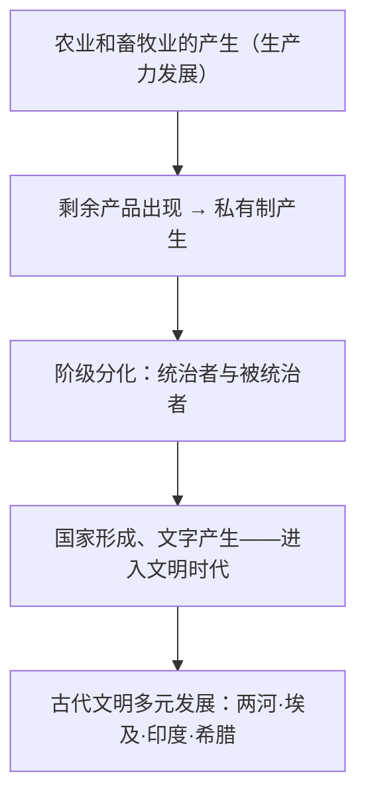

# 第1课 文明的产生与早期发展

## 时空坐标

- 约公元前3500年左右：两河流域南部苏美尔人建立最初的城市国家
- 约公元前3100年：埃及初步统一
- 公元前2900年左右：苏美尔地区出现一系列城市国家
- 约公元前18世纪：汉谟拉比基本统一两河流域，颁布《汉谟拉比法典》
- 公元前6世纪：恒河流域国家兴起，佛教产生
- 公元前8—前6世纪：希腊城邦发展，前5世纪雅典民主政治达于顶峰

## 知识梳理

| 文明 | 自然环境 | 政治 | 文化成就 |
| --- | --- | --- | --- |
| 两河（西亚） | 幼发拉底、底格里斯河 | 君主专制，《汉谟拉比法典》 | 楔形文字、《吉尔伽美什》、60进制 |
| 古埃及 | 尼罗河定期泛滥 | 法老集权 | 象形文字、金字塔、太阳历、莎草纸 |
| 古印度 | 印度河、恒河流域 | 种姓制度（婆罗门·刹帝利·吠舍·首陀罗） | 佛教、史诗、"0"与十进制数字 |
| 古希腊 | 多山少地、海洋环绕 | 城邦政治，雅典民主/斯巴达寡头 | 神话、悲喜剧、史学（希罗多德、修昔底德）、哲学三贤 |

## 重点精讲

1. **文明产生的标志**：阶级的出现、**国家的形成**、**文字的产生**。根本动力是农业畜牧业发展带来的社会大分工与剩余产品。
2. **文明的多元特征**：各文明基本**独立发展**，因自然地理环境不同而呈现鲜明的地域特色——大河文明多集权农耕（灌溉需要），海洋文明的希腊形成小国寡民的城邦。
3. **《汉谟拉比法典》**：世界上现存最早的较完整成文法典；宣扬君权神授，维护奴隶主利益与私有财产，实行同态复仇原则；是研究古巴比伦社会的珍贵文献。
4. **雅典民主的两面性**：成年男性公民直接参政（公民大会、抽签轮流任职）是古代民主的高峰；但妇女、外邦人、奴隶被排除在外，是**少数人的民主**，建立在奴隶制基础之上。

## 典型例题

**例1（选择题）** 古代埃及形成集权国家、两河流域诞生成文法典、希腊出现城邦民主。这说明古代文明具有（　）
A. 同源性　B. 多元性　C. 继承性　D. 排他性
**解析**：不同自然与社会条件孕育不同政治形态，体现文明发展的多元性。选 **B**。

**例2（材料题）** 材料：法典石柱浮雕刻画太阳神沙马什向汉谟拉比授予权杖。
问：该图像宣扬了什么观念？法典的实质是什么？
**解析**：宣扬**君权神授**，为王权披上神圣外衣。实质：维护奴隶主阶级利益和统治秩序的工具（保护私有财产、明确等级惩罚差异），同时客观上是古代法制文明的重要成果。

## 易错点

- 文明产生的根本原因是**生产力发展**，私有制、阶级、国家是其结果链条。
- 种姓制度四等级由**出身**决定、职业世袭、贵贱分明，"不可接触者"在四等级之外。
- 雅典民主是**公民（成年男性）**的民主，不能表述为"人人平等"。
- 楔形文字（两河）与象形文字（埃及）勿互换。

## 背记要点

1. 文明标志：阶级、国家、文字。
2. 四大早期文明区：两河、埃及、印度、希腊（多元独立发展）。
3. 《汉谟拉比法典》：现存最早较完整成文法典，君权神授+同态复仇。
4. 种姓制度四等级；佛教主张众生平等（对种姓的冲击）。
5. 雅典民主：直接民主、抽签轮值；局限是少数人的民主。

## 自测题

1. 文明产生的前提和标志分别是什么？
2. 比较大河文明与海洋文明在政治形态上的差异及原因。
3. 简评《汉谟拉比法典》的价值与实质。
4. 雅典民主政治的进步性与局限性各是什么？

## 相关知识点

早期文明间的交流与帝国扩张见 [[第2课 古代世界的帝国与文明的交流]]；中古文明的演进见 [[第3课 中古时期的欧洲]]。
