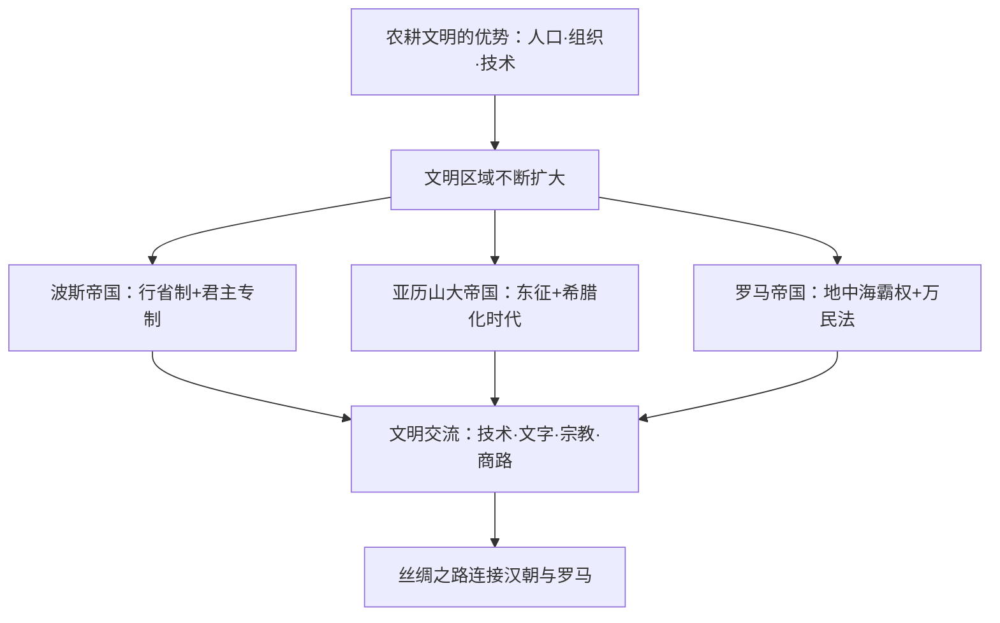

# 第2课 古代世界的帝国与文明的交流

## 时空坐标

- 公元前6世纪：波斯帝国兴起，地跨欧亚非三洲
- 公元前4世纪晚期：亚历山大东征，建立亚历山大帝国
- 公元前27年：屋大维建立元首制，罗马进入帝国时代
- 1—2世纪：罗马帝国鼎盛，地中海成为"内海"
- 2世纪：甘英出使大秦（罗马）至波斯湾；166年"大秦王安敦"使者到东汉
- 4世纪末：罗马帝国分裂为东西两部分；476年西罗马帝国灭亡

## 知识梳理

| 帝国 | 统治特点 | 文明影响 |
| --- | --- | --- |
| 波斯 | 君权神授、行省制、税收系统、驿道 | 继承西亚传统，行省制为后世借鉴 |
| 亚历山大 | 继承波斯制度，宣布君权神授 | 东征促成"希腊化时代"，希腊文化东传 |
| 罗马 | 元首制→君主统治，法律体系（万民法） | 基督教兴起并定为国教；拉丁字母传播 |

## 重点精讲

1. **文明扩展的方式**：农耕文明以**武力扩张与移民**扩展（埃及、亚述、波斯）；希腊以**殖民**方式在地中海和黑海沿岸建立众多城邦。扩展的根源是农耕文明较高的生产力与组织能力。
2. **帝国统治的共性**：君主专制、官僚体系与行省管理、常备军、依托税收——大帝国客观上把不同文明圈联为一体，为交流提供政治条件。
3. **文明交流的表现**：技术（冶铁术自西亚扩散）、神话与雕刻艺术（西亚→希腊）、字母文字（腓尼基字母→希腊字母→拉丁字母；向东演化出阿拉马字母）、**丝绸之路**（汉朝丝绸西传，甘英使大秦、安敦使者来华为东西方直接交往的例证）。
4. **交流的总趋势**：文明之间交往**不断加强、相互影响不断扩大**；暴力冲突（战争）与和平交往（商贸、使节）都是客观上的交流途径。

## 典型例题

**例1（选择题）** 亚历山大东征后，希腊语在西亚、北非广泛使用，亚历山大城成为学术中心。这一现象被称为（　）
A. 罗马化　B. 希腊化　C. 东方化　D. 拉丁化
**解析**：东征促成希腊文化与东方文化交融的"希腊化时代"。选 **B**。

**例2（材料题）** 材料：腓尼基字母向西演变为希腊字母、拉丁字母，向东演变出阿拉马字母，后者又发展出多种文字。
问：材料反映了古代文明交流的什么特点？举一例说明汉与罗马的交往。
**解析**：特点：文明成果在**传播中被改造创新**，呈双向、多线扩散，影响深远。例证：97年甘英出使大秦抵波斯湾；166年"大秦王安敦"使者经海路到达东汉（《后汉书》载），或丝绸经丝路远销罗马。

## 易错点

- 波斯帝国的**行省制**早于亚历山大与罗马，亚历山大**继承**了波斯的基本制度。
- "希腊化"是希腊文化与**东方文化交融**，不是单向的希腊文化输出。
- 罗马**共和国**（前509—前27）与**帝国**（前27—）阶段区分；1—2世纪鼎盛的是帝国。
- 汉与罗马是**间接交往为主**，直接使节往来仅个别记载。

## 背记要点

1. 文明扩展：农耕帝国武力扩张；希腊海外殖民。
2. 三大帝国：波斯（行省制）、亚历山大（希腊化）、罗马（万民法、基督教国教）。
3. 字母文字传播链：腓尼基→希腊→拉丁；东支阿拉马字母。
4. 丝绸之路：97年甘英使大秦；166年安敦使者来汉。
5. 趋势：文明交流互鉴不断加强。

## 自测题

1. 农耕文明区域扩大的原因是什么？
2. 列举波斯、亚历山大、罗马三帝国统治的共同特征。
3. 什么是"希腊化时代"？其文化意义何在？
4. 举两例说明古代东西方文明的交流。

## 相关知识点

早期文明的独立发展见 [[第1课 文明的产生与早期发展]]；罗马帝国分裂后的欧洲见 [[第3课 中古时期的欧洲]]。
