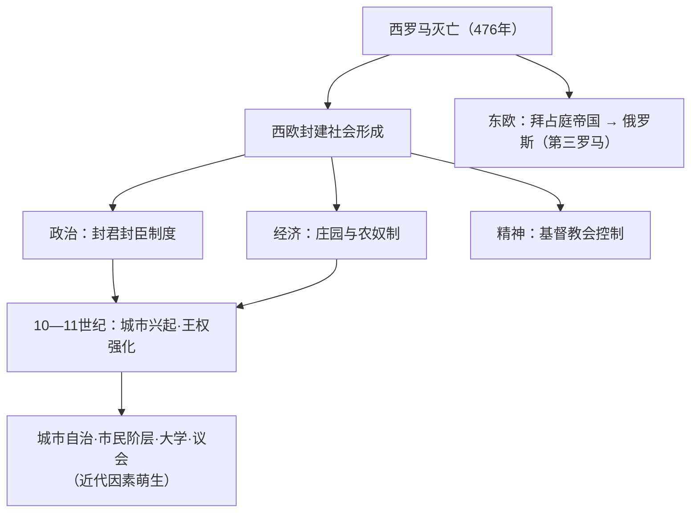

# 第3课 中古时期的欧洲

## 时空坐标

- 476年：西罗马帝国灭亡，西欧进入中古时期
- 5—9世纪：法兰克王国兴起；800年查理加冕称帝
- 10—11世纪起：西欧城市复兴，大学兴起
- 1054年：基督教会东西分裂（天主教/东正教）
- 6世纪：查士丁尼在位，编《罗马民法大全》（拜占庭鼎盛）
- 1453年：奥斯曼帝国攻陷君士坦丁堡，拜占庭帝国灭亡
- 15世纪末16世纪初：莫斯科公国统一俄罗斯，伊凡四世称"沙皇"

## 知识梳理

| 制度 | 内容 | 特点 |
| --- | --- | --- |
| 封君封臣 | 以土地封赐为纽带，臣服与保护相交换 | 层层分封、等级森严；地方分裂割据 |
| 庄园农奴制 | 庄园自给自足；农奴人身依附、服劳役 | 中古西欧基本的农业经济组织 |
| 教会统治 | 拥有大量庄园地产、征什一税、精神垄断 | 等级制度森严，控制民众精神生活 |

## 重点精讲

1. **封君封臣制度**：以**土地**为纽带（授予与效忠互为条件），"我的附庸的附庸不是我的附庸"——导致王权软弱与政治分裂；但国王作为名义最高封君，为后来**王权强化**留下制度接口。
2. **中古西欧的新变化（10—11世纪起）**：城市工商业复兴→市民以金钱赎买或武装斗争获得**自治权**；城市支持王权，英法出现**议会/三级会议**（等级君主制）；**大学兴起**（"中世纪最美好的花朵"）。这些是近代西欧文明的胚芽。
3. **拜占庭与俄罗斯**：拜占庭延续千年，查士丁尼《罗马民法大全》使罗马法体系化，保存希腊罗马古典文化；1453年亡于奥斯曼。俄罗斯继承东正教与拜占庭传统，莫斯科自称"第三罗马"，伊凡四世强化中央集权（特辖领地制打击大贵族）。
4. **多元面貌**：中古欧洲并非纯粹"黑暗时代"——封建制度中孕育着城市、大学、议会、法律等近代因素。

## 典型例题

**例1（选择题）** "我的附庸的附庸不是我的附庸"反映西欧封君封臣制度的特点是（　）
A. 中央集权高度发达　B. 等级逐级保护与效忠，王权受限　C. 教权高于王权　D. 庄园自给自足
**解析**：封臣仅对直接封君效忠，权力层层分割，王权软弱。选 **B**。

**例2（材料题）** 材料：13世纪，牛津、巴黎等大学相继兴起；伦敦等城市从国王处获得特许状实行自治。
问：概括材料反映的变化并分析其历史意义。
**解析**：变化：城市自治与大学兴起（工商业发展的产物）。意义：①市民阶层壮大，为资本主义萌芽准备社会条件；②城市与王权结盟促进统一国家形成；③大学培养世俗人才、传承学术，为文艺复兴与宗教改革奠基。

## 易错点

- 封君封臣制的纽带是**土地（封土）**，不是血缘。
- 城市"自治"针对**封建领主**，多数城市仍在王国框架内，并常支持王权。
- 《罗马民法大全》是**拜占庭**查士丁尼时期编纂，勿归入西欧。
- 中古欧洲教权与王权**既依存又斗争**，不能简单说教权始终至上。

## 背记要点

1. 西欧封建三支柱：封君封臣、庄园农奴制、基督教会。
2. 新变化：城市自治、市民阶层、大学兴起、等级君主制（英议会、法三级会议）。
3. 拜占庭：《罗马民法大全》；1453年灭亡。
4. 俄罗斯：东正教传统，伊凡四世称沙皇、强化集权。

## 自测题

1. 封君封臣制度的纽带、义务关系和政治后果是什么？
2. 庄园经济有哪些特征？农奴与奴隶有何区别？
3. 中古西欧10世纪后出现了哪些新变化？意义何在？
4. 拜占庭帝国的主要文化贡献是什么？

## 相关知识点

罗马帝国的遗产见 [[第2课 古代世界的帝国与文明的交流]]；同时期的亚洲文明见 [[第4课 中古时期的亚洲]]。
