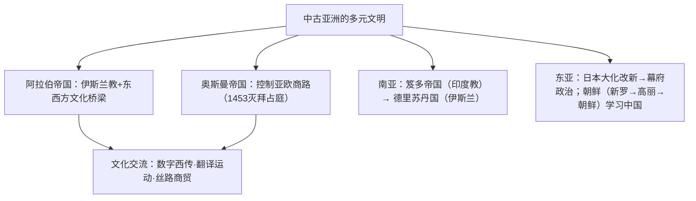

# 第4课 中古时期的亚洲

## 时空坐标

- 7世纪初：穆罕默德创立伊斯兰教；622年迁居麦地那，建立政权
- 8世纪中期：阿拉伯帝国地跨欧亚非三洲
- 646年：日本"大化改新"，模仿唐制建立中央集权
- 12世纪末：日本进入镰仓幕府统治的武家时代
- 13世纪末：奥斯曼帝国兴起；1453年灭拜占庭
- 4世纪：笈多帝国兴起（印度教发展）；13世纪：德里苏丹国建立（伊斯兰教为国教）

## 知识梳理

| 政权 | 政治制度 | 文化/影响 |
| --- | --- | --- |
| 阿拉伯帝国 | 哈里发集政教军权于一身 | 翻译古典著作、代数学、"阿拉伯数字"西传、《一千零一夜》 |
| 奥斯曼帝国 | 苏丹专制，宗教上层与封建主为统治阶级 | 控制东西商路，重税促使欧洲寻新航路 |
| 日本 | 大化改新仿唐制→庄园与武士→幕府统治 | 天皇为名义元首，将军掌实权；锁国倾向 |
| 朝鲜 | 高丽王朝仿唐制；1392年朝鲜王朝建立 | 学习中国制度文化；16世纪末联明抗倭（壬辰战争） |

## 重点精讲

1. **阿拉伯帝国的文明桥梁作用**：地处欧亚非交界，商人活跃于海陆商路；**翻译运动**保存并发展希腊、波斯、印度典籍；把中国造纸术、印度数字等传入欧洲——"阿拉伯人把东方文明和西方文明结合起来"。
2. **奥斯曼帝国与商路**：1453年灭拜占庭、定都伊斯坦布尔；控制连接亚欧的传统商路并征收重税，客观上**推动西欧开辟新航路**（与第6课呼应）。
3. **日本政治演变**：大化改新（646年起）模仿隋唐建立律令制国家；10世纪起庄园兴起、武士集团壮大；1192年源赖朝获"征夷大将军"，开启**幕府政治**——天皇虚位、将军当权、武士以效忠换俸禄（与西欧封建有形似之处）。
4. **南亚宗教更替**：笈多帝国时期**印度教**成为主要宗教；德里苏丹国以**伊斯兰教**为国教，最高统治者称苏丹——南亚文明呈现多宗教叠加的面貌。

## 典型例题

**例1（选择题）** 阿拉伯帝国在世界文明交流中的突出贡献是（　）
A. 首创字母文字　B. 沟通东西方文化，传播造纸术与印度数字　C. 开辟新航路　D. 创立佛教
**解析**：阿拉伯人是东西方文化交流的桥梁。选 **B**。

**例2（材料题）** 材料：12世纪末以后，日本"天皇临朝而不理政，将军挟武士以令诸国"。
问：这反映了日本怎样的政治体制？其社会基础是什么？
**解析**：反映**幕府政治**：天皇保留名义权威，实权掌握在幕府将军手中。社会基础：庄园经济发展与**武士阶层**崛起——武士与将军结成主从关系，以军事效忠换取土地俸禄，形成武家统治秩序。

## 易错点

- 伊斯兰教创立于**7世纪**麦加，帝国鼎盛在**8世纪中期**，时序勿颠倒。
- "阿拉伯数字"源于**印度**，经阿拉伯人改进西传。
- 幕府时代天皇**并未废除**，是"虚君+将军实权"结构。
- 德里苏丹国的国教是**伊斯兰教**，与笈多时期的印度教区分。

## 背记要点

1. 阿拉伯：政教合一（哈里发）；文化桥梁（翻译运动、数字西传）。
2. 奥斯曼：1453灭拜占庭；控制商路征重税→刺激新航路开辟。
3. 日本：大化改新仿唐→镰仓幕府（1192）武家政治。
4. 朝鲜：仿唐制；1592年联明抗击丰臣秀吉侵略。
5. 印度：笈多（印度教）→德里苏丹国（伊斯兰教）。

## 自测题

1. 阿拉伯帝国对世界文化交流的贡献有哪些？
2. 奥斯曼帝国的扩张对欧洲历史产生了什么影响？
3. 简述日本从大化改新到幕府政治的演变。
4. 比较日本幕府制度与西欧封君封臣制的异同。

## 相关知识点

同时期欧洲的封建社会见 [[第3课 中古时期的欧洲]]；被商路变动引发的大航海见 [[第6课 全球航路的开辟]]；非洲美洲文明见 [[第5课 古代非洲与美洲]]。
