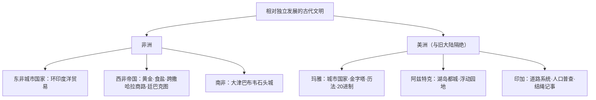

# 第5课 古代非洲与美洲

## 时空坐标

- 公元前后：班图人开始大迁徙，农业冶铁技术传播撒哈拉以南
- 8—15世纪：东非沿海产生一系列城市国家（摩加迪沙等）
- 8—16世纪：西非加纳、马里、桑海帝国先后兴盛（黄金与跨撒哈拉贸易）
- 11世纪起：大津巴布韦文明兴起（14—15世纪鼎盛）
- 3—15世纪：玛雅文明繁盛于中美洲尤卡坦半岛
- 14—16世纪初：阿兹特克帝国（墨西哥谷地）与印加帝国（安第斯山区）强盛

## 知识梳理

| 文明 | 地区 | 主要成就/特点 |
| --- | --- | --- |
| 桑海 | 西非 | 16世纪极盛；廷巴克图为学术文化中心 |
| 玛雅 | 中美洲 | 众多城市国家；复杂历法、20进制（含零）、象形文字 |
| 阿兹特克 | 墨西哥谷地 | 特诺奇蒂特兰城；"浮动园地"扩大耕地 |
| 印加 | 安第斯山区 | 中央集权典范：四大政区、完善道路、人口调查、马丘比丘 |

## 重点精讲

1. **班图人迁徙**：历时千余年，把**农业、冶铁技术与班图语言**传播到撒哈拉以南广大地区，是非洲文明发展的内在动力。
2. **西非帝国与贸易**：控制**黄金—食盐**贸易与跨撒哈拉商路而兴盛；马里国王曼萨·穆萨朝觐麦加挥金如土闻名世界；**廷巴克图**成为西非的学术文化中心——说明非洲有发达的本土文明，驳斥"非洲无历史"的偏见。
3. **美洲文明的独立性**：与欧亚大陆基本隔绝，独立培育玉米、马铃薯、番茄等作物（后经物种交换惠及全球）；没有铁器、大牲畜与轮车，却建成宏大城市与国家组织——证明人类文明道路的**多样性**。
4. **印加的国家治理**：国王集权，全国分四大政区；修建纵贯全境的**道路系统**便于调兵与传令；定期**人口普查**、迁移人口；以**结绳（奇普）**记事——古代美洲最完善的集权国家。

## 典型例题

**例1（选择题）** 玛雅历法精密、印加道路纵横、阿兹特克浮动园地独具匠心。这最能说明（　）
A. 美洲文明源自埃及　B. 美洲人独立创造了辉煌文明　C. 美洲文明领先世界　D. 地理隔绝阻碍一切发展
**解析**：美洲与旧大陆隔绝，其成就是独立创造的产物，体现文明多元。选 **B**。

**例2（材料题）** 材料：14世纪马里国王曼萨·穆萨携大量黄金朝觐麦加，沿途挥洒，致埃及金价多年低落；廷巴克图书籍贸易利润"高于任何商品"。
问：材料说明中古西非社会的哪些状况？
**解析**：①西非盛产黄金，控制跨撒哈拉贸易而国力雄厚；②统治者信奉伊斯兰教，与外部世界联系密切；③重视文化教育，廷巴克图为学术中心、书籍贸易繁荣——中古非洲拥有高度发达的本土文明。

## 易错点

- 大津巴布韦是**南部非洲**班图人建立的文明，石头城为其标志。
- 美洲三大文明**彼此亦少往来**：玛雅（中美，城市国家）≠阿兹特克（帝国）≠印加（南美集权帝国）。
- 玛雅使用**20进制**并有零的概念；印加用**结绳记事**（无文字）。
- 非洲、美洲文明的衰落各有内因，最终中断主要缘于**外来殖民入侵**（后续课呼应）。

## 背记要点

1. 班图人迁徙：传播农业、冶铁与语言。
2. 西非三帝国：加纳→马里→桑海；廷巴克图学术中心。
3. 东非城市国家靠印度洋贸易；南非大津巴布韦石头城。
4. 美洲：玛雅历法文字、阿兹特克浮动园地、印加道路与人口普查。
5. 启示：文明独立多元，各有其发展道路。

## 自测题

1. 班图人迁徙对非洲历史有何影响？
2. 西非帝国兴盛的经济基础是什么？
3. 列举玛雅、阿兹特克、印加各一项代表性成就。
4. 古代美洲文明的发展特点给我们什么启示？

## 相关知识点

亚洲诸文明的并行发展见 [[第4课 中古时期的亚洲]]；美洲文明的命运转折见 [[第7课 全球联系的初步建立与世界格局的演变]]。
