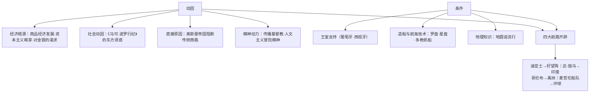

# 第6课 全球航路的开辟

## 时空坐标

- 1487年：迪亚士抵达非洲最南端好望角
- 1492年：哥伦布横渡大西洋，到达美洲（巴哈马群岛）
- 1497—1498年：达·伽马绕好望角到达印度
- 1519—1522年：麦哲伦船队完成人类首次环球航行
- 16世纪起：卡伯特父子、卡蒂埃、巴伦支、哈得逊、德雷克、塔斯曼等开辟北大西洋与南太平洋新航线

## 知识梳理

| 航海家 | 时间 | 资助国 | 成就 |
| --- | --- | --- | --- |
| 迪亚士 | 1487 | 葡萄牙 | 抵达好望角 |
| 达·伽马 | 1497–1498 | 葡萄牙 | 开辟直达印度航路 |
| 哥伦布 | 1492 | 西班牙 | 发现美洲新大陆 |
| 麦哲伦船队 | 1519–1522 | 西班牙 | 首次环球航行，证实地圆说 |

## 重点精讲

1. **动因的层次**：根本原因是**西欧商品经济发展与资本主义萌芽**对金银、市场的需求（"寻金热"）；商路受阻是**直接原因**；宗教热情与人文主义精神是思想动力——多因合力，经济因素居首。
2. **葡西先行的原因**：地处大西洋沿岸，具备航海传统；**王室直接支持**（中央集权较早完成）；掌握先进航海技术。
3. **其他航路的意义**：北大西洋（卡伯特、哈得逊等）与南太平洋（塔斯曼发现塔斯马尼亚、新西兰）航线，使人类对地球的认识更完整，世界主要大洋和大陆之间建立起直接联系。
4. **中西对比视角**：郑和下西洋（1405—1433）早于且规模大于西欧航海，但以宣扬国威为目的、不计经济效益而难以持续；西欧航海以逐利为动力，推动了持续的扩张——目的差异导致结果迥异。

## 典型例题

**例1（选择题）** 15世纪西欧人开辟新航路的根本原因是（　）
A. 奥斯曼帝国阻断商路　B. 商品经济发展和资本主义萌芽的需求　C. 地圆说的流行　D. 传播基督教的热情
**解析**：商路受阻是直接原因，技术与宗教是条件与动力，根本动因在经济。选 **B**。

**例2（材料题）** 材料：哥伦布说："黄金是一切商品中最宝贵的……谁占有黄金，谁就能获得他在世上所需的一切。"
问：材料反映了航海活动的什么动机？结合所学分析其时代背景。
**解析**：动机：对**黄金财富的狂热追求**（寻金热）。背景：①西欧商品经济发展，货币需求激增；②资本主义萌芽需要原始积累；③《马可·波罗行纪》渲染东方富庶；④传统商路被奥斯曼控制，贸易成本上升——追逐财富成为新航路开辟最强驱动力。

## 易错点

- 迪亚士到**好望角**、达·伽马到**印度**，均为葡萄牙资助的**东向**航线；哥伦布、麦哲伦为西班牙资助的**西向**航线。
- 麦哲伦本人死于菲律宾，完成环球的是其**船队**。
- 哥伦布至死认为所到之地是**亚洲（印度）**，"美洲"得名于亚美利哥。
- 新航路开辟≠殖民扩张本身，但直接引发了殖民扩张（下一课内容）。

## 背记要点

1. 动因：经济根源（求金）+商路受阻+宗教与冒险精神。
2. 条件：王室支持、造船航海技术、地圆说。
3. 四大航路：迪亚士—好望角；达·伽马—印度；哥伦布—美洲；麦哲伦—环球。
4. 其他航线：北大西洋高纬航线与南太平洋航线补全世界图景。

## 自测题

1. 从根本、直接、思想三个层面分析新航路开辟的原因。
2. 列表写出四位航海家的时间、资助国与成就。
3. 为什么葡萄牙、西班牙成为大航海的先行者？
4. 比较郑和下西洋与西欧大航海的目的与影响差异。

## 相关知识点

商路受阻的背景见 [[第4课 中古时期的亚洲]]（奥斯曼帝国）；航路开辟的后果见 [[第7课 全球联系的初步建立与世界格局的演变]]。
