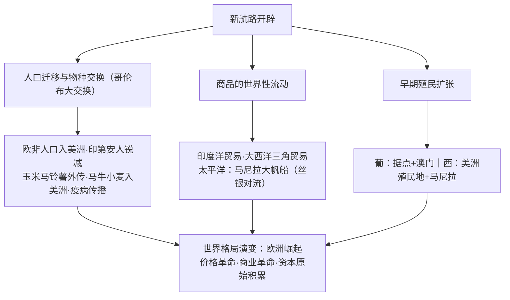

# 第7课 全球联系的初步建立与世界格局的演变

## 时空坐标

- 16世纪初起：欧洲人向美洲移民；天花等病原体致印第安人口锐减
- 16世纪：葡萄牙建立以澳门为主要中转站的海上贸易网络；西班牙经营马尼拉大帆船贸易
- 16—17世纪：三角贸易兴起，黑奴被贩运至美洲
- 16世纪中叶后：白银大量流入中国；欧洲发生"价格革命""商业革命"
- 17世纪初：荷兰崛起为"海上马车夫"

## 知识梳理

| 概念 | 内容 | 影响 |
| --- | --- | --- |
| 哥伦布大交换 | 动植物、人口、病原体跨洲流动 | 改变世界人文地理格局与自然环境状态 |
| 三角贸易 | 欧（枪支酒）→非（黑奴）→美（金银原料）→欧 | 非洲丧失大量劳动力；美洲种植园经济；欧洲积累资本 |
| 价格革命 | 金银涌入欧洲，物价上涨 | 依赖固定地租的封建主衰落，新兴资产阶级获利 |
| 商业革命 | 商品种类增多、贸易中心转移（地中海→大西洋沿岸） | 意大利衰落，葡西荷英法兴起 |

## 重点精讲

1. **人口迁移与疫病**：欧洲人移民美洲、非洲黑奴被强迫迁移，美洲族群混合程度最高；欧洲人带来的**天花**等疫病使缺乏免疫力的印第安人大量死亡（一些地区减少约90%）——殖民者能够征服美洲的重要原因。
2. **白银流向与中国**：西属美洲白银经**马尼拉大帆船**运往亚洲，大量流入中国换取丝绸瓷器；白银流入促进明后期**商品经济发展**（白银货币化）——中国被纳入早期世界贸易体系。
3. **两场"革命"辨析**：价格革命作用于**社会结构**（封建地主衰落、资产阶级壮大，加速封建制度解体）；商业革命作用于**贸易格局**（范围扩大、商品增多、中心转移、经营方式创新如股份公司）。
4. **总体评价**：全球联系初步建立，世界市场雏形出现；但对亚非拉而言是灾难的开端——殖民掠夺、奴隶贸易与文明浩劫；人类社会从分散走向整体的进程以**不平等**方式展开。

## 典型例题

**例1（选择题）** 16世纪后期欧洲金银贬值、物价上涨，靠固定地租为生的封建主每况愈下。这一现象是（　）
A. 商业革命　B. 价格革命　C. 工业革命　D. 光荣革命
**解析**：金银流入导致货币贬值物价上涨，冲击封建生产关系，即价格革命。选 **B**。

**例2（材料题）** 材料：玉米、马铃薯传入欧亚，助推人口增长；美洲则接纳了小麦、马匹与欧洲移民，也承受了天花与奴役。
问：概括"哥伦布大交换"的特点并简评其影响。
**解析**：特点：**双向交流但结果不对等**；内容涵盖物种、人口、疫病；范围全球。影响：积极——丰富各洲物质生活，促进人口增长与经济互补，推动世界连为一体；消极——疫病灭绝性打击原住民，奴隶贸易与殖民掠夺造成亚非拉长期落后，生态亦被改变。

## 易错点

- "世界市场**雏形**出现"（新航路开辟后）与"最终形成"（第二次工业革命后）阶段勿混。
- 价格革命受害者是**封建地主**，受益者是新兴资产阶级；勿写反。
- 马尼拉大帆船连接的是**墨西哥阿卡普尔科—菲律宾马尼拉**，核心商品是中国丝绸与美洲白银。
- 早期殖民主要国家是**葡、西**（16世纪），荷兰英国崛起在17世纪。

## 背记要点

1. 哥伦布大交换：物种、人口、疫病的洲际流动。
2. 三大洋贸易：印度洋（葡）、大西洋（三角贸易）、太平洋（马尼拉大帆船）。
3. 白银大量流入中国：丝—银贸易。
4. 价格革命（社会结构）+商业革命（贸易格局）→欧洲崛起。
5. 评价：整体化开端+殖民灾难的双重性。

## 自测题

1. 什么是"哥伦布大交换"？列举双向流动的物种各两例。
2. 画出三角贸易的路线与商品。
3. 区分价格革命与商业革命的内容和影响。
4. 新航路开辟后的全球贸易对明代中国有何影响？

## 相关知识点

航路开辟的过程见 [[第6课 全球航路的开辟]]；殖民扩张时代的思想解放见 [[第8课 欧洲的思想解放运动]]；殖民体系的最终形成见 [[第12课 资本主义世界殖民体系的形成]]。
